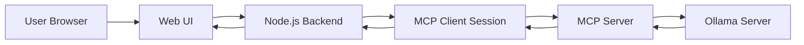
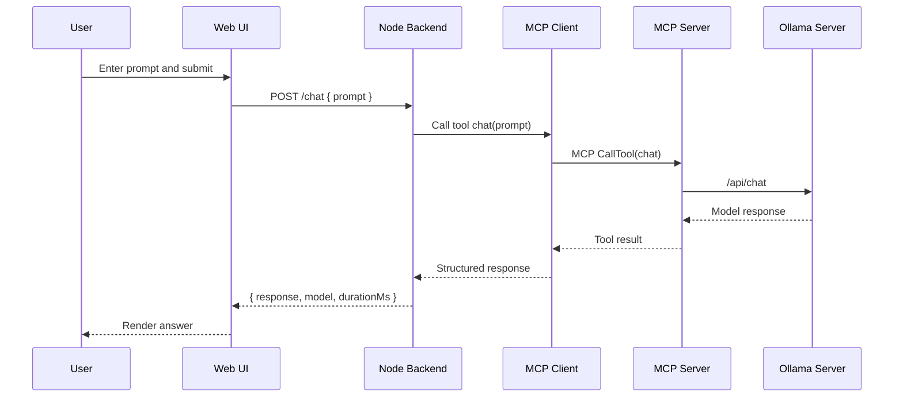
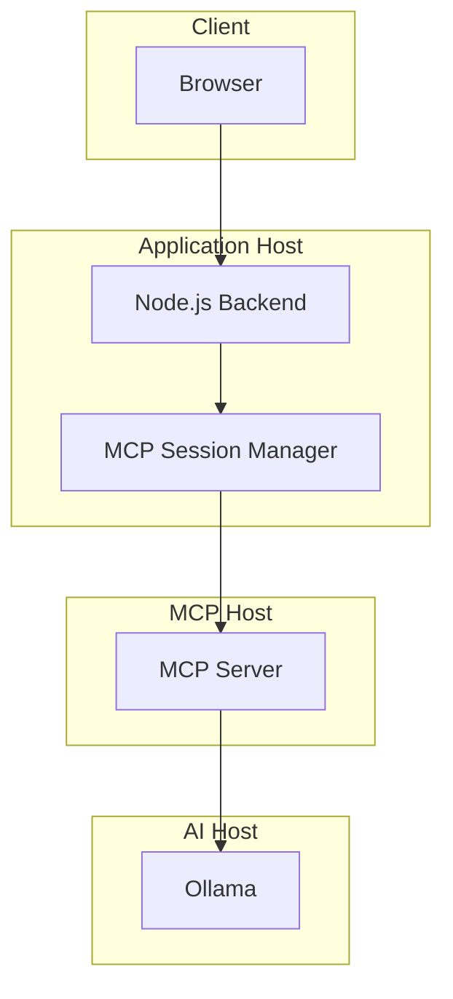
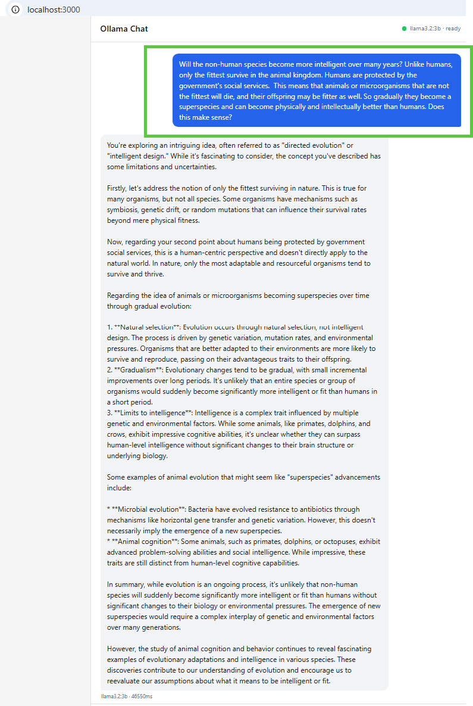
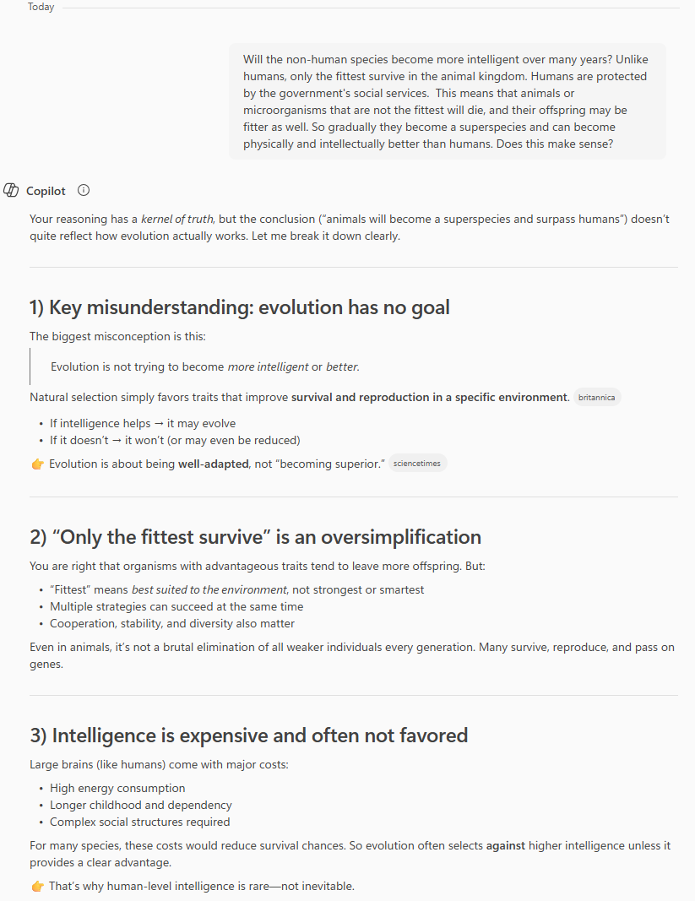

AI inference doesn't have to mean a cloud API call. This post walks through a spike I built to run a locally hosted language model through a clean, layered architecture using Ollama and the Model Context Protocol (MCP).

*The full source is on [GitHub](https://github.com/JigsawFlux/ollama-mcp-starter). Contributions and feedback welcome.*

<!-- truncate -->

## Why Local LLMs?

Most AI integrations today rely on external APIs — you send a prompt to a cloud provider, they run the model, you get a response. That works fine for many use cases, but it comes with real tradeoffs:

- **Privacy**: your prompts leave your network
- **Connectivity**: requires reliable internet
- **Cost**: token-based pricing adds up quickly at scale
- **Latency**: round-trip to a remote data centre

For health tech, crisis response, and humanitarian tools — areas where JigsawFlux focuses — these tradeoffs can matter a great deal. Patient data is sensitive. Field teams in disaster zones may have limited connectivity. Running AI locally sidesteps all of these concerns.

Local LLMs have become genuinely useful. Models like `llama3.2:3b` run comfortably on consumer hardware and handle a wide range of practical tasks: summarisation, triage, Q&A, and structured extraction.

## What is Ollama?

[Ollama](https://ollama.com) is an open-source tool that makes running LLMs locally straightforward. Think of it as a package manager for AI models — pull a model, run it, and interact with it over a local HTTP API.

```bash
ollama pull llama3.2:3b
ollama run llama3.2:3b
```

Once running, Ollama exposes a REST API on `localhost:11434` (or a networked host). It handles model loading, memory management, and inference. You interact with it exactly as you would a cloud API, just without the round-trip.

For this spike, Ollama runs on a separate machine on my local network at `192.168.1.80` — a common setup where a more capable machine hosts the model and lighter clients query it.

## Setting Up Ollama on Linux

### Installation

The quickest way is the official install script — one line and it handles everything:

```bash
curl -fsSL https://ollama.com/install.sh | sh
```

If you prefer to install manually (air-gapped environments, or you want control over the binary location):

```bash
# Download the Linux binary
curl -L https://ollama.com/download/ollama-linux-amd64 -o ollama

# Make it executable
chmod +x ollama

# Move to a directory in your PATH
sudo mv ollama /usr/local/bin/
```

### Starting the Server

By default, `ollama serve` binds to `127.0.0.1` — only accessible from the same machine. For this spike, Ollama runs on a dedicated machine on the local network and the application connects to it from a different host. To allow that, bind to all interfaces:

```bash
OLLAMA_HOST=0.0.0.0 ollama serve
```

To make this permanent (e.g. as a systemd service override):

```bash
sudo systemctl edit ollama.service
```

Add the following and save:

```ini
[Service]
Environment="OLLAMA_HOST=0.0.0.0"
```

Then reload and restart:

```bash
sudo systemctl daemon-reload
sudo systemctl restart ollama
```

The server now listens on port `11434` on all network interfaces. Other machines on the same network can reach it at `http://<host-ip>:11434`.

### Pulling a Model

Before the server can handle requests, pull the model you want to use:

```bash
ollama pull llama3.2:3b
```

### Testing the API

Ollama exposes a simple HTTP API. Once the server is running, you can test it directly with `curl` — no SDK needed.

**Generate completion** (single prompt, no conversation context):

```bash
curl $OLLAMA_HOST/api/generate -d '{
  "model": "llama3.2",
  "prompt": "Explain kubernetes in one paragraph",
  "stream": false
}'
```

**Chat completion** (conversation format with message roles):

```bash
curl $OLLAMA_HOST/api/chat -d '{
  "model": "llama3.2",
  "messages": [
    {"role": "user", "content": "What is Docker?"}
  ],
  "stream": false
}'
```

The `/api/generate` endpoint is stateless — one prompt in, one response out. The `/api/chat` endpoint accepts a `messages` array so you can pass conversation history and get contextually aware replies. This spike uses `/api/chat` for both the chat and summarise tools.

Set `OLLAMA_HOST` in your environment or `.env` file to point at the machine running Ollama:

```bash
OLLAMA_HOST=http://192.168.1.80:11434
```

## What is MCP?

The [Model Context Protocol](https://modelcontextprotocol.io) (MCP) is an open standard from Anthropic for structuring communication between AI hosts and the tools or services they call. It defines a consistent way to:

- **Expose tools** — name them, describe their inputs/outputs
- **Call tools** — invoke them with structured arguments
- **Handle responses** — receive results in a predictable format

The key idea is separation of concerns. Your application logic doesn't need to know the details of how a model is invoked — it just calls a tool. The MCP server handles the translation to whatever inference backend is running.

This makes the architecture composable. Swap Ollama for another model runner, add a new tool, or connect a different MCP client — each layer stays isolated.

## Architecture of the Spike

The system has four main layers:



### Layer 1: Browser (Frontend)

A vanilla HTML/CSS/JS frontend with two tabs — **Chat** and **Summarise**. No framework, no build step. The UI handles user input, loading states, and error display. It talks only to the Express backend and never directly to Ollama.

### Layer 2: Express Backend (API Layer)

A Node.js/Express server that exposes three endpoints:

| Endpoint | Description |
| --- | --- |
| `GET /health` | Returns status of backend, MCP, and Ollama |
| `POST /chat` | Accepts a prompt, returns a model response |
| `POST /summarise` | Accepts text and optional style, returns a summary |

The backend holds a **persistent MCP client session** — one long-lived connection to the MCP server rather than spinning up a new process per request. It also assigns a correlation ID to each request for tracing.

### Layer 3: MCP Server (Tool Layer)

A stdio-based MCP server written in TypeScript. It registers three tools:

- `health_check` — pings Ollama and returns status
- `chat` — sends a prompt to the model
- `summarise` — sends a text block for summarisation

The MCP server contains an **Ollama adapter** — a single module that centralises all Ollama API communication. Connection errors, timeouts, and model-not-found responses are normalised here into consistent, user-actionable messages.

### Layer 4: Ollama (Inference Layer)

The model runner. This spike uses `llama3.2:3b` — a capable 3-billion parameter model that runs fast on modest hardware. Ollama receives requests at `/api/chat` and returns model completions.

## Request Flow

Here is what happens when you submit a prompt in the chat UI:



The response includes the model name and duration — useful for understanding latency and knowing which model answered.

## Key Design Decisions

**Isolated Ollama adapter.** All HTTP calls to Ollama live in one file (`ollama-adapter.ts`). Changing the inference backend, adding retry logic, or switching models only requires touching this one module.

**Stdio MCP transport.** The MCP server runs as a child process communicating over stdio rather than a network socket. This keeps deployment simple — no extra port to manage — and makes it easy to integrate with other MCP-compatible clients like VS Code Copilot.

**Single persistent MCP session.** The backend creates one MCP client session at startup and reuses it across requests. This avoids the overhead of spawning a new process per request and keeps session state coherent.

**Vanilla frontend.** No React, no Vite, no build pipeline. The frontend is plain HTML/CSS/JS served directly. This keeps the system portable — it can run anywhere a static file server exists.

**Security baseline.** The browser never talks to Ollama directly. All inference is proxied through the backend. Request body size limits are applied. Sensitive text is redacted from error logs.

### Deployment View



## Running It Locally

The project structure looks like this:

```text
ollama-claude/
├── mcp-server/           # MCP server + Ollama adapter (TypeScript)
├── backend/
│   ├── ...               # Express API + MCP client session (TypeScript)
│   └── k8s-deployment/   # Kubernetes manifests for MicroK8s
├── frontend/             # Static UI (HTML/CSS/JS)
├── start.sh              # Unix startup script
└── start.bat             # Windows startup script
```

To get started:

```bash
# Copy environment files and configure your Ollama host
cp .env.example .env
# Edit OLLAMA_HOST to point at your Ollama instance

# Start all three services
./start.sh          # macOS/Linux
start.bat           # Windows
```

Then open `http://localhost:3000` in your browser.

## Deploying on Kubernetes (MicroK8s)

The `backend/k8s-deployment/` folder contains production-ready manifests for running the Ollama stack on MicroK8s with MetalLB and Nginx ingress. The key files are:

| Manifest | Purpose |
| -------- | ------- |
| `ollama-stack.yaml` | `ollama` namespace, 50 Gi PVC, Ollama StatefulSet, ClusterIP service |
| `ollama-automated.yaml` | Variant that pre-pulls `llama3.1:8b` via an `initContainer` on first boot |
| `open-webui-stack.yaml` | Open WebUI deployment with 10 Gi PVC, pointed at the internal Ollama service |
| `ollama-ingress.yaml` | Exposes Ollama at `ollama.local` |
| `open-webui-ingress.yaml` | Exposes Open WebUI at `ai.local` |
| `dashboard-ingress.yaml` | Exposes the Kubernetes dashboard at `dashboard.local` (SSL passthrough) |
| `ingress-lb.yaml` | LoadBalancer service for the Nginx ingress controller (ports 80/443) |

Apply them in order:

```bash
kubectl apply -f backend/k8s-deployment/ollama-stack.yaml
kubectl apply -f backend/k8s-deployment/open-webui-stack.yaml
kubectl apply -f backend/k8s-deployment/ollama-ingress.yaml
kubectl apply -f backend/k8s-deployment/open-webui-ingress.yaml
kubectl apply -f backend/k8s-deployment/dashboard-ingress.yaml
kubectl apply -f backend/k8s-deployment/ingress-lb.yaml
```

Prerequisites: MicroK8s with `dns`, `storage`, `ingress`, and `metallb` add-ons enabled. Add `ollama.local`, `ai.local`, and `dashboard.local` to your `/etc/hosts` pointing at the MetalLB-assigned IP.

GPU support is optional — uncomment the `nvidia.com/gpu: 1` resource limit in `ollama-stack.yaml` after running `microk8s enable gpu`.

## Demo

In this demo, I asked this crazy question to both locally hosted ollama and Microsoft CoPilot

The below is from my locally hosted ollama



The chat tab lets you send prompts directly to the model. The health indicator in the header shows live status of the MCP and Ollama connections. If either goes down, the indicator updates and requests fail with a clear error message rather than a silent timeout.

The below was the response from Microsoft Co-pilot



## What's Next

This is a spike — a working proof of concept, not production software. The obvious next steps are:

- **Streaming responses** — currently the UI waits for the full completion; streaming would feel much more interactive
- **Conversation history** — right now each prompt is stateless; persisting context would allow follow-up questions
- **Structured logging** — correlation IDs are assigned but not yet threaded through all log lines
- **Docker packaging** — containerising all three services would make deployment reproducible anywhere

For JigsawFlux, the interesting application of this architecture is in tools for field teams and health workers — where data privacy matters, connectivity is unreliable, and a locally-running model on a shared device could provide genuine decision support.

The full source is on [GitHub](https://github.com/JigsawFlux/ollama-mcp-starter). Contributions and feedback welcome.
