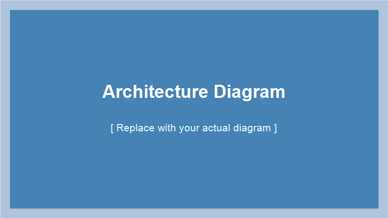
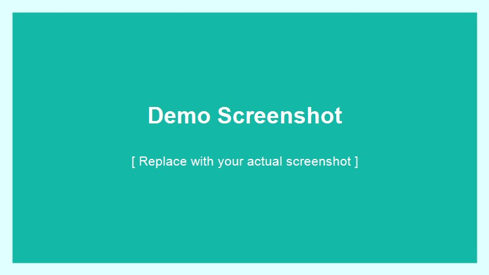

Short summary that appears on the blog listing page (1-2 sentences). Everything above the truncate marker is shown in the preview.

<!-- truncate -->

## Introduction

Write the full post content here. This section is only shown when the reader clicks into the post.

## Architecture

The diagram below shows the overall system design:

Explain what the diagram shows. Walk through the key components and how they interact.

## Demo

The screenshot below shows the feature in action:

Describe what the reader is looking at and why it matters.

## Summary

Wrap up the key points. Link to the GitHub repo or related posts if relevant.
