# Architecture Document — CTA Public Transport Optimisation System

<!-- truncate -->

**Version:** 1.0
**Date:** 2026-03-12
**Status:** Baselined
**Standard:** 4+1 Architectural View Model (Kruchten, 1995)
**Notation:** ArchiMate 3.1 concepts rendered as Mermaid diagrams

---

## Table of Contents

1. [Document Purpose and Scope](#1-document-purpose-and-scope)
2. [Architectural Drivers](#2-architectural-drivers)
3. [Use Case View (+1)](#3-use-case-view-1)
4. [Logical View](#4-logical-view)
5. [Process View](#5-process-view)
6. [Development View](#6-development-view)
7. [Physical View](#7-physical-view)
8. [Architectural Decisions Summary](#8-architectural-decisions-summary)
9. [Risks and Technical Debt](#9-risks-and-technical-debt)

---

## 1. Document Purpose and Scope

### 1.1 Purpose

This document describes the software architecture of the **Chicago Transit Authority (CTA)
Public Transport Optimisation System**.  It is structured according to the **4+1 Architectural
View Model** (Kruchten, IEEE Software 1995), which organises the architecture into five
complementary views, each addressing the concerns of a different stakeholder group:

| View | Primary Audience | Central Concern |
|------|-----------------|-----------------|
| Use Case (+1) | All stakeholders | Scenarios that drive architectural decisions |
| Logical | Architects, developers | Functional decomposition and key abstractions |
| Process | Architects, integrators | Concurrency, data flows, runtime behaviour |
| Development | Developers, build engineers | Module structure, package organisation |
| Physical | Operations, DevOps | Deployment topology, infrastructure mapping |

Diagrams use **Mermaid** syntax and follow **ArchiMate 3.1** layering conventions:
- **Technology Layer** — infrastructure elements (brokers, databases, containers)
- **Application Layer** — software components and their interfaces
- **Business Layer** — business processes and actors that the system serves

### 1.2 System Overview

The system is a real-time streaming pipeline that ingests simulated operational data from the
CTA elevated rail network ("L"), processes it through multiple transformation stages, and presents
a live transit status dashboard.  It demonstrates a full **Event-Driven Architecture (EDA)** on
the Confluent Kafka platform.

### 1.3 Scope

- Three train lines: **Blue**, **Red**, **Green** (each with 10 trains, bidirectional)
- Station arrival events, turnstile ridership counts, and weather telemetry
- Static station reference data from PostgreSQL
- A browser-accessible real-time status dashboard

---

## 2. Architectural Drivers

### 2.1 Quality Attribute Requirements

| ID | Quality Attribute | Scenario | Architectural Response |
|----|-------------------|----------|----------------------|
| QA-01 | **Throughput** | 3 lines × stations × 10 trains produce arrival events every 5 s | 10-partition Kafka topic; AvroProducer batching |
| QA-02 | **Decoupling** | New consumers must not require producer changes | All communication via Kafka topics (no direct calls) |
| QA-03 | **Schema Evolution** | Fields may be added to events over time | Avro + Schema Registry with compatibility enforcement |
| QA-04 | **Replayability** | Dashboard must recover state on restart | Consumers start from `offset_earliest`; Faust rebuilds table from log |
| QA-05 | **Responsiveness** | Dashboard must serve HTTP requests without stalling Kafka polling | Tornado async IO loop; consumers as coroutines |
| QA-06 | **Extensibility** | Station reference data changes without code deployment | Kafka Connect JDBC connector; consumers subscribe to topic |

### 2.2 Constraints

- Python-only application code (no JVM services authored in-house)
- Single-host Docker Compose deployment (development / demonstration environment)
- Confluent Platform 5.2.2 (fixed version)

---

## 3. Use Case View (+1)

The Use Case View captures the key scenarios that motivated and validate the architectural
decisions.  In the 4+1 model this view acts as the glue — each scenario exercises a slice
through every other view.

### 3.1 Actor Diagram

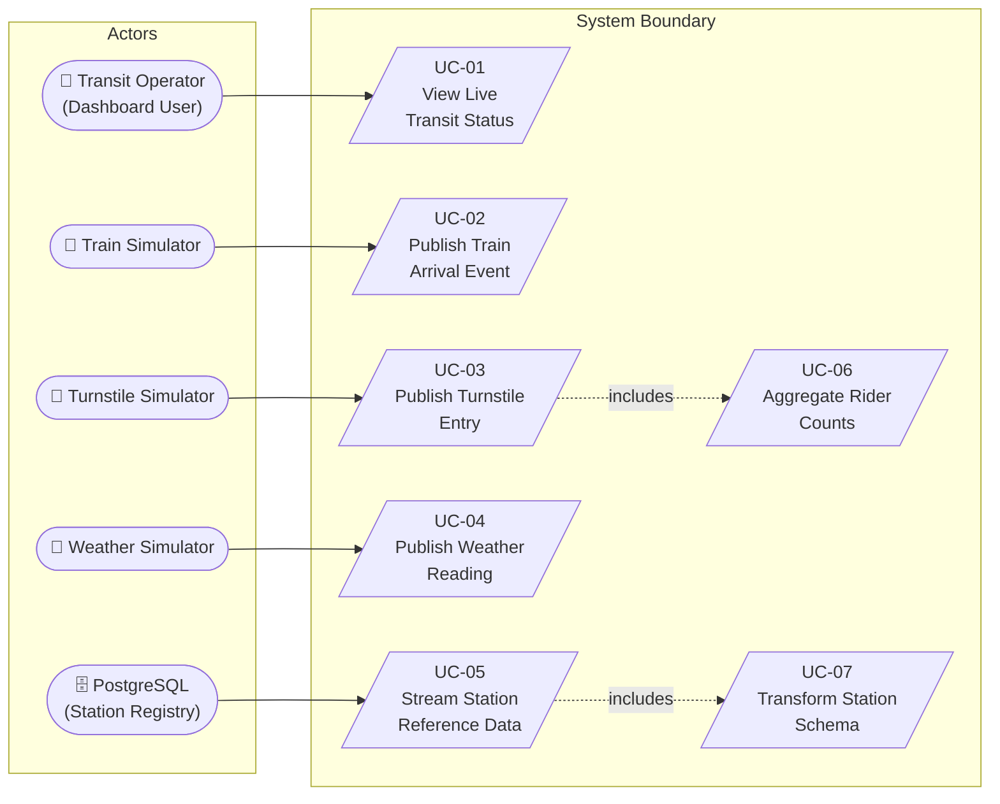

### 3.2 Key Scenarios

#### UC-01 — View Live Transit Status
**Trigger:** Transit operator opens `http://localhost:8888`
**Flow:** Tornado serves `status.html` populated from in-memory `Lines` and `Weather` state
that is continuously updated by four Kafka consumers running as async coroutines.
**Architectural relevance:** Drives the Tornado async server choice (ADR-006) and the
requirement for in-process Kafka consumer coroutines.

#### UC-02 — Publish Train Arrival Event
**Trigger:** Simulation time step advances; a train moves to the next station.
**Flow:** `Station.run()` → `AvroProducer.produce()` → Schema Registry validates Avro →
Kafka topic `org.chicago.cta.station.arrivals.t001` → `KafkaConsumer` in server →
`Lines.process_message()` → UI state updated.
**Architectural relevance:** Establishes the end-to-end Kafka + Avro pipeline (ADR-001, ADR-002).

#### UC-04 — Publish Weather Reading
**Trigger:** Simulation hour boundary.
**Flow:** `Weather.run()` → HTTP POST to Kafka REST Proxy → Kafka topic
`org.chicago.cta.weather.v1` → `KafkaConsumer` in server → `Weather.process_message()`.
**Architectural relevance:** Demonstrates the REST Proxy integration path (ADR-005).

#### UC-06 — Aggregate Rider Counts
**Trigger:** Continuous turnstile events on `com.cta.stations.turnstile.entry`.
**Flow:** KSQL `turnstile` table materialises from topic → KSQL `TURNSTILE_SUMMARY` GROUP BY
aggregation → new Kafka topic → `KafkaConsumer (is_avro=False)` in server → UI ridership count.
**Architectural relevance:** Drives the KSQL aggregation decision (ADR-004).

#### UC-07 — Transform Station Schema
**Trigger:** Kafka Connect pushes a raw station row to `com.cta.stations.data.rawt001.stations`.
**Flow:** Faust `transform_stations` agent reads record → resolves `red/blue/green` booleans
to `line` string → writes `TransformedStation` to `org.chicago.cta.stations.table.v1t001`
and updates Faust in-memory table.
**Architectural relevance:** Drives the Faust stream processor choice (ADR-004).

---

## 4. Logical View

The Logical View describes the system's functional decomposition into key abstractions,
their responsibilities, and their relationships.  This view follows ArchiMate's
**Application Layer** notation.

### 4.1 Component Overview

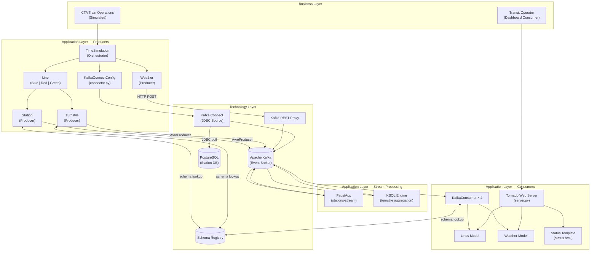

### 4.2 Key Abstractions

#### Producer Hierarchy

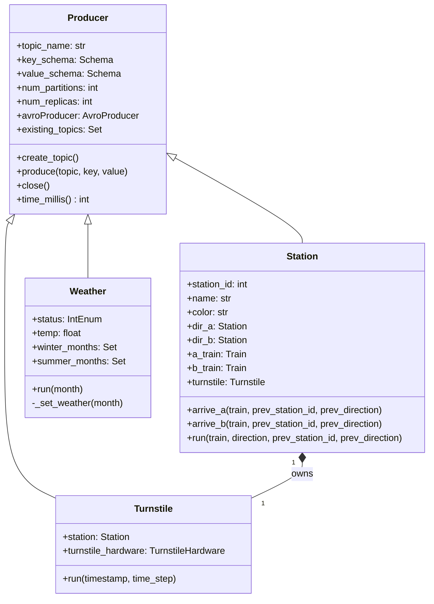

#### Consumer / Model Hierarchy

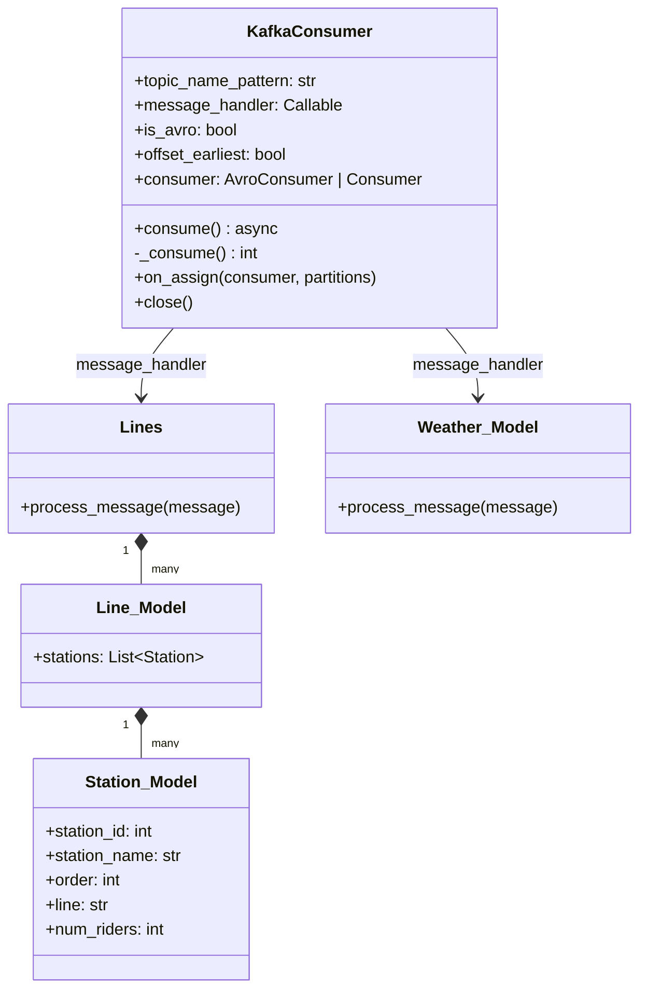

### 4.3 Kafka Topic Catalogue

| Topic | Producer | Consumer(s) | Format | Partitions |
|-------|----------|-------------|--------|------------|
| `org.chicago.cta.station.arrivals.t001` | Station (AvroProducer) | Tornado server | Avro | 10 |
| `com.cta.stations.turnstile.entry` | Turnstile (AvroProducer) | KSQL | Avro | 10 |
| `org.chicago.cta.weather.v1` | Weather (REST Proxy) | Tornado server | Avro | 10 |
| `com.cta.stations.data.rawt001.stations` | Kafka Connect JDBC | Faust | JSON (Connect) | 1 |
| `org.chicago.cta.stations.table.v1t001` | Faust | Tornado server | JSON | 1 |
| `TURNSTILE_SUMMARY` | KSQL | Tornado server | JSON | — |

---

## 5. Process View

The Process View describes the system's dynamic behaviour — how processes start, how data
flows between them at runtime, and how concurrency is managed.

### 5.1 System Startup Sequence

The diagram below shows the mandatory startup order.  Components further right depend on
components to their left being fully initialised.

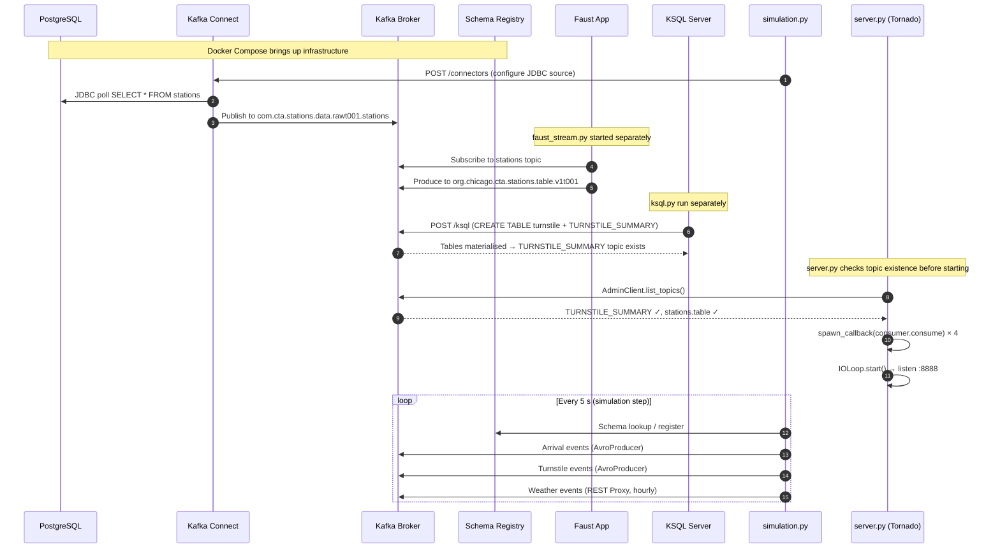

### 5.2 End-to-End Data Flow — Train Arrival

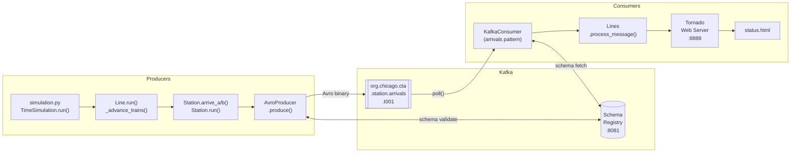

### 5.3 End-to-End Data Flow — Turnstile Aggregation

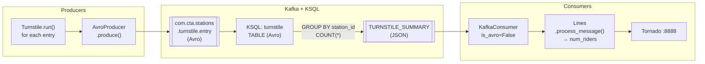

### 5.4 Concurrency Model

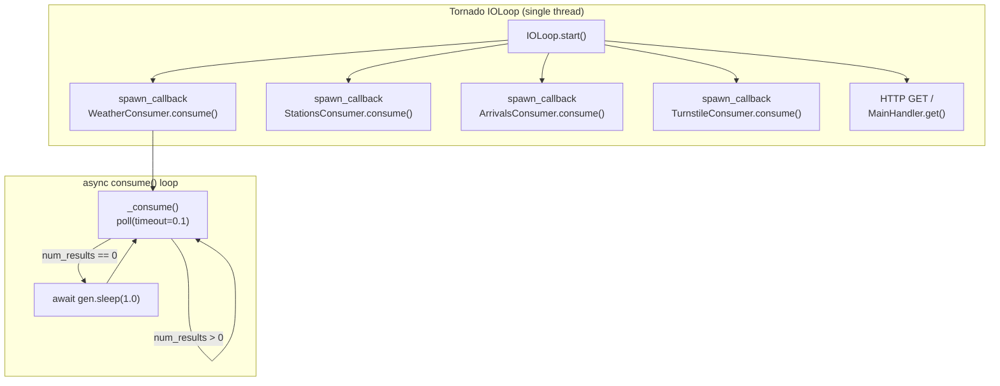

The entire consumer application runs in a **single OS thread** using cooperative multitasking.
Kafka polling is non-blocking (0.1 s timeout).  The HTTP handler is synchronous but executes
between coroutine yield points, keeping UI latency low.

---

## 6. Development View

The Development View describes the organisation of the software in the development environment —
module structure, package dependencies, and build artefacts.

### 6.1 Module Structure

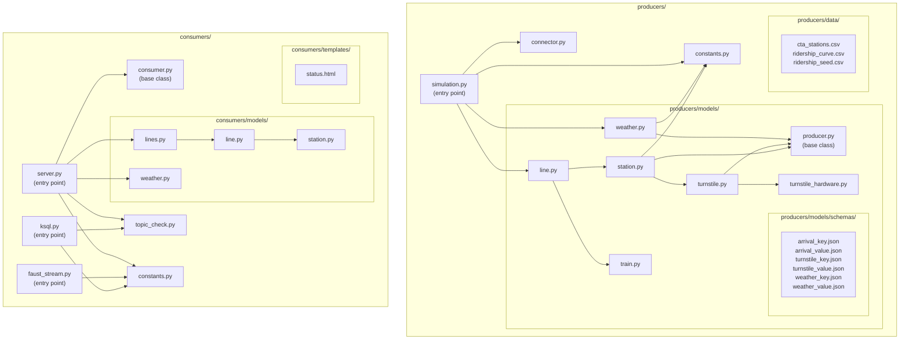

### 6.2 Package Dependencies

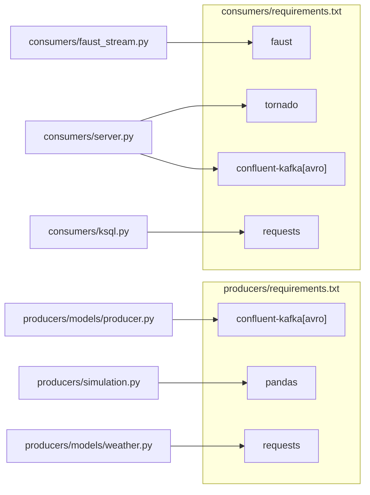

### 6.3 Entry Points and Startup Commands

| Process | Entry Point | Command |
|---------|------------|---------|
| Data producer + simulation | `producers/simulation.py` | `python simulation.py` |
| Station stream transformer | `consumers/faust_stream.py` | `faust -A faust_stream worker -l info` |
| Turnstile KSQL setup | `consumers/ksql.py` | `python ksql.py` |
| Dashboard web server | `consumers/server.py` | `python server.py` |

> **Note:** Processes 2, 3, and 4 have an implicit startup ordering dependency.
> The Kafka Connect JDBC connector (configured by the simulation) must produce station data
> before the Faust app can transform it; the KSQL tables must exist before the dashboard starts.
> There is no orchestration script enforcing this order.

---

## 7. Physical View

The Physical View maps software components onto physical (or virtualised) infrastructure.
This view follows ArchiMate's **Technology Layer**.

### 7.1 Container Deployment Diagram

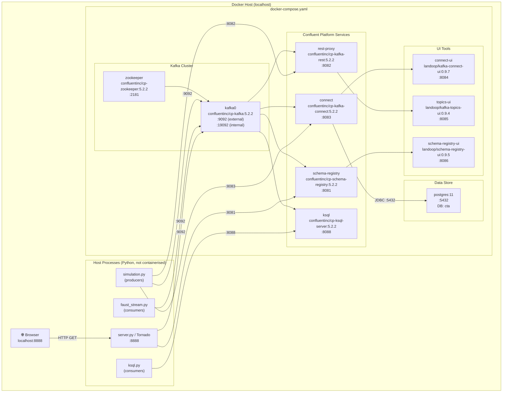

### 7.2 Network Port Map

| Port | Service | Protocol | Consumer(s) |
|------|---------|----------|-------------|
| 2181 | Zookeeper | TCP | Kafka broker (internal) |
| 9092 | Kafka broker | PLAINTEXT | Python producers, Python consumers, Faust |
| 8081 | Schema Registry | HTTP | AvroProducer, AvroConsumer, Kafka Connect |
| 8082 | Kafka REST Proxy | HTTP | Weather producer |
| 8083 | Kafka Connect REST API | HTTP | `connector.py` setup |
| 8084 | Connect UI | HTTP | Operator browser |
| 8085 | Topics UI | HTTP | Operator browser |
| 8086 | Schema Registry UI | HTTP | Operator browser |
| 8088 | KSQL Server | HTTP | `ksql.py` setup |
| 5432 | PostgreSQL | TCP | Kafka Connect JDBC |
| 8888 | Tornado Dashboard | HTTP | Transit Operator browser |

### 7.3 Data Persistence Boundary

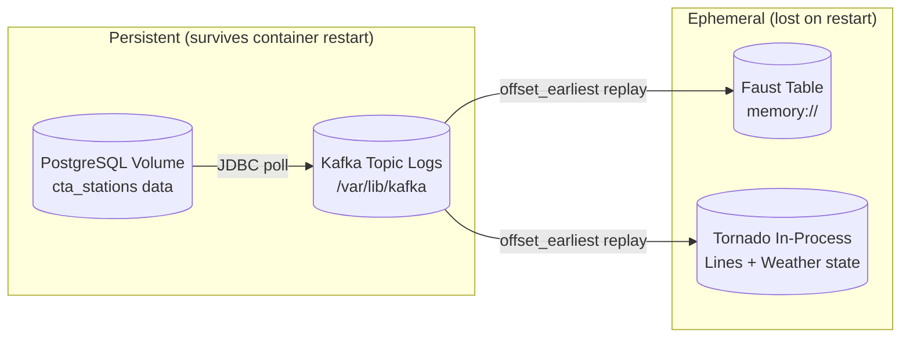

All in-process state is rebuilt from Kafka on restart.  Durable state exists only in PostgreSQL
(station reference data) and the Kafka topic logs.

---

## 8. Architectural Decisions Summary

Cross-reference to the detailed ADR documents in `docs/adr/`.

| ID | Decision | Rationale | ADR |
|----|---------|-----------|-----|
| AD-01 | Apache Kafka as the central event bus | Decoupling, replayability, fan-out | [ADR-001](adr/ADR-001-kafka-as-central-event-bus.md) |
| AD-02 | Avro + Schema Registry for all first-party topics | Schema evolution, contract enforcement | [ADR-002](adr/ADR-002-avro-schema-registry.md) |
| AD-03 | Kafka Connect JDBC Source for PostgreSQL | Zero custom ingestion code; handles offset/retry | [ADR-003](adr/ADR-003-kafka-connect-jdbc-postgres.md) |
| AD-04 | Faust for station transformation | Python-native; record-level transform | [ADR-004](adr/ADR-004-dual-stream-processing-faust-ksql.md) |
| AD-05 | KSQL for turnstile aggregation | Declarative SQL GROUP BY; no Python state management | [ADR-004](adr/ADR-004-dual-stream-processing-faust-ksql.md) |
| AD-06 | Kafka REST Proxy for weather | Demonstrates HTTP-based produce path | [ADR-005](adr/ADR-005-rest-proxy-for-weather-producer.md) |
| AD-07 | Tornado async web server | Single-thread concurrency for Kafka + HTTP | [ADR-006](adr/ADR-006-tornado-async-dashboard.md) |

---

## 9. Risks and Technical Debt

### 9.1 Risks

| ID | Risk | Severity | Affected View | Mitigation |
|----|------|----------|---------------|------------|
| R-01 | Single Kafka broker — SPOF | High | Physical | Add 2 additional brokers; set `replication_factor=3` |
| R-02 | Replication factor 1 on all topics | High | Physical | Increase to 3 in production |
| R-03 | Hard-coded `localhost` addresses in both `constants.py` files | Medium | Development | Externalise via environment variables or a config file |
| R-04 | Hard-coded DB credentials in `connector.py` | High | Physical | Use Kafka Connect secrets management or environment injection |
| R-05 | Manual startup ordering with no orchestration | Medium | Process | Add a readiness-check script or use `depends_on` with health checks |
| R-06 | `AvroProducer` is a deprecated Confluent API | Medium | Development | Migrate to `SerializingProducer` + `AvroSerializer` |

### 9.2 Technical Debt

| ID | Description | Location | Effort |
|----|-------------|----------|--------|
| TD-01 | `TURNSTILE_SUMMARY` uses JSON while all other topics use Avro — inconsistency in serialisation convention | `consumers/ksql.py`, `consumers/server.py:87` | Low |
| TD-02 | Faust Table uses `store="memory://"` — state lost on restart, rebuild time increases with topic size | `consumers/faust_stream.py:38` | Medium |
| TD-03 | Both `producers/constants.py` and `consumers/constants.py` duplicate identical constant values | Both files | Low |
| TD-04 | No unit or integration tests present in the repository | Entire codebase | High |
| TD-05 | Weather schema JSON loaded on every `Weather.__init__` call via file I/O (class variables mitigate partially) | `producers/models/weather.py:49-55` | Low |
| TD-06 | `connector.py` exits the process on connector creation failure, preventing graceful recovery | `producers/connector.py:51-53` | Low |

---

*Document generated by reverse-engineering the source code on 2026-03-12.
All diagrams use [Mermaid](https://mermaid.js.org/) and render natively on GitHub.*
