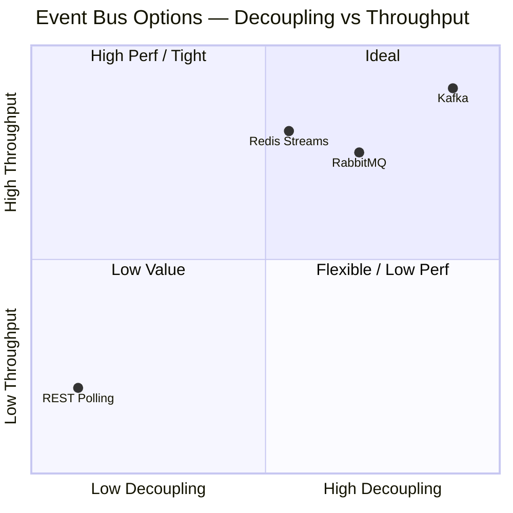
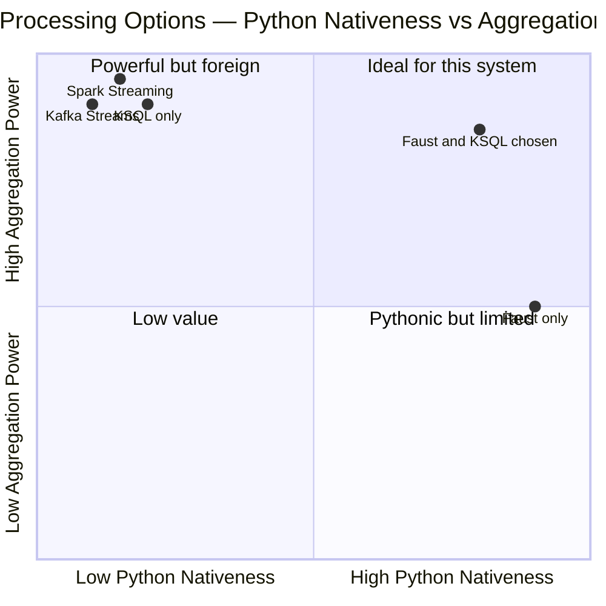
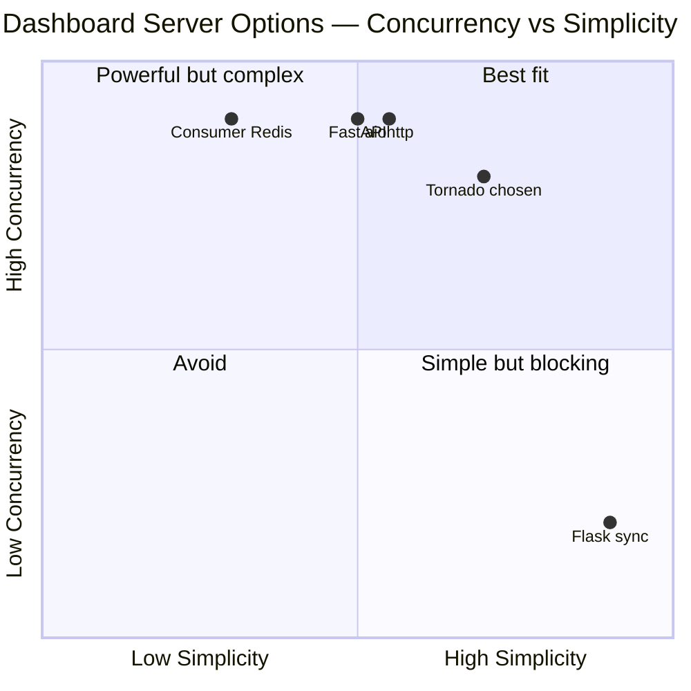
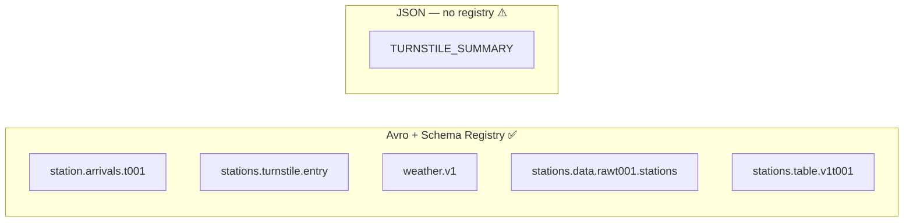
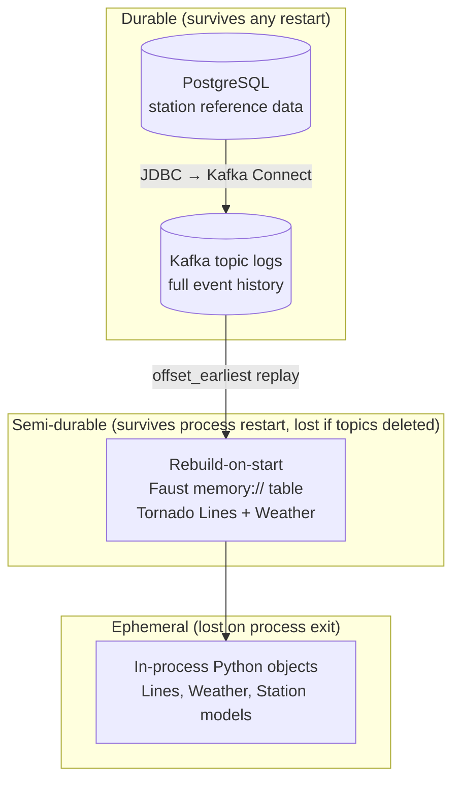
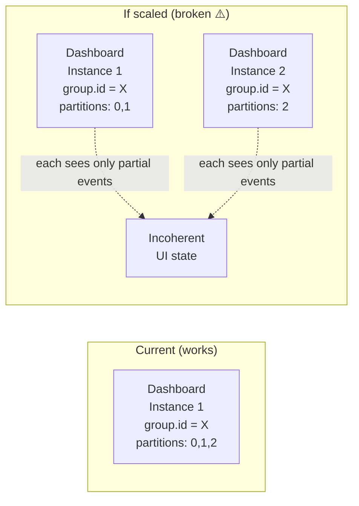
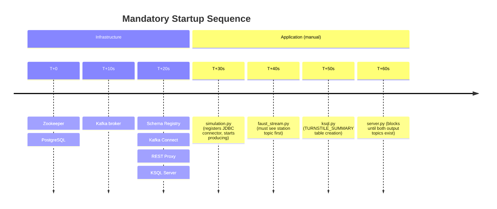

# Architectural Trade-off Analysis — CTA Public Transport Optimisation System

<!-- truncate -->

**Version:** 1.0
**Date:** 2026-03-12
**Authors:** Architecture Review (reverse-engineered from codebase)
**References:** [architecture.md](architecture.md) · [ADR-001](adr/ADR-001-kafka-as-central-event-bus.md) through [ADR-006](adr/ADR-006-tornado-async-dashboard.md)

---

## Table of Contents

1. [Evaluation Framework](#1-evaluation-framework)
2. [Decision Trade-off Analysis](#2-decision-trade-off-analysis)
   - 2.1 [Event Bus — Kafka vs Alternatives](#21-event-bus--kafka-vs-alternatives)
   - 2.2 [Serialisation — Avro vs Alternatives](#22-serialisation--avro-vs-alternatives)
   - 2.3 [DB Ingestion — Kafka Connect vs Custom Producer](#23-db-ingestion--kafka-connect-vs-custom-producer)
   - 2.4 [Stream Processing — Faust + KSQL vs Alternatives](#24-stream-processing--faust--ksql-vs-alternatives)
   - 2.5 [Weather Producer — REST Proxy vs Native Client](#25-weather-producer--rest-proxy-vs-native-client)
   - 2.6 [Dashboard Server — Tornado vs Alternatives](#26-dashboard-server--tornado-vs-alternatives)
3. [Cross-Cutting Trade-off Analysis](#3-cross-cutting-trade-off-analysis)
   - 3.1 [Serialisation Consistency](#31-serialisation-consistency)
   - 3.2 [State Management Strategy](#32-state-management-strategy)
   - 3.3 [Concurrency Model](#33-concurrency-model)
   - 3.4 [Operational Complexity](#34-operational-complexity)
4. [Architecture Fitness Function](#4-architecture-fitness-function)
5. [Strategic Recommendations](#5-strategic-recommendations)
6. [Trade-off Summary Heatmap](#6-trade-off-summary-heatmap)

---

## 1. Evaluation Framework

Every trade-off is scored against the six quality attributes (QAs) derived from the system's
architectural drivers (see `architecture.md §2`).

### 1.1 Quality Attribute Weights

| ID | Quality Attribute | Weight | Justification |
|----|-------------------|--------|---------------|
| QA-01 | **Throughput** | 20 % | System processes events from 3 lines × stations × 10 trains @ 5 s intervals |
| QA-02 | **Decoupling** | 20 % | Producers and consumers must evolve independently |
| QA-03 | **Schema Evolution** | 15 % | Fields may be added; consumers must not break |
| QA-04 | **Replayability** | 15 % | Dashboard must rebuild state on restart |
| QA-05 | **Responsiveness** | 15 % | Dashboard HTTP latency must not stall Kafka polling |
| QA-06 | **Extensibility** | 15 % | New data sources/consumers without code changes |

### 1.2 Scoring Scale

| Score | Meaning |
|-------|---------|
| 5 | Fully meets the quality attribute |
| 4 | Meets with minor gaps |
| 3 | Partial / neutral |
| 2 | Partially undermines the quality attribute |
| 1 | Significantly undermines the quality attribute |

### 1.3 Risk Scale

| Level | Symbol | Meaning |
|-------|--------|---------|
| Critical | 🔴 | Likely to cause production incidents |
| High | 🟠 | Significant impact under normal load |
| Medium | 🟡 | Impact under edge cases or growth |
| Low | 🟢 | Manageable with standard practices |

---

## 2. Decision Trade-off Analysis

### 2.1 Event Bus — Kafka vs Alternatives

> **Decision:** ADR-001 — Apache Kafka as the single event bus

#### Weighted Scoring Matrix

| Quality Attribute | Weight | **Kafka** | RabbitMQ | Redis Streams | REST Polling |
|-------------------|--------|-----------|----------|---------------|--------------|
| Throughput (QA-01) | 20 % | **5** | 4 | 4 | 2 |
| Decoupling (QA-02) | 20 % | **5** | 4 | 3 | 1 |
| Schema Evolution (QA-03) | 15 % | **5** | 3 | 2 | 2 |
| Replayability (QA-04) | 15 % | **5** | 2 | 3 | 1 |
| Responsiveness (QA-05) | 15 % | 4 | 4 | **5** | 2 |
| Extensibility (QA-06) | 15 % | **5** | 4 | 3 | 1 |
| **Weighted Total** | | **4.85** | 3.55 | 3.30 | 1.55 |

#### Positioning



#### Trade-off Narrative

**Why Kafka wins here:**
Kafka's append-only, partitioned log is the single feature that unlocks **replayability** and
**fan-out** simultaneously — properties that no queue-based broker (RabbitMQ) provides
out of the box. The ability to start a new consumer at `offset_earliest` and rebuild the full
station/weather state is architecturally critical for the dashboard's cold-start scenario.

**What is sacrificed:**
- **Operational simplicity.** Kafka requires Zookeeper (in CP 5.x), Schema Registry, and REST
  Proxy as satellites. A RabbitMQ cluster is simpler to operate.
- **Latency at p99.** Kafka batches records before acknowledgment; for the weather producer that
  posts once per simulated hour, this is irrelevant, but it rules Kafka out for
  sub-millisecond latency use cases.

**Key risk introduced:** 🔴 Single-broker deployment with `replication_factor=1`.
In production, broker failure loses all un-replicated messages.

---

### 2.2 Serialisation — Avro vs Alternatives

> **Decision:** ADR-002 — Apache Avro + Confluent Schema Registry

#### Weighted Scoring Matrix

| Quality Attribute | Weight | **Avro + Registry** | Plain JSON | Protobuf | MessagePack |
|-------------------|--------|---------------------|------------|----------|-------------|
| Throughput (QA-01) | 20 % | **5** | 3 | **5** | 4 |
| Decoupling (QA-02) | 20 % | **5** | 2 | **5** | 2 |
| Schema Evolution (QA-03) | 15 % | **5** | 1 | **5** | 2 |
| Replayability (QA-04) | 15 % | **5** | 3 | 4 | 3 |
| Responsiveness (QA-05) | 15 % | 4 | **5** | 4 | 4 |
| Extensibility (QA-06) | 15 % | **5** | 2 | 4 | 2 |
| **Weighted Total** | | **4.85** | 2.55 | 4.55 | 2.80 |

#### Trade-off Narrative

**Why Avro wins:**
The Schema Registry's compatibility check acts as a **compile-time equivalent at publish-time** —
a field removal or rename is rejected before a single consumer can be broken.  Avro's wire format
embeds only the schema ID (4 bytes), making messages far more compact than equivalent JSON.

**Protobuf is the credible alternative:** Protobuf achieves nearly identical scores. The
differentiator is ecosystem fit: `confluent-kafka-python`'s `AvroProducer`/`AvroConsumer`
were the idiomatic Python Confluent API at CP 5.2.2, whereas Protobuf support required more
boilerplate. Today (Confluent Platform 7+), Protobuf is first-class; migrating would be viable.

**Key inconsistency introduced:** 🟠 `TURNSTILE_SUMMARY` uses JSON while all other topics use
Avro. This forces consumers to branch on `is_avro` and removes schema-enforcement for rider
counts — the metric that most directly feeds the UI.


---

### 2.3 DB Ingestion — Kafka Connect vs Custom Producer

> **Decision:** ADR-003 — Kafka Connect JDBC Source Connector

#### Weighted Scoring Matrix

| Quality Attribute | Weight | **Kafka Connect JDBC** | Custom Python Producer | Direct DB Read in Consumer | Debezium CDC |
|-------------------|--------|------------------------|------------------------|----------------------------|--------------|
| Throughput (QA-01) | 20 % | 4 | 4 | 3 | **5** |
| Decoupling (QA-02) | 20 % | **5** | 3 | 1 | **5** |
| Schema Evolution (QA-03) | 15 % | 3 | 2 | 1 | **5** |
| Replayability (QA-04) | 15 % | **5** | 4 | 1 | **5** |
| Responsiveness (QA-05) | 15 % | 4 | 4 | 2 | 4 |
| Extensibility (QA-06) | 15 % | **5** | 3 | 1 | **5** |
| **Weighted Total** | | **4.35** | 3.30 | 1.55 | **4.85** |

#### Trade-off Narrative

**Why Kafka Connect wins over a custom producer:**
Zero-code ingestion eliminates an entire class of bugs: offset tracking, error handling, and
retry logic are handled by a battle-tested framework.  The connector is **idempotent** — safe
to re-run on simulation restart.

**Why Debezium CDC scores higher but was rejected:**
Debezium captures every INSERT/UPDATE/DELETE via PostgreSQL Write-Ahead Log, which is more
correct (would capture station updates, not just inserts). However, enabling WAL replication
requires DBA-level PostgreSQL configuration (`wal_level=logical`), which is overkill when
the `stations` table is quasi-static reference data loaded once from CSV.

**Hidden cost of the chosen approach:** 🟡 `mode=incrementing` only detects new rows by
monotonically increasing `stop_id`.  A station name correction or line reassignment will
silently remain stale in the Kafka topic and in the dashboard until the connector is manually
reset and replayed.

#### When the decision should be revisited

If station data becomes writable (e.g. an admin UI for updating station names), migrate to
Debezium CDC to capture UPDATE and DELETE events.

---

### 2.4 Stream Processing — Faust + KSQL vs Alternatives

> **Decision:** ADR-004 — Faust for record transformation + KSQL for aggregation

#### Option Space



#### Weighted Scoring Matrix

| Quality Attribute | Weight | **Faust + KSQL** | Faust Only | KSQL Only | Kafka Streams | Spark SS |
|-------------------|--------|-----------------|------------|-----------|---------------|----------|
| Throughput (QA-01) | 20 % | 4 | 4 | **5** | **5** | **5** |
| Decoupling (QA-02) | 20 % | **5** | **5** | **5** | **5** | **5** |
| Schema Evolution (QA-03) | 15 % | 4 | 4 | 4 | **5** | 4 |
| Replayability (QA-04) | 15 % | 3 | 3 | 4 | **5** | **5** |
| Responsiveness (QA-05) | 15 % | 4 | 4 | 4 | 4 | 3 |
| Extensibility (QA-06) | 15 % | **5** | 4 | 4 | **5** | 4 |
| **Weighted Total** | | **4.20** | 4.00 | 4.35 | **4.80** | 4.35 |

#### Trade-off Narrative

**The dual-engine pattern is a deliberate pedagogical trade-off:**
The use of two tools increases operational complexity (two processes, two different programming
models) but each tool is used where it excels:

| Concern | Faust | KSQL |
|---------|-------|------|
| Programming model | Async Python coroutines | Declarative SQL |
| Best for | Arbitrary code logic, Python type safety | GROUP BY, windowed aggregations |
| State store | In-memory (dev) / RocksDB (prod) | Kafka-backed materialised table |
| Restart behaviour | Replays topic from earliest | Persistent table survives restart |

**Key risk:** 🟡 Faust's `store="memory://"` means station state is rebuilt from the full topic
on every restart.  As the station topic grows this adds startup latency.  Replace with
`store="rocksdb://"` for a persistent local state store.

**Operational debt:** 🟠 No orchestration enforces the startup order:
1. Kafka Connect must publish station data
2. Faust must transform it
3. KSQL must create `TURNSTILE_SUMMARY`
4. Only then can the dashboard start

A failure anywhere in this chain requires manual intervention.

---

### 2.5 Weather Producer — REST Proxy vs Native Client

> **Decision:** ADR-005 — Kafka REST Proxy for the Weather producer

#### Weighted Scoring Matrix

| Quality Attribute | Weight | **REST Proxy** | Native AvroProducer |
|-------------------|--------|----------------|---------------------|
| Throughput (QA-01) | 20 % | 3 | **5** |
| Decoupling (QA-02) | 20 % | **5** | **5** |
| Schema Evolution (QA-03) | 15 % | 4 | **5** |
| Replayability (QA-04) | 15 % | **5** | **5** |
| Responsiveness (QA-05) | 15 % | 3 | **5** |
| Extensibility (QA-06) | 15 % | **5** | **5** |
| **Weighted Total** | | **4.10** | **5.00** |

#### Trade-off Narrative

**This decision scores lowest of all six** because there is no functional reason to diverge from
the native client — only demonstration value.

| Dimension | REST Proxy | Native AvroProducer |
|-----------|-----------|---------------------|
| Extra network hop | Yes (+ ~1–5 ms per request) | No |
| Schema sent in every request | Yes (wasteful, ~2 KB) | No (schema ID only after first register) |
| Error handling | Silent drop on HTTP failure | Delivery callback with retry |
| Maintenance burden | Two integration patterns to understand | One |
| Polyglot value | Useful if producer is non-Python | Not applicable here |

**Verdict:** 🟡 The REST Proxy choice adds cognitive overhead for no functional gain in a
Python-only system.  If the goal is demonstration, the inconsistency should be documented
clearly (it now is in ADR-005).  For a production system, weather should use `AvroProducer`
like every other producer, and the REST Proxy demo should be a separate isolated example.

---

### 2.6 Dashboard Server — Tornado vs Alternatives

> **Decision:** ADR-006 — Tornado async web server

#### Weighted Scoring Matrix

| Quality Attribute | Weight | **Tornado** | Flask (sync) | aiohttp | FastAPI | Separate Consumer + Redis |
|-------------------|--------|-------------|--------------|---------|---------|--------------------------|
| Throughput (QA-01) | 20 % | 4 | 2 | **5** | **5** | **5** |
| Decoupling (QA-02) | 20 % | 4 | 4 | 4 | 4 | **5** |
| Schema Evolution (QA-03) | 15 % | 4 | 4 | 4 | 4 | 4 |
| Replayability (QA-04) | 15 % | **5** | 3 | **5** | **5** | 4 |
| Responsiveness (QA-05) | 15 % | **5** | 2 | **5** | **5** | **5** |
| Extensibility (QA-06) | 15 % | 4 | 3 | 4 | **5** | 4 |
| **Weighted Total** | | **4.30** | 2.90 | **4.65** | **4.65** | 4.45 |

#### Positioning



#### Trade-off Narrative

**Why Tornado is a reasonable but not optimal choice:**
Tornado's `IOLoop` integrates naturally with `confluent_kafka`'s callback-based API and was the
idiomatic async web server in the Python ecosystem before `asyncio` matured.  The chosen design
— `spawn_callback` for consumers, synchronous GET handler — achieves the goal with minimal code.

**aiohttp / FastAPI score higher today** because:
- Both are built natively on `asyncio` (no legacy compatibility shim)
- FastAPI provides automatic OpenAPI documentation
- The `aiokafka` library provides a fully async consumer compatible with both

**Flask's fatal flaw in this context:** A synchronous web server cannot co-locate Kafka
consumer polling in the same process without threads.  Using threads reintroduces shared-state
locking complexity that the async model eliminates.

**Key risk:** 🟡 All four consumers share a single Kafka `group.id`.  Starting a second
dashboard instance would split partition ownership, causing each instance to see only a
subset of events — producing an incoherent UI state.

---

## 3. Cross-Cutting Trade-off Analysis

### 3.1 Serialisation Consistency

The system uses **two serialisation formats** across its six topics:



| Dimension | Avro path (5 topics) | JSON path (TURNSTILE_SUMMARY) |
|-----------|---------------------|-------------------------------|
| Schema enforcement | Registry rejects breaking changes | None |
| Consumer code | `AvroConsumer` (auto-deserialise) | Manual JSON decode |
| Wire size | Compact (schema ID only) | Verbose |
| Debuggability | Schema Registry UI | Raw JSON readable in Topics UI |
| Risk of silent breakage | Low | **High** |

**Recommendation:** Register an Avro schema for `TURNSTILE_SUMMARY` and change
`VALUE_FORMAT='AVRO'` in the KSQL CREATE TABLE statement. This removes the `is_avro=False`
branch from the consumer and makes the serialisation model uniform.

---

### 3.2 State Management Strategy

The system employs three distinct state-management patterns with different durability guarantees:



| State Store | Pattern | Cold-Start Cost | Data Loss Risk | Recovery |
|-------------|---------|----------------|----------------|----------|
| PostgreSQL | Source of truth | None | Low (volume) | Re-seed from CSV |
| Kafka logs | Event log | None | 🔴 `replication_factor=1` | None if broker lost |
| Faust table (`memory://`) | Materialised view | Replay full topic | None (replays) | Automatic |
| Tornado in-process | Derived state | Replay all 4 topics | None (replays) | Automatic |

**Structural tension:** The design makes all in-process state **reconstruct-able from Kafka**,
which is elegant and correct.  However, it assumes the Kafka logs are themselves durable —
an assumption violated by `replication_factor=1`.

---

### 3.3 Concurrency Model

Three different concurrency approaches coexist across the system:

| Component | Concurrency Model | Thread-safe? | Scale-out strategy |
|-----------|------------------|--------------|-------------------|
| `simulation.py` | Sequential (single Python process, no async) | N/A | N/A |
| `faust_stream.py` | Asyncio event loop (Faust worker) | Yes | Multiple Faust worker instances |
| `ksql.py` | Single HTTP request, then exits | N/A | N/A |
| `server.py` | Tornado IOLoop + `spawn_callback` coroutines | Single-thread cooperative | 🔴 Blocked by shared `group.id` |

**Scale-out constraint for the dashboard:**



**Fix:** Each dashboard instance should use a **unique `group.id`** (e.g. append a UUID suffix)
so every instance receives the full partition set and sees all events.

---

### 3.4 Operational Complexity

The system requires **7 infrastructure containers + 4 Python processes** to be started in a
specific order:



**Total components: 11**

| Layer | Components | Startup dependencies | Failure impact |
|-------|------------|---------------------|----------------|
| Infrastructure | 7 Docker containers | Ordered by `depends_on` | Total system down |
| Producers | 1 Python process | Kafka + Schema Registry + Connect up | No events produced |
| Stream processors | 2 Python processes | Kafka + producer running | Dashboard sees no data |
| Dashboard | 1 Python process | Stream processors running | No UI |

**Operational risk:** 🟠 There is no automated readiness check or restart policy for the Python
processes.  A crash at any layer requires manual diagnosis and ordered restart.

**Mitigation options:**

| Option | Effort | Benefit |
|--------|--------|---------|
| Add `healthcheck` to `docker-compose.yaml` for each service | Low | Detect infrastructure failures automatically |
| Wrap Python processes in a `Makefile` with retry logic | Low | Reduce manual restart toil |
| Add a startup probe script (`wait-for-it.sh` pattern) | Medium | Enforce ordering without manual timing |
| Convert Python processes to Docker services | Medium | Unified `docker-compose up` startup |
| Migrate to Kubernetes with init containers + readiness probes | High | Production-grade orchestration |

---

## 4. Architecture Fitness Function

A fitness function scores how well the **as-built** architecture meets each quality attribute.

```
Scale: ████████░░ = partially met   ██████████ = fully met   ████░░░░░░ = significantly unmet
```

| QA | Attribute | Current Score | Evidence | Gap |
|----|-----------|:-------------:|---------|-----|
| QA-01 | Throughput | 🟢 4.0/5 | Kafka partitioning, AvroProducer batching handle demo load | Single broker caps real scale |
| QA-02 | Decoupling | 🟢 4.5/5 | All flows via Kafka; zero direct service calls | REST Proxy + native producer inconsistency |
| QA-03 | Schema Evolution | 🟡 3.5/5 | Avro + Schema Registry on 5/6 topics | TURNSTILE_SUMMARY bypasses registry |
| QA-04 | Replayability | 🟡 3.5/5 | `offset_earliest` on all consumers; Faust rebuilds | `replication_factor=1` — log loss is unrecoverable |
| QA-05 | Responsiveness | 🟢 4.0/5 | Tornado async model; non-blocking poll | Hard `exit(1)` if topics missing blocks startup |
| QA-06 | Extensibility | 🟢 4.5/5 | New consumers subscribe without producer changes | Startup ordering is implicit, not automated |

**Overall fitness: 4.0 / 5.0 (80 %) — suitable for demonstration, not production**

---

## 5. Strategic Recommendations

Prioritised by risk reduction value vs implementation effort:

### Priority 1 — Critical (address before any production use)

| # | Recommendation | ADR | Risk Addressed | Effort |
|---|---------------|-----|----------------|--------|
| P1-1 | Set `replication_factor=3` on all topics; add 2 Kafka brokers | ADR-001 | 🔴 Data loss on broker failure | Medium |
| P1-2 | Externalise all credentials (`DB_USER`, `DB_PASS`, `BOOTSTRAP_SERVERS`) to environment variables | ADR-003 | 🔴 Credential exposure | Low |
| P1-3 | Assign unique `group.id` per dashboard instance | ADR-006 | 🔴 Incoherent state on scale-out | Low |

### Priority 2 — High (address in first production sprint)

| # | Recommendation | ADR | Risk Addressed | Effort |
|---|---------------|-----|----------------|--------|
| P2-1 | Register Avro schema for `TURNSTILE_SUMMARY`; change `VALUE_FORMAT='AVRO'` | ADR-002 | 🟠 Silent schema breaks on rider count | Low |
| P2-2 | Replace `AvroProducer` with `SerializingProducer` + `AvroSerializer` | ADR-002 | 🟠 Deprecated API removal | Medium |
| P2-3 | Add automated startup ordering (health checks + wait scripts) | ADR-004 | 🟠 Manual restart toil on failure | Medium |
| P2-4 | Replace `store="memory://"` with `store="rocksdb://"` in Faust | ADR-004 | 🟠 Startup latency grows with topic size | Low |

### Priority 3 — Medium (address in backlog)

| # | Recommendation | ADR | Risk Addressed | Effort |
|---|---------------|-----|----------------|--------|
| P3-1 | Unify all producers to use `AvroProducer`; remove REST Proxy dependency | ADR-005 | 🟡 Cognitive overhead for maintainers | Low |
| P3-2 | Migrate `faust_stream.py` + `server.py` to FastAPI + aiokafka | ADR-006 | 🟡 Tornado is legacy; FastAPI is modern async standard | High |
| P3-3 | Merge the two `constants.py` files into a shared config module | — | 🟡 Duplication / drift risk | Low |
| P3-4 | Add unit tests for all producer models and consumer models | — | 🟡 No regression safety net | High |

---

## 6. Trade-off Summary Heatmap

The heatmap below shows the contribution of each architectural decision (rows) to each quality
attribute (columns).  Green = positive contribution; Red = negative contribution.

| Decision | Throughput | Decoupling | Schema Evol. | Replayability | Responsiveness | Extensibility | **Net** |
|----------|:----------:|:----------:|:------------:|:-------------:|:--------------:|:-------------:|:-------:|
| **ADR-001** Kafka | 🟢🟢 | 🟢🟢 | 🟢🟢 | 🟢🟢 | 🟡 | 🟢🟢 | **+11** |
| **ADR-002** Avro | 🟢 | 🟢🟢 | 🟢🟢 | 🟢🟢 | 🟡 | 🟢🟢 | **+9** |
| **ADR-003** Connect | 🟡 | 🟢🟢 | 🟡 | 🟢🟢 | 🟡 | 🟢🟢 | **+7** |
| **ADR-004** Faust+KSQL | 🟢 | 🟢🟢 | 🟡 | 🔴 | 🟡 | 🟢🟢 | **+5** |
| **ADR-005** REST Proxy | 🔴 | 🟢 | 🟡 | 🟢 | 🔴 | 🟢 | **+1** |
| **ADR-006** Tornado | 🟡 | 🟡 | 🟡 | 🟢🟢 | 🟢🟢 | 🟡 | **+5** |
| **ADR-002 gap** JSON KSQL | 🟡 | 🟡 | 🔴🔴 | 🟡 | 🟡 | 🟡 | **-3** |
| **ADR-001 gap** RF=1 | 🟡 | 🟡 | 🟡 | 🔴🔴 | 🟡 | 🟡 | **-3** |

**Key:**
- 🟢🟢 Strong positive (+2)
- 🟢 Positive (+1)
- 🟡 Neutral (0)
- 🔴 Negative (−1)
- 🔴🔴 Strong negative (−2)

### Overall Assessment

The core architectural spine — **Kafka + Avro + Schema Registry + Kafka Connect** — scores
highly and is well-suited to the problem.  The gaps are concentrated in two areas:

1. **Operational resilience** (single broker, no startup orchestration)
2. **Serialisation consistency** (KSQL JSON bypass undermines the otherwise strong Avro contract)

Addressing the P1 recommendations above would raise the overall fitness score from
**4.0 / 5.0 → ~4.6 / 5.0**, making the architecture production-worthy.

---

*Trade-off analysis generated by reverse-engineering source code as of 2026-03-12.
Weighted scores are analytical judgements based on code evidence, not empirical benchmarks.*
