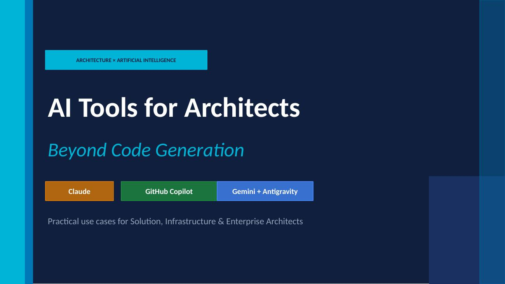
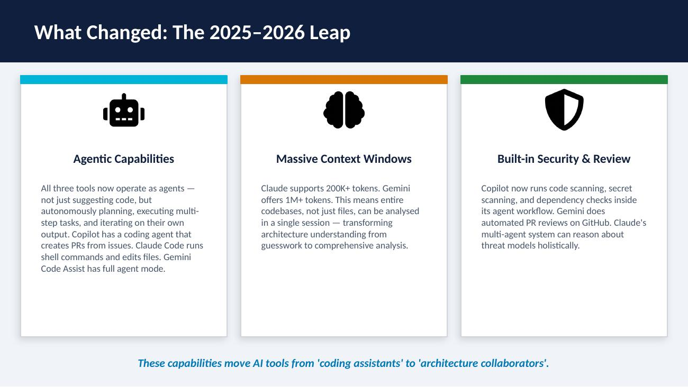
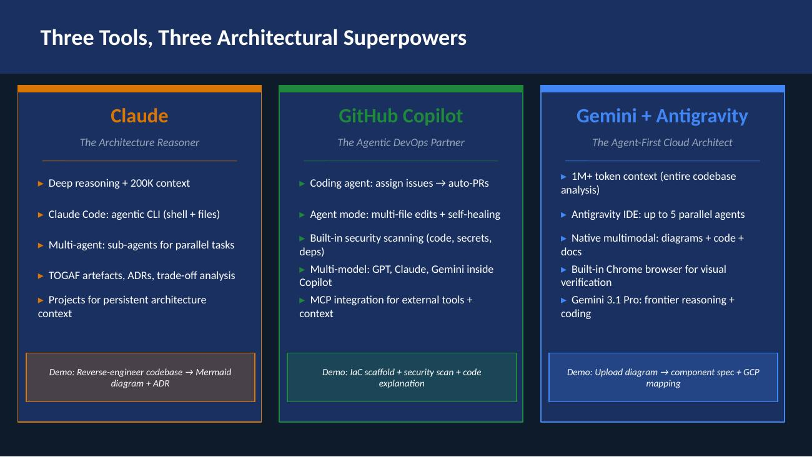
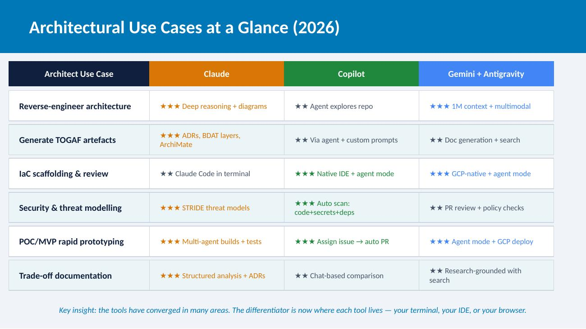
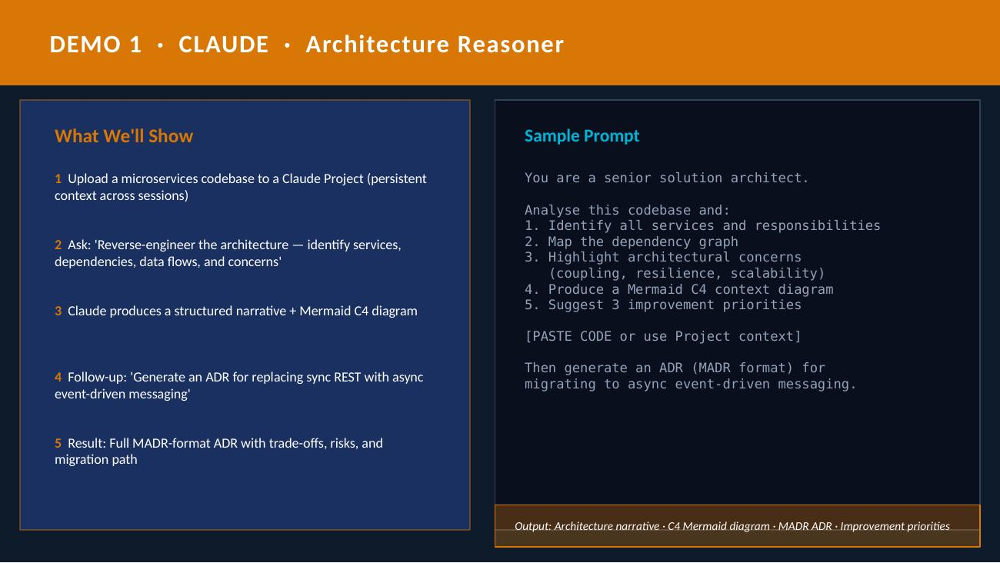
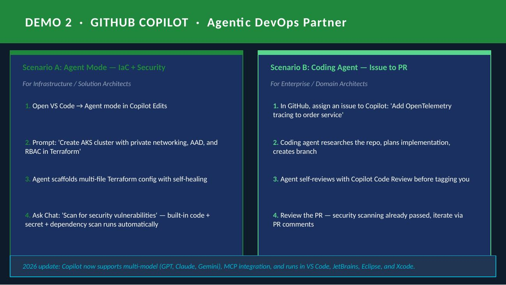
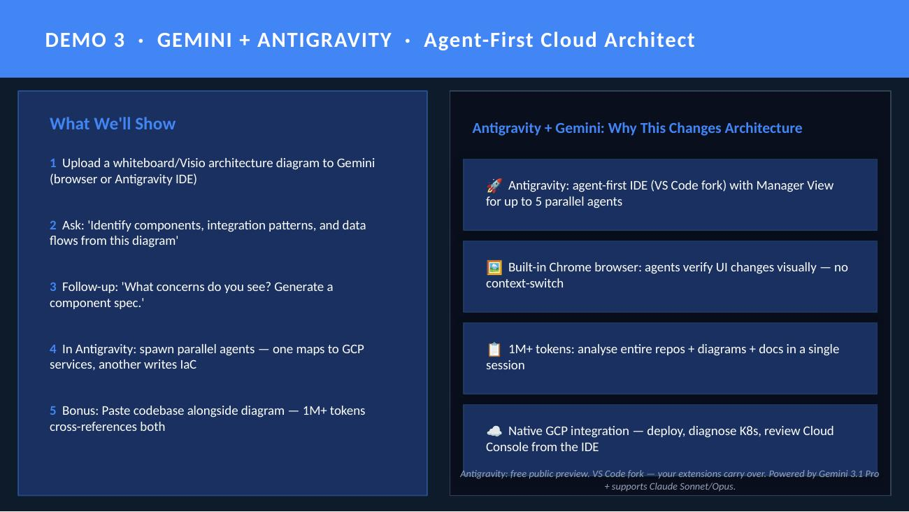
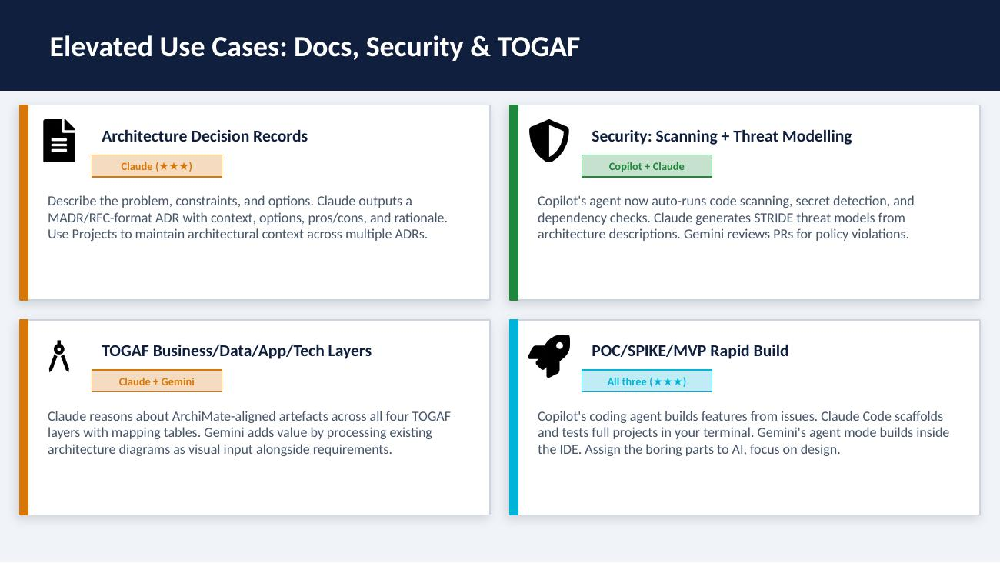
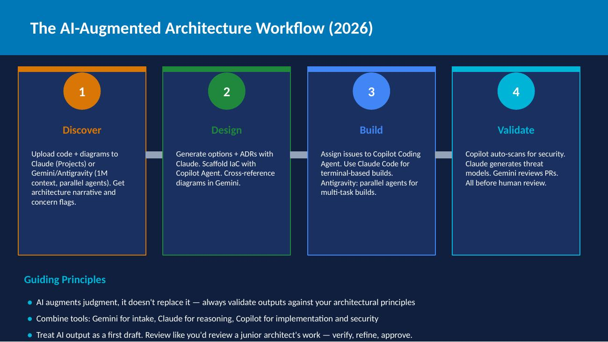
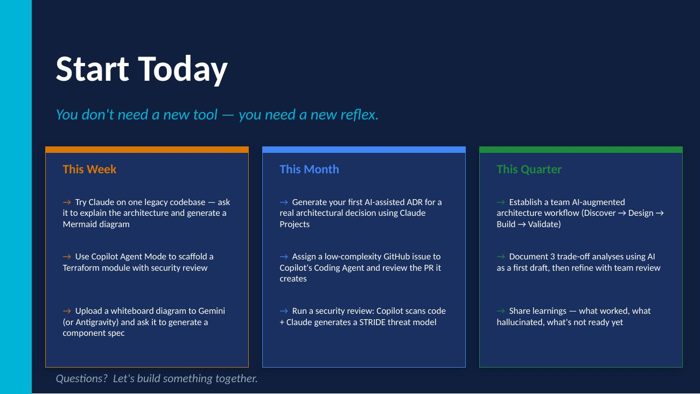

## AI Tools for Architects: Beyond Code Generation - Evaluation of alternatives and Suitability

> **Practical use cases for Solution, Infrastructure & Enterprise Architects**
> Featuring **Claude**, **GitHub Copilot**, and **Gemini + Antigravity**

The rapid explosion of number LLMs and AI tools to assist software engineers and architects are kind of mind boggling. Selecting the righ tools for each use case can be a daunding task. I have been experimenting with three super powers, Claude Code, GitHub Copilot + Vs Code and Antigravity+Gemini. The variations such as using Cursor with Claude can easily be derived from the below.

This article also shares a GitHub repo where it demonstrate some of the architecture use cases

---

## Table of Contents

| #   | Slide                                                                                       | Topic                                            |
| --- | ------------------------------------------------------------------------------------------- | ------------------------------------------------ |
| 1   | [Title](#1-title)                                                                           | AI Tools for Architects — Beyond Code Generation |
| 2   | [What Changed](#2-what-changed-the-20252026-leap)                                           | The 2025–2026 Leap                               |
| 3   | [Three Superpowers](#3-three-tools-three-architectural-superpowers)                         | Claude · Copilot · Gemini + Antigravity          |
| 4   | [Use Case Matrix](#4-architectural-use-cases-at-a-glance-2026)                              | Architect use cases rated across all three tools |
| 5   | [Demo 1: Claude](#5-demo-1--claude--architecture-reasoner)                                  | Reverse-engineer architecture → ADR              |
| 6   | [Demo 2: Copilot](#6-demo-2--github-copilot--agentic-devops-partner)                        | IaC scaffold + security scan + coding agent      |
| 7   | [Demo 3: Gemini + Antigravity](#7-demo-3--gemini--antigravity--agent-first-cloud-architect) | Upload diagram → component spec + GCP mapping    |
| 8   | [Elevated Use Cases](#8-elevated-use-cases-docs-security--togaf)                            | ADRs, Security, TOGAF, POC/MVP                   |
| 9   | [Workflow](#9-the-ai-augmented-architecture-workflow-2026)                                  | Discover → Design → Build → Validate             |
| 10  | [Start Today](#10-start-today)                                                              | This Week / This Month / This Quarter actions    |

---

## 1. Three superpowers

<details>
<summary> Notes</summary>

All three tools — Claude, GitHub Copilot, and Google Gemini (including Google's new Antigravity IDE) — have evolved massively in the past year. They're no longer just code generators. They now have agentic capabilities, long context windows, multimodal understanding, and integrated security scanning. This talk shows how architects can leverage each tool's unique strengths for elevated use cases: reverse-engineering architecture, generating TOGAF artefacts, security analysis, and building POC/SPIKEs. Note: Antigravity is Google's agent-first IDE (VS Code fork) released Nov 2025 alongside Gemini 3 — it's the IDE where Gemini truly comes alive.

</details>



**AI Tools for Architects — Beyond Code Generation**

ARCHITECTURE × ARTIFICIAL INTELLIGENCE

Three tools, differentiated by strength: **Claude** · **GitHub Copilot** · **Gemini + Antigravity**


---

## 2. What Changed: The 2025–2026 Leap




### Agentic Capabilities

All three tools now operate as agents — not just suggesting code, but autonomously planning, executing multi-step tasks, and iterating on their own output. Copilot has a coding agent that creates PRs from issues. Claude Code runs shell commands and edits files. Gemini Code Assist has full agent mode.

### Massive Context Windows

Claude supports 200K+ tokens. Gemini offers 1M+ tokens. This means entire codebases, not just files, can be analysed in a single session — transforming architecture understanding from guesswork to comprehensive analysis.

### Built-in Security & Review

Copilot now runs code scanning, secret scanning, and dependency checks inside its agent workflow. Gemini does automated PR reviews on GitHub. Claude's multi-agent system can reason about threat models holistically.

> *These capabilities move AI tools from 'coding assistants' to 'architecture collaborators'.*

<details>
<summary> Key message</summary>

Key message: since late 2025, these are fundamentally different tools than what most architects tried a year ago. The context window expansion is particularly transformative — Gemini's 1M tokens means you can feed an entire microservices codebase. Claude's 200K tokens handles most real-world repos. And agentic mode means the tool doesn't just suggest — it plans, executes, and self-corrects. For architects, this means tasks like 'understand this legacy system' or 'generate a threat model' are now genuinely viable.

</details>

---

## 3. Three Tools, Three Architectural Superpowers



### Claude — *The Architecture Reasoner*

- Deep reasoning + 200K context
- Claude Code: agentic CLI (shell + files)
- Multi-agent: sub-agents for parallel tasks
- TOGAF artefacts, ADRs, trade-off analysis
- Projects for persistent architecture context

**Sample Use cases :** Reverse-engineer codebase → Mermaid diagram + ADR

### GitHub Copilot — *The Agentic DevOps Partner*

- Coding agent: assign issues → auto-PRs
- Agent mode: multi-file edits + self-healing
- Built-in security scanning (code, secrets, deps)
- Multi-model: GPT, Claude, Gemini inside Copilot
- MCP integration for external tools + context

**Sample Use cases:** IaC scaffold + security scan + code explanation

### Gemini + Antigravity — *The Agent-First Cloud Architect*

- 1M+ token context (entire codebase analysis)
- Antigravity IDE: up to 5 parallel agents
- Native multimodal: diagrams + code + docs
- Built-in Chrome browser for visual verification
- Gemini 3.1 Pro: frontier reasoning + coding

**Sample Use case:** Upload diagram → component spec + GCP mapping

<details>
<summary>Recent Updates - 2026</summary>

Updated differentiation for 2026:

**CLAUDE:** No longer just a chat window. Claude Code is a full agentic CLI that runs in your terminal, executes commands, edits files, and uses a multi-agent architecture. It's strongest for deep architectural reasoning — understanding large codebases, generating structured documentation, and trade-off analysis. Projects allow persistent context across sessions.

**COPILOT:** Now has a full coding agent that can be assigned GitHub issues and autonomously creates PRs. Agent mode does multi-file edits with self-healing. Built-in security scanning (code scanning, secret scanning, dependency checks) runs automatically. Multi-model support means you can use Claude or Gemini models inside Copilot.

**GEMINI + ANTIGRAVITY:** 1M+ token context is the headline differentiator for architecture work. Gemini Code Assist now has agent mode in the IDE plus automated PR reviews on GitHub. Native multimodality means you can upload whiteboard photos, Visio diagrams, and architecture screenshots. Gemini 3.1 Pro offers frontier-class reasoning. Antigravity is Google's agent-first IDE — a VS Code fork with a Manager View for up to 5 parallel agents and a built-in Chrome browser for visual verification.

</details>

---

## 4. Architectural Use Cases at a Glance (2026)



| Architect Use Case | Claude | Copilot | Gemini + Antigravity |
|----|----|----|-----|
| **Reverse-engineer architecture** | ★★★ Deep reasoning + diagrams | ★★ Agent explores repo | ★★★ 1M context + multimodal |
| **Generate TOGAF artefacts** | ★★★ ADRs, BDAT layers, ArchiMate | ★★ Via agent + custom prompts | ★★ Doc generation + search |
| **IaC scaffolding & review** | ★★ Claude Code in terminal | ★★★ Native IDE + agent mode | ★★★ GCP-native + agent mode |
| **Security & threat modelling** | ★★★ STRIDE threat models | ★★★ Auto scan: code+secrets+deps | ★★ PR review + policy checks |
| **POC/MVP rapid prototyping** | ★★★ Multi-agent builds + tests | ★★★ Assign issue → auto PR | ★★★ Agent mode + GCP deploy |
| **Trade-off documentation** | ★★★ Structured analysis + ADRs | ★★ Chat-based comparison | ★★ Research-grounded with search |

> *Key insight: the tools have converged in many areas. The differentiator is now where each tool lives — your terminal, your IDE, or your browser.*

<details>
<summary> 2026 Evolution</summary>

Updated matrix reflects 2026 reality: the tools have converged significantly. All three now have agent modes. All can do code explanation and security analysis. The real differentiators are: WHERE the tool lives (terminal/CLI for Claude Code, IDE for Copilot, browser+IDE+cloud for Gemini), CONTEXT SIZE (Gemini wins with 1M tokens), REASONING DEPTH (Claude wins for structured architectural analysis), and WORKFLOW INTEGRATION (Copilot wins — it's embedded in GitHub issues, PRs, and CI/CD).

</details>

---

## 5. Case study Claude · Architecture Reasoner



### What is done?

1. Upload a microservices codebase to a Claude Project (persistent context across sessions)
2. Ask: *"Reverse-engineer the architecture — identify services, dependencies, data flows, and concerns"*
3. Claude produces a structured architecture narrative + Mermaid C4 diagram
4. Follow-up: *"Generate an ADR for replacing sync REST with async event-driven messaging"*
5. Result: Full MADR-format ADR with trade-offs, risks, and migration path

###  Prompts

```
You are a senior solution architect.

Analyse this codebase and:
1. Identify all services and responsibilities
2. Map the dependency graph
3. Highlight architectural concerns
   (coupling, resilience, scalability)
4. Produce a Mermaid C4 context diagram
5. Suggest 3 improvement priorities

[PASTE CODE or use Project context]

Then generate an ADR (MADR format) for
migrating to async event-driven messaging.
```

**Output:** Architecture narrative · C4 Mermaid diagram · MADR ADR · Improvement priorities

<details>
<summary> Case Study</summary>

**1 — Claude** (claude.ai or Claude Code CLI).

**Study  A (Web):** Create a Claude Project, upload the codebase as context, then prompt.
**Study B (CLI):** Use Claude Code in your terminal — it can read files, run commands, and iterate.

Key obsevations:
- Claude's 200K token context handles most real-world repos in one session
- Projects provide persistent context — come back tomorrow and it still knows your codebase
- Multi-agent architecture means Claude spawns sub-agents for parallel analysis
- Claude excels at structured reasoning: ADRs, trade-off docs, TOGAF artefacts
- Mention Claude Code's agentic capabilities: it can read your repo, run tests, and generate diagrams

**IMPORTANT:** This has been a  'thinking partner' study — Claude's strength is deep architectural reasoning, not just code generation.

</details>

---

## 6. Case Study 2 · GitHub Copilot · Agentic DevOps Partner



### Scenario A: Agent Mode — IaC + Security
*For Infrastructure / Solution Architects*

1. Open VS Code → Agent mode in Copilot Edits
2. Prompt: *"Create AKS cluster with private networking, AAD, and RBAC in Terraform"*
3. Agent scaffolds multi-file Terraform config with self-healing
4. Ask Chat: *"Scan for security vulnerabilities"* — built-in code + secret + dependency scan runs automatically

### Scenario B: Coding Agent — Issue to PR
*For Enterprise / Domain Architects*

1. In GitHub, assign an issue to Copilot: *"Add OpenTelemetry tracing to order service"*
2. Coding agent researches the repo, plans implementation, creates branch
3. Agent self-reviews with Copilot Code Review before tagging you
4. Review the PR — security scanning already passed, iterate via PR comments

> *2026 update: Copilot now supports multi-model (GPT, Claude, Gemini), MCP integration, and runs in VS Code, JetBrains, Eclipse, and Xcode.*

<details>
<summary>Observations</summary>

**GitHub Copilot** in VS Code + GitHub.

**Scenario A** shows the updated Agent Mode (not the old chat). In agent mode, Copilot autonomously plans, edits multiple files, runs terminal commands, and self-heals errors. The security scanning is the big update — code scanning, secret scanning, and dependency vulnerability checks now run automatically inside the agent workflow.

**Scenario B** shows the Coding Agent — this is the async, background agent announced May 2025. You assign a GitHub issue to Copilot, and it autonomously researches the repo, creates a plan, implements across multiple files, runs its own code review, runs security scans, and creates a PR. You review when it's done.

Key 2026 updates to mention:
- Multi-model support: you can now use Claude Opus 4.7 or Gemini inside Copilot
- MCP integration: connect external tools (Jira, Slack, databases) to the agent
- Agentic code review: reviews now gather full project context before suggesting changes
- Available in VS Code, JetBrains, Eclipse, Xcode
- Coding agent runs on GitHub Actions infrastructure

</details>

---

## 7. Case Study 3 · Gemini + Antigravity · Agent-First Cloud Architect



### What is done

1. Upload a whiteboard/Visio architecture diagram to Gemini (browser or Antigravity IDE)
2. Ask: *"Identify components, integration patterns, and data flows from this diagram"*
3. Follow-up: *"What concerns do you see? Generate a component spec."*
4. In Antigravity: spawn parallel agents — one maps to GCP services, another writes IaC
5. Bonus: Paste codebase alongside diagram — 1M+ tokens cross-references both

### Antigravity + Gemini: Why This Changes Architecture

- 🚀 **Antigravity:** agent-first IDE (VS Code fork) with Manager View for up to 5 parallel agents
- 🖼️ **Built-in Chrome browser:** agents verify UI changes visually — no context-switch
- 📋 **1M+ tokens:** analyse entire repos + diagrams + docs in a single session
- ☁️ **Native GCP integration** — deploy, diagnose K8s, review Cloud Console from the IDE

> *Antigravity: free public preview. VS Code fork — your extensions carry over. Powered by Gemini 3.1 Pro + supports Claude Sonnet/Opus.*

<details>
<summary>Observations and Notes</summary>

**DEMO 3 — Gemini + Antigravity IDE.**

Antigravity is Google's agent-first IDE, released Nov 2025 alongside Gemini 3. It's a VS Code fork, so all your extensions, keybindings, and themes carry over. But the value is the layer on top:

- **Manager View:** spawn up to 5 parallel agents working on different tasks simultaneously
- **Built-in Chrome browser:** agents can navigate to localhost, interact with UI, take screenshots to verify their own work
- **Multi-model:** Gemini 3.1 Pro (default), Gemini 3 Flash, Claude Sonnet 4.6, Claude Opus 4.6, GPT-OSS-120B
- **Artifacts:** every agent produces structured outputs — plans, diffs, screenshots, test results
- Free in public preview as of May 2026

For the demo: open Antigravity, upload an architecture diagram to Gemini, show the multimodal analysis. Then show the Manager View — spawn one agent to write the component spec, another to generate Terraform for GCP. Show the built-in browser verifying a deployed service.

Key observations for architects: Antigravity shifts your role from 'writer of code' to 'mission controller'. You direct agents, review their artifacts, and focus on architectural decisions. This is the closest any tool comes to the architect-as-orchestrator paradigm.

Note on Gemini ecosystem: Antigravity (IDE), Gemini Code Assist (IDE extension for VS Code/JetBrains), Gemini CLI (terminal tool), Gemini web app (browser). Each serves a different workflow.

</details>

---

## 8. Elevated Use Cases: Docs, Security & TOGAF



### Architecture Decision Records — `Claude (★★★)`

Describe the problem, constraints, and options. Claude outputs a MADR/RFC-format ADR with context, options, pros/cons, and rationale. Use Projects to maintain architectural context across multiple ADRs.

### Security: Scanning + Threat Modelling — `Copilot + Claude`

Copilot's agent now auto-runs code scanning, secret detection, and dependency checks. Claude generates STRIDE threat models from architecture descriptions. Gemini reviews PRs for policy violations.

### TOGAF Business/Data/App/Tech Layers — `Claude + Gemini`

Claude reasons about ArchiMate-aligned artefacts across all four TOGAF layers with mapping tables. Gemini adds value by processing existing architecture diagrams as visual input alongside requirements.

### POC/SPIKE/MVP Rapid Build — `All three (★★★)`

Copilot's coding agent builds features from issues. Claude Code scaffolds and tests full projects in your terminal. Gemini's agent mode builds inside the IDE. Assign the boring parts to AI, focus on design.

<details>
<summary> Description</summary>

These four tiles represent the highest-value use cases beyond coding.

**ADRs:** Claude remains the strongest for structured reasoning. With Projects, you can maintain persistent architecture context — feed in your tech radar, principles, and existing ADRs, then generate new ones in that context.

**Security:** The big 2026 change is Copilot's built-in scanning. The coding agent auto-runs code scanning, secret scanning, and dependency vulnerability checks before even opening a PR. Combine with Claude for holistic STRIDE threat modelling.

**TOGAF:** Claude for reasoning, Gemini for multimodal input (existing diagrams + requirements docs).

**POC/MVP:** All three tools now have genuine agentic build capabilities. Copilot's coding agent is particularly strong here — assign an issue, come back to a PR.

</details>

---

## 9. The AI-Augmented Architecture Workflow (2026)



### 1️⃣ Discover

Upload code + diagrams to Claude (Projects) or Gemini/Antigravity (1M context, parallel agents). Get architecture narrative and concern flags.

### 2️⃣ Design

Generate options + ADRs with Claude. Scaffold IaC with Copilot Agent. Cross-reference diagrams in Gemini.

### 3️⃣ Build

Assign issues to Copilot Coding Agent. Use Claude Code for terminal-based builds. Antigravity: parallel agents for multi-task builds.

### 4️⃣ Validate

Copilot auto-scans for security. Claude generates threat models. Gemini reviews PRs. All before human review.

### Guiding Principles

- AI augments judgment, it doesn't replace it — always validate outputs against your architectural principles
- Combine tools: Gemini for intake, Claude for reasoning, Copilot for implementation and security
- Treat AI output as a first draft. Review like you'd review a junior architect's work — verify, refine, approve.

<details>
<summary>Notes</summary>

The workflow has evolved from 'copy-paste into chat' to a genuine multi-tool architecture workflow.

### Discover
Claude Projects maintain context across sessions — upload your codebase once, query it for weeks. Gemini's 1M tokens let you feed an entire repo + existing docs.

### Design
Claude generates structured ADRs and trade-off docs. Copilot agent mode scaffolds IaC with self-healing.

### Build
The biggest 2026 change. Copilot's coding agent takes GitHub issues and autonomously creates PRs. Claude Code runs in your terminal as a full agentic tool. Gemini Code Assist has agent mode in the IDE.

### Validate
Copilot now auto-runs security scanning (code, secrets, deps) in the agent workflow. This is genuinely new — security is shifting left into the AI agent itself.

</details>

---

## Case study output

import adr from './docs/adr/ADR-001-kafka-as-central-event-bus.md'

<details>

**AI Generated ADR**

{adr}

</details>

## 10. Start Today



> *You don't need a new tool — you need a new reflex.*

### This Week

- → Try Claude on one legacy codebase — ask it to explain the architecture and generate a Mermaid diagram
- → Use Copilot Agent Mode to scaffold a Terraform module with security review
- → Upload a whiteboard diagram to Gemini (or Antigravity) and ask it to generate a component spec

### This Month

- → Generate your first AI-assisted ADR for a real architectural decision using Claude Projects
- → Assign a low-complexity GitHub issue to Copilot's Coding Agent and review the PR it creates
- → Run a security review: Copilot scans code + Claude generates a STRIDE threat model

### This Quarter

- → Establish a team AI-augmented architecture workflow (Discover → Design → Build → Validate)
- → Document 3 trade-off analyses using AI as a first draft, then refine with team review
- → Share learnings — what worked, what hallucinated, what's not ready yet

**Questions? Let's build something together.**

<details>
<summary>Questions and Concerns</summary>


- **'Is our code safe?'** — All three offer enterprise tiers with data protection. Don't paste proprietary code into free consumer tiers. Claude Enterprise, Copilot Enterprise, and Gemini Enterprise all have no-training guarantees.
- **'What about hallucinations?'** — Treat AI output like a junior colleague's work. Always validate. The agentic tools are getting better at self-correction (Copilot's coding agent runs its own code review + security scan before PRs).
- **'Which model is inside Copilot?'** — Multi-model now: GPT-4o (default), Claude, Gemini. You choose.
- **'What is Antigravity?'** — Google's agent-first IDE (VS Code fork), released Nov 2025. Free public preview. Runs Gemini 3.1 Pro by default but also supports Claude Sonnet/Opus 4.6. Up to 5 parallel agents. Built-in Chrome browser. Your VS Code extensions carry over.
- **'What's the difference between Antigravity and Gemini Code Assist?'** — Antigravity is a full standalone IDE (agent-first). Gemini Code Assist is an extension for existing IDEs (VS Code, JetBrains). Use Antigravity for greenfield/agent-heavy work, Code Assist for day-to-day coding in your existing setup.
- **Costs:** Claude Pro ~£20/mo, Copilot from £8/mo, Antigravity free in preview, Gemini Code Assist has a free tier.

</details>

---

## Resources & Links

| Tool | Link | Notes |
|------|------|-------|
| Claude | [claude.ai](https://claude.ai) | Web app, Projects, 200K context |
| Claude Code | [code.claude.com](https://code.claude.com) | Agentic CLI for terminal |
| GitHub Copilot | [github.com/features/copilot](https://github.com/features/copilot) | IDE + Coding Agent + Security |
| Google Antigravity | [antigravity.google](https://antigravity.google) | Agent-first IDE (VS Code fork) |
| Gemini Code Assist | [cloud.google.com/gemini/docs/codeassist](https://cloud.google.com/gemini/docs/codeassist/overview) | IDE extension for VS Code/JetBrains |
| Gemini | [gemini.google.com](https://gemini.google.com) | Web app, 1M+ context, multimodal |

---

*Created in May 2026. Content reflects tool capabilities as of this date — these tools evolve rapidly.*
