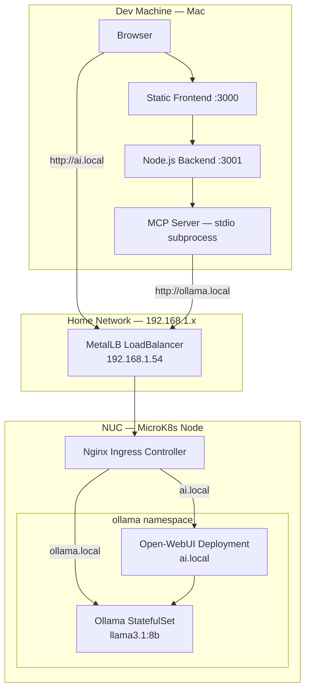
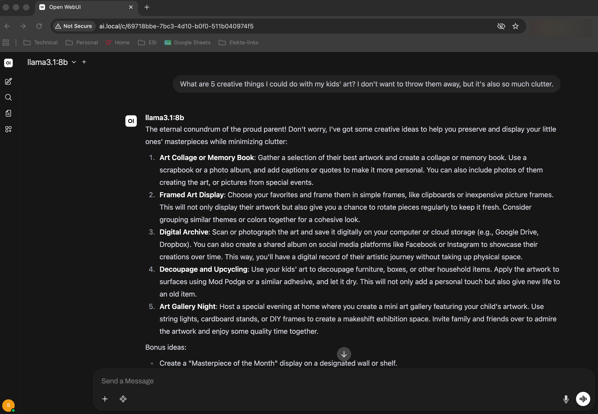

In [Part 1](/blog/local-llm-ollama-mcp-spike) I ran Ollama directly on a Linux machine and wired it up through an MCP layer to a small web app. It worked. But bare-metal has friction — if the process crashes, it stays down. Adding Open-WebUI means managing another process. Resource limits are manual. There's no clean internal networking between services.

This post moves the whole thing into Kubernetes. The goal isn't enterprise-grade infrastructure — it's a home lab setup that's reliable, easy to extend, and honest about its limitations.

*Manifests are in the [`ollama-mcp-starter`](https://github.com/JigsawFlux/ollama-mcp-starter) repo under `backend/k8s-deployment/`.*

<!-- truncate -->

## The Hardware

The server is an Intel NUC Hades Canyon (NUC8i7HVK) — a small-form-factor machine with a skull logo on the lid and a surprisingly capable spec for its size:

| Component | Detail |
| --------- | ------ |
| CPU | Intel Core i7-8809G, 4C/8T, 3.1 GHz base / 4.2 GHz turbo |
| RAM | 32 GB DDR4 |
| Storage | NVMe SSD (M.2 PCIe) |
| GPU | AMD Radeon RX Vega M GH — 4 GB HBM2 |
| Network | 2× Intel Gigabit LAN |
| Power | 230W external adapter |

It draws modest power for a home server, runs quietly, and fits on a shelf. These are the things that matter when it's on 24/7.

### The GPU caveat

The Vega M GH is a capable GPU for graphics workloads, but **Ollama's GPU acceleration uses CUDA — an NVIDIA-only technology**. AMD GPU support via ROCm exists in Ollama but requires manual configuration and is not supported through the standard Kubernetes GPU operator.

In practice: Ollama on this box runs **CPU-only**. The i7-8809G handles inference well enough for personal and home lab use — expect 10–20 tokens/second with `llama3.1:8b`. More on this in [Lessons Learned](#lessons-learned).

## Why Move to Kubernetes?

Running Ollama on bare metal works, but once you add a second service (Open-WebUI), you're managing two processes manually. A third service and it becomes unwieldy. Kubernetes solves this cleanly:

- **Auto-restart** — pods restart automatically on crash; no babysitting processes
- **Resource limits** — cap CPU and memory per service so one greedy process can't starve the others
- **Persistent storage** — PersistentVolumeClaims keep model data across pod restarts
- **Internal DNS** — services talk to each other by name (`ollama-service.ollama.svc.cluster.local`) rather than fragile IP addresses
- **Ingress** — one load balancer IP, hostname-based routing to multiple services

For a single-node home lab, **MicroK8s** is the right choice. It installs as a snap package, ships with the add-ons you need, and doesn't require a multi-node cluster to be useful.

## Architecture Overview

Before diving into setup, here's the logical view of the full system:



Two access paths to Ollama:

- **MCP path** (from Part 1) — Browser → Static Frontend → Node.js Backend → MCP Server → `ollama.local`
- **Direct path** — Browser → `ai.local` → Open-WebUI → Ollama (internal ClusterIP)

Both paths go through MetalLB and Nginx on the NUC. The MCP app and frontend still run on the dev machine; only the inference layer lives in Kubernetes.

## MicroK8s Setup

### Install

```bash
sudo snap install microk8s --classic
sudo usermod -aG microk8s $USER
newgrp microk8s
```

Verify the node is ready:

```bash
microk8s kubectl get nodes
```

### Enable Add-ons

```bash
microk8s enable dns
microk8s enable storage
microk8s enable ingress
microk8s enable metallb
```

When enabling MetalLB, you'll be prompted for an IP range. Use a small slice of your local subnet that won't conflict with DHCP — for example:

```
192.168.1.50-192.168.1.60
```

MetalLB will assign IPs from this pool to LoadBalancer services. The ingress controller picks up `192.168.1.54` in this setup.

### kubectl alias

MicroK8s ships its own `kubectl`. To use the standard `kubectl` command (useful for remote access from another machine):

```bash
microk8s config > ~/.kube/config
```

Then install `kubectl` on your client machine and point it at the exported config.

### GPU Operator

```bash
microk8s enable gpu
```

This installs the **NVIDIA GPU Operator**. It works well if your node has an NVIDIA card — it handles driver installation, container runtime configuration, and makes GPUs schedulable as resources.

On this NUC, the GPU is AMD (Vega M GH), so the operator deploys but has nothing to drive. Ollama falls back to CPU. The `gpu-operator-resources` namespace will exist but be idle. See [Lessons Learned](#lessons-learned).

## Deploying Ollama

### Why a StatefulSet?

Ollama stores pulled models in `/root/.ollama`. A `Deployment` gives pods random names and doesn't guarantee stable storage attachment. A `StatefulSet` gives a stable pod name (`ollama-0`), ordered startup and shutdown, and a consistent binding between the pod and its PersistentVolumeClaim.

### The Stack Manifest

`ollama-stack.yaml` creates four resources in sequence:

1. The `ollama` namespace
2. A 50 Gi PVC (models are large — `llama3.1:8b` is ~5 GB; headroom matters)
3. The Ollama StatefulSet
4. A ClusterIP service on port 11434

```yaml
apiVersion: apps/v1
kind: StatefulSet
metadata:
  name: ollama
  namespace: ollama
spec:
  replicas: 1
  template:
    spec:
      containers:
        - name: ollama
          image: ollama/ollama:latest
          resources:
            limits:
              cpu: "4"
              memory: "16Gi"
            requests:
              cpu: "2"
              memory: "4Gi"
          volumeMounts:
            - name: ollama-volume
              mountPath: /root/.ollama
```

The memory limit of 16 Gi gives `llama3.1:8b` enough headroom to load the full model into RAM without competing with Open-WebUI for the remaining 16 Gi.

### Model Preload with initContainer

The first time Ollama starts, no models are pulled. If your app tries to chat before a model exists, it fails with a confusing error. `ollama-automated.yaml` solves this with an `initContainer` that pulls the model before the main container starts:

```yaml
initContainers:
  - name: pull-model
    image: ollama/ollama:latest
    command: ["/bin/sh", "-c"]
    args:
      - |
        ollama serve &
        sleep 5
        ollama pull llama3.1:8b
        kill %1
    volumeMounts:
      - name: ollama-volume
        mountPath: /root/.ollama
```

The init container starts `ollama serve` in the background, waits for it to be ready, pulls the model, then stops. The main container finds the model already on disk and starts serving immediately.

Apply it:

```bash
kubectl apply -f backend/k8s-deployment/ollama-stack.yaml
# or, to pre-pull the model on first boot:
kubectl apply -f backend/k8s-deployment/ollama-automated.yaml
```

## Deploying Open-WebUI

Open-WebUI is a polished chat interface that connects directly to Ollama. `open-webui-stack.yaml` deploys it in the same `ollama` namespace:

```yaml
env:
  - name: OLLAMA_BASE_URL
    value: http://ollama-service.ollama.svc.cluster.local:11434
```

The key line is `OLLAMA_BASE_URL`. It uses Kubernetes internal DNS (`<service>.<namespace>.svc.cluster.local`) to reach Ollama — no hard-coded IPs, no reliance on external networking. If the Ollama pod restarts and gets a new IP, the DNS name still resolves correctly.

A 10 Gi PVC stores chat history and Open-WebUI configuration.

```bash
kubectl apply -f backend/k8s-deployment/open-webui-stack.yaml
```

Once running, Open-WebUI is available at `http://ai.local` (after ingress is configured below).

## MetalLB + Nginx Ingress

### Why MetalLB?

In a cloud cluster, `type: LoadBalancer` services get a public IP automatically from the cloud provider. On bare metal, nothing assigns that IP — services stay in `<pending>`. MetalLB fills that gap by assigning IPs from a configured pool to LoadBalancer services on your local network.

`ingress-lb.yaml` creates a LoadBalancer service for the Nginx ingress controller:

```bash
kubectl apply -f backend/k8s-deployment/ingress-lb.yaml
```

MetalLB assigns `192.168.1.54` from the configured pool. Verify:

```bash
kubectl get svc -n ingress
# ingress-loadbalancer   LoadBalancer   ...   192.168.1.54   80:...,443:...
```

### Ingress Rules

Three ingress objects route hostnames to services:

| File | Hostname | Target Service |
| ---- | -------- | -------------- |
| `ollama-ingress.yaml` | `ollama.local` | `ollama-service:11434` |
| `open-webui-ingress.yaml` | `ai.local` | `open-webui-service:80` |
| `dashboard-ingress.yaml` | `dashboard.local` | Kubernetes dashboard |

```bash
kubectl apply -f backend/k8s-deployment/ollama-ingress.yaml
kubectl apply -f backend/k8s-deployment/open-webui-ingress.yaml
kubectl apply -f backend/k8s-deployment/dashboard-ingress.yaml
```

### Client Hosts File

Any machine that wants to reach these hostnames needs a single `/etc/hosts` entry pointing the names at the MetalLB IP:

```text
192.168.1.54  dashboard.local ollama.local ai.local
```

On macOS: `/etc/hosts`. On Windows: `C:\Windows\System32\drivers\etc\hosts`.

After this, `http://ai.local` opens Open-WebUI in the browser, and `http://ollama.local` is the Ollama API endpoint.

## Connecting the MCP App from Part 1

The MCP app from Part 1 pointed at the bare-metal Ollama IP. Switching to the k8s deployment is a one-line `.env` change in both `backend/.env` and `mcp-server/.env`:

```bash
# Before (bare metal)
OLLAMA_HOST=http://192.168.1.80:11434

# After (k8s ingress)
OLLAMA_HOST=http://ollama.local
OLLAMA_MODEL=llama3.1:8b
OLLAMA_TIMEOUT=180000
```

The app now survives an Ollama pod restart without any manual intervention — the pod comes back up, the DNS name resolves, and the next request succeeds. The 3-minute timeout (`180000` ms) accounts for the slower CPU-only inference on `llama3.1:8b`.

## Verifying the Deployment

Check everything is running:

```bash
kubectl get pods,svc,ingress -n ollama
```

Expected output:

```text
NAME                             READY   STATUS    RESTARTS
pod/ollama-0                     1/1     Running   1
pod/open-webui-648d966b5-jsvfl   1/1     Running   2

NAME                         TYPE        CLUSTER-IP       PORT(S)
service/ollama-service       ClusterIP   10.152.183.132   11434/TCP
service/open-webui-service   ClusterIP   10.152.183.48    80/TCP

NAME                                    HOSTS        ADDRESS
ingress/ollama-ingress                  ollama.local 127.0.0.1
ingress/open-webui-ingress             ai.local     127.0.0.1
```

Test Ollama directly:

```bash
curl http://ollama.local/api/tags
```

## Demo

With everything running, Open-WebUI is available at `http://ai.local` — a full chat interface served entirely from the home lab, with no cloud API involved.



`llama3.1:8b` handling a practical question with a detailed, well-structured response. The model name and URL in the browser confirm it's running locally through the k8s ingress.

## Lessons Learned

**The GPU assumption cost time.** I installed the NVIDIA GPU operator early, assumed Ollama would detect the AMD Vega M and use it. It didn't — CUDA and ROCm are separate stacks. The Ollama container never saw the GPU. Lesson: check GPU vendor before planning acceleration. For AMD, ROCm support in Ollama requires a custom image and a different operator setup — a future post if I get there.

**CPU inference is slower than expected on larger models.** `llama3.2:3b` from Part 1 was snappy on CPU. Upgrading to `llama3.1:8b` dropped throughput noticeably — around 10–15 tokens/second. The 3B model was fine for quick tests; the 8B model is better quality but requires patience. The 3-minute timeout in the MCP app exists because of this.

**The `initContainer` preload is worth the complexity.** On first deploy without it, the Ollama pod starts, the Open-WebUI pod starts, a user immediately tries to chat, and gets a confusing "model not found" error. The initContainer adds maybe 5 minutes to first boot (model download) and eliminates that failure mode entirely.

**StatefulSet vs Deployment matters less than the PVC.** I spent time deliberating over this. The real thing that matters is the PVC binding — models must persist across restarts. StatefulSet makes the PVC binding explicit; a Deployment with a manual PVC binding would also work. StatefulSet is cleaner.

**Ingress address shows `127.0.0.1` — that's normal.** MicroK8s reports the ingress ADDRESS as `127.0.0.1` rather than the MetalLB IP. This confused me initially. The actual external IP lives on the LoadBalancer service in the `ingress` namespace, not on the ingress objects themselves.

## What's Next

The infrastructure is stable. The next steps are on the application side:

- **Streaming responses** — the MCP app waits for the full model completion before showing anything; streaming would feel much more interactive
- **Containerise the app** — the Node.js backend and MCP server still run locally on the dev machine; packaging them as containers and deploying to the same cluster would make the whole system self-contained
- **AMD GPU support** — ROCm-based Ollama on the Vega M is worth exploring; a 4 GB HBM2 GPU could significantly improve throughput even at reduced model precision

*The full source, including all manifests, is on [GitHub](https://github.com/JigsawFlux/ollama-mcp-starter). Feedback and contributions welcome.*
