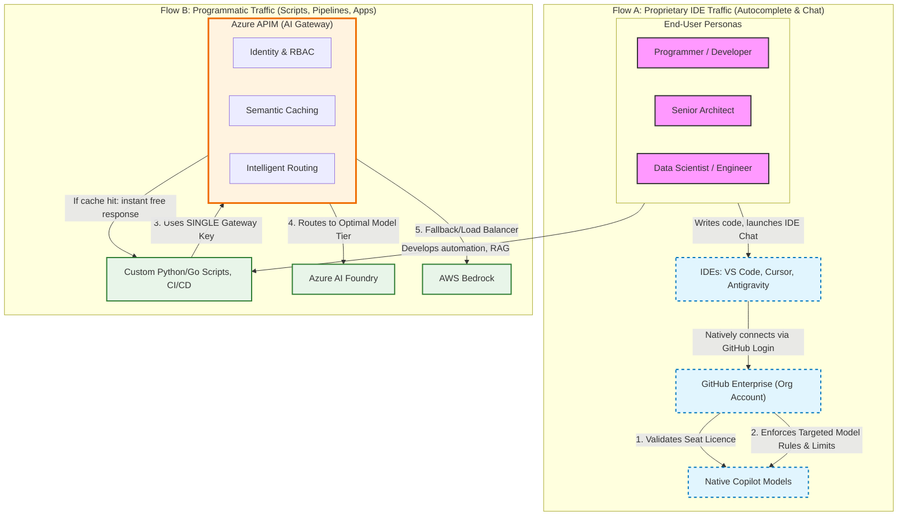

Four months into 2026, Uber's AI budget for the year was already gone — thousands of engineers with un-gated access to Claude Code, bills reportedly running $500–$2,000 per person per month, and leadership asking very loud questions about what exactly all those tokens were buying. Around the same time, an unnamed "mystery company" reportedly burned $500 million on Claude credits in a single month — not from a runaway model or a billing bug, but because nobody had thought to put a usage cap on employee licences.

Neither story is about bad engineering. Both are about one broken default: when developers get unrestricted access to frontier models, they use frontier models for everything.

I've been working through a framework to fix this — not by restricting access, but by routing the right task to the right model. The goal is frictionless development that doesn't quietly drain your budget. Here's how it works.

<!-- truncate -->

## The shift that changed everything

Until early 2026, enterprise AI tooling largely ran on flat-rate subscriptions. You paid a seat fee, your team used whatever they needed, and costs were predictable. That model is gone. GitHub Copilot retired flat-rate allowances in favour of token-metered "AI Credits" on June 1, 2026. Every major provider has followed the same trajectory.

The problem isn't the pricing model — it's that usage habits haven't caught up. Complex agentic tasks and heavy reasoning models consume tokens exponentially faster than simple completions. A developer running Claude Opus to autocomplete a for-loop is swinging a sledgehammer at a drawing pin. The pin goes in either way; the difference is what the swing cost.

That's the sledgehammer problem, and it's the single largest source of AI budget waste: identical output, ten times the price.

## Tier your workload

The fix is simpler than it sounds: match the model to the complexity of the task. Not every request needs deep reasoning. Not every request needs a lightweight model either. Three tiers cover almost everything.

| Task Complexity | Typical Use Cases | Recommended Tier | Cost Profile |
| :--- | :--- | :--- | :--- |
| **Tier 1 — Simple & Deterministic** | Inline completion, boilerplate, unit tests, regex, Dockerfiles | Efficient models (Haiku, GPT-4o-mini, Gemini Flash) | 📉 Lowest |
| **Tier 2 — Moderate & Generative** | Component logic, API endpoints, Mermaid diagram generation | Balanced models (Sonnet, Gemini Pro) | ⚖️ Medium |
| **Tier 3 — Complex Reasoning** | Architecture design, C++ memory debugging, large repo refactoring | Frontier models (Opus, GPT-5, Gemini Ultra) | 📈 Highest |

The goal isn't to ban frontier models — it's to use them where they actually earn their keep. A well-structured RAG pipeline or a cross-cutting refactor across a million-line codebase? That's a Tier 3 problem. A standard API endpoint in Go? It isn't.

## Two traffic lanes: IDE vs programmatic

Tiering the workload is half the answer. The other half is routing enforcement — making sure models are actually selected based on task complexity rather than developer habit. The architecture I recommend splits AI traffic into two distinct lanes, each governed differently.

### Lane A: IDE traffic via GitHub Copilot

Everyday inline coding and IDE chat stays within the GitHub Enterprise account. Governance happens through native Copilot policies: seat-based licensing, Targeted Model Rules, and usage caps. The key move is enforcing "Auto" mode as the default for standard users — it selects an appropriate model rather than defaulting to the most expensive one. Senior architects and principal engineers can be granted Tier 3 access for the work that justifies it.

### Lane B: Programmatic traffic via Azure APIM

Custom scripts, CI/CD pipelines, and internal tools route through a single Azure API Management gateway. Rather than each team managing its own provider keys and burning Tier 3 credits by default, everything flows through a central control point that provides:

- **Identity-based access control** via Entra ID
- **Semantic caching** — identical prompts return cached responses at zero token cost
- **Intelligent routing** across Azure AI Foundry and AWS Bedrock
- **Dollar-based budgets** enforced per team or pipeline

The caching point deserves emphasis. An automated pipeline making 50 near-identical classification requests doesn't need to pay for 50 model calls. It pays for one, caches the response, and the remaining 49 return instantly — the most straightforward cost reduction in the entire framework.

## Architecture

## What this looks like day-to-day

Three scenarios that show the framework working in practice:

**The developer writing .NET boilerplate in VS Code** opens a file and starts typing. Copilot's Auto mode kicks in with a Tier 1 model — fast, cheap, accurate for the task. The developer never thinks about model selection, and the team's AI Credits aren't quietly being drained by Opus completions for standard controller logic.

**The architect testing a RAG pipeline** writes a Python script to benchmark embedding strategies. Instead of managing three different provider API keys, they authenticate once via Entra ID and send all calls through the APIM gateway. The gateway checks their team budget, routes to the appropriate tier, and logs everything. If their budget is close to the limit, a threshold alert fires — not a surprise invoice.

**The data pipeline categorising code risk across 50 repositories** runs nightly. The first repository's analysis is processed and cached. Repositories two through fifty hit the semantic cache and return at zero token cost. A task that would otherwise consume 50× the tokens costs the same as one.

## Rolling this out

Three phases, and the order is deliberate:

1. **Gateway first.** Stand up Azure APIM and migrate all programmatic API calls to the unified endpoint. Establish identity-based routing and per-team budgets before anything else. You can't govern what you can't see.
2. **IDE governance second.** Once programmatic traffic is visible and controlled, implement GitHub Enterprise Targeted Model Rules. Restrict Tier 3 access to roles that genuinely need it; set Auto as the default for everyone else.
3. **Team education last.** Infrastructure changes enforce behaviour. Education reinforces it. Once the system is in place, rolling out guidelines on prompt scoping, context compression, and model selection across VS Code, Cursor, and Antigravity lands on a foundation that already supports the habits you're trying to build.

The temptation is to start with education — it feels fast and low-risk. But guidelines without enforcement fade. Get the infrastructure right first.

## The non-profit dimension

Everything above assumes an enterprise with a budget to optimise. But the same billing shock hits harder when you're running on grants, donations, or a volunteer-funded open-source project. Non-profits face a specific version of this problem: the same productivity pressure, the same tooling expectations from technical staff, and far less capacity to absorb a surprise $2,000-per-engineer monthly bill.

The tiering framework still applies — but for cost-constrained organisations, there are additional levers worth considering beyond just routing between model tiers.

**Local inference** removes marginal token cost entirely. Tools like [Ollama](https://ollama.com) let you run open models (Llama, Mistral, Phi, Gemma) on local hardware or a small cloud VM — I've written about exactly this setup before, [running Ollama on a Kubernetes home lab](/blog/local-llm-kubernetes-home-lab). The per-query cost drops to near zero; you trade API fees for infrastructure and a ceiling on model capability. For Tier 1 tasks — boilerplate, unit tests, simple completions — a locally hosted 7B or 13B model is often indistinguishable in output quality from a cloud API call, at a fraction of the ongoing cost.

Local hosting earns its keep in two situations beyond pure cost. The first is **edge deployment**: when inference needs to run on devices in the field — clinics with unreliable connectivity, crisis-response hardware, remote sensors — a cloud API isn't slow, it's unavailable. The second is subtler: for high-frequency, low-complexity workloads, the **network round trip itself becomes a cost**. Every cloud call pays latency and egress on top of the token price. A local model answering in tens of milliseconds, with no per-call fee, beats a cloud frontier model answering the same mundane question in two seconds — both on responsiveness and on the invoice.

**Corporate cloud hosting** sits between local inference and direct API access. Running models through AWS Bedrock or Azure AI Foundry — rather than calling Anthropic or Google directly — typically costs 20–40% less per token under enterprise agreements. More importantly for non-profits, it keeps data within a known compliance boundary, avoids egress fees from mixed-cloud setups, and makes budget governance easier through existing cloud billing tools. If your organisation is already on Azure or AWS, routing AI workloads through Foundry or Bedrock is often the fastest path to meaningful cost reduction without changing tooling.

The decision tree for cost-constrained teams:

1. Can a local model (Ollama + Llama/Mistral) handle this task acceptably? Use it.
2. Is your org already on Azure or AWS? Route through Foundry or Bedrock first.
3. Does the task genuinely need a frontier capability? Then pay for the direct API — but only then.

The same tiering logic, extended one level further down.

## References

1. *Visual Studio Magazine*, "Copilot Billing Shock Hits Developers" (June 4, 2026)
2. *InfoWorld*, "GitHub shifts Copilot to usage-based billing" (April 28, 2026)
3. *Forbes*, ["Uber Burns Its 2026 AI Budget in Four Months on Claude Code"](https://www.forbes.com/sites/janakirammsv/2026/05/17/uber-burns-its-2026-ai-budget-in-four-months-on-claude-code/) (May 17, 2026)
4. *AI Magazine*, ["Why Uber Has Already Burned Through Its AI Budget"](https://aimagazine.com/news/why-uber-has-already-burned-through-its-ai-budget)
5. *Inc. Magazine*, "1 Company Spent Half a Billion Dollars on Claude in a Single Month" (June 5, 2026)
6. *Tom's Hardware*, "Mystery company accidentally blew $500 million on Claude AI in a single month" (May 29, 2026)

---

## Appendix: How this post was written

This post was drafted and iterated entirely using Claude Code — which makes it a small live example of the tiering approach it describes. Three sessions, three different kinds of work, with measurably different token costs for each.

**Session 1 — structural work (Sonnet + Haiku subagent)**

The first session covered the heavy lifting: converting a raw strategy document into a structured blog post, rewriting from third-person enterprise-doc tone to first-person narrative, and setting up the publishing infrastructure (frontmatter, truncate markers, draft log).

| Step | Model | Use case | Cost |
| :--- | :--- | :--- | :--- |
| Iter 0 | claude-sonnet-4-6 | Frontmatter, CLAUDE.md setup, draft log scaffolding | — |
| Iter 1 | claude-sonnet-4-6 | Full structural rewrite — enterprise doc → first-person blog | — |
| Subagent | claude-haiku-4-5 | Read-only codebase lookup (existing blog tone analysis) | $0.02 |
| **Session 1 total** | | 1.5k input · 18k output · 1.6m cache read | **$1.30** |

**Session 2 — prose and new sections (Sonnet)**

The second session expanded the post: narrative restructuring, the non-profit section, and the first version of this appendix. Same model as Session 1, but cheaper — targeted edits on a stable structure produce far fewer output tokens than a full rewrite.

| Step | Model | Use case | Cost |
| :--- | :--- | :--- | :--- |
| Iter 2–3 | claude-sonnet-4-6 | Prose polish, non-profit section, appendix with real cost data | — |
| **Session 2 total** | | 0.7k input · 11.1k output · 1.0m cache read | **~$0.56** |

**Session 3 — narrative pass (Fable 5)**

The final session switched to `claude-fable-5`, Anthropic's narrative-optimised model, for a light editorial pass: metaphor consistency, sentence rhythm, and voice. The smallest change set of the three sessions — and, unexpectedly, the most expensive.

| Step | Model | Use case | Cost |
| :--- | :--- | :--- | :--- |
| Iter 4 | claude-fable-5 | Editorial polish — metaphor consistency, rhythm, voice | $2.25 |
| **Session 3 total** | | 645 input · 5.1k output | **$2.25** |

Look at the numbers side by side. Sonnet generated 31.4k output tokens across two sessions of structural and prose work for $2.01. Fable generated 5.1k tokens — a sixth of the volume — for $2.25. The lightest session cost the most, because premium per-token pricing dominated token count entirely.

That accidental result is a cleaner demonstration of this post's thesis than anything I planned: **model choice drives cost more than workload size does.** Whether the premium model was worth it for an editorial pass is exactly the kind of question the tiering framework exists to force. Total across all three sessions: **$4.28**.

*Full token breakdown: `_DRAFT_LOG.md` in this post's directory.*
