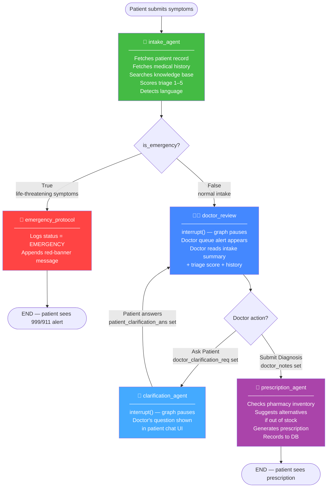
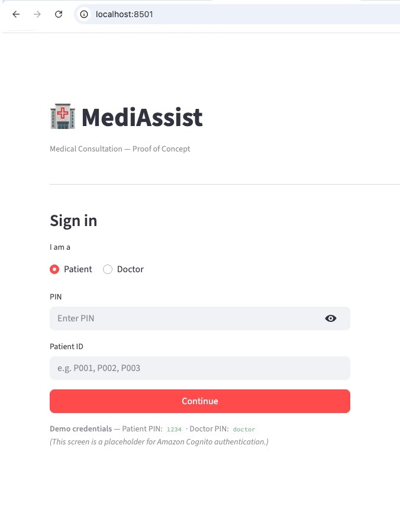
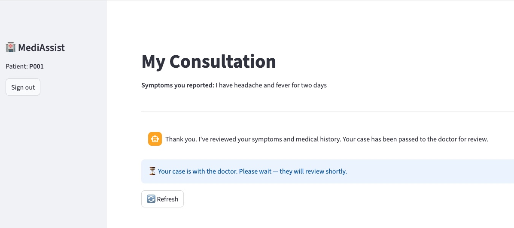
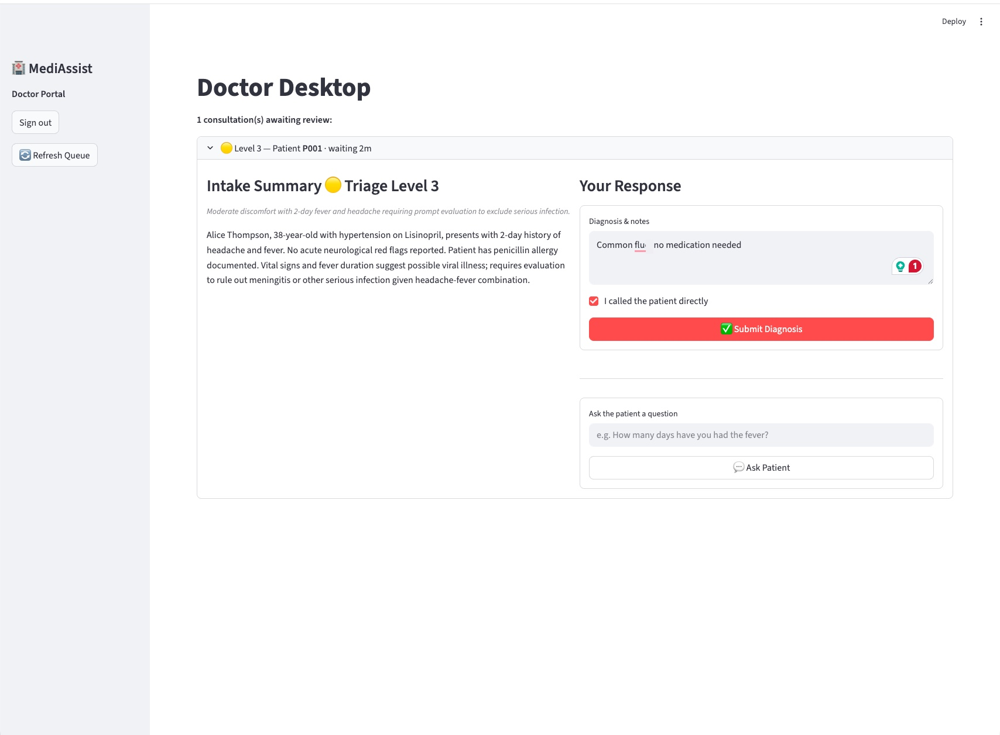

The name cuts two ways. It's a clinic — for patients. And the clinic runs on agents.

The problem this POC targets is specific: small and charity hospitals where doctor time is genuinely scarce and IT budgets are measured in hundreds of dollars, not thousands. A consultation isn't just a diagnosis — it's intake, medical history retrieval, triage sorting, prescription recording, pharmacy stock checking. The typical workflow hands all of that to a doctor anyway, because there's no other option. The result: a clinician spending 40% of their time on work that doesn't require clinical judgment.

The premise here is simple. AI handles everything that doesn't require a clinician. The doctor steps in exactly once — to read the AI-produced intake summary and give a diagnosis. That's it. The prescription agent takes over from there.

This is a [JigsawFlux](https://github.com/JigsawFlux) project. JigsawFlux builds open-source tools for health tech, crisis management, and humanitarian response — tools that have to work in the real world, not the well-funded one. That means two hard constraints shaped every architecture decision here: **cost** and **deployability**. Viable on a shoestring budget. Runnable in places where "cloud-native" isn't an option — a clinic with a single server, unreliable internet, and an IT team of one.

Built on **AWS Bedrock** (Claude Haiku 4.5), **LangGraph** for orchestration, **LangChain** `@tool` wrappers for data access, and **Streamlit** for the UI. Total cost: **< $0.01 per consultation**. Deployable on a £25/month VPS or a clinic's own hardware, with the option to go fully on-premises as models improve.

<!-- truncate -->

---

## Why Not Lambda + Bedrock?

The obvious AWS pattern for an LLM-powered app is Lambda + Bedrock: a Lambda function receives a request, calls the model, returns a response. It works well for single-turn, stateless interactions.

A medical consultation is not a single-turn interaction. It looks like this:

```
Patient submits symptoms        [seconds]
↓ intake agent runs             [~5 seconds]
↓ graph pauses — doctor queued  [minutes to hours]
↓ doctor submits diagnosis
↓ prescription agent runs       [~3 seconds]
↓ patient receives prescription
```

That middle gap — between intake completing and the doctor responding — can be minutes or hours. Lambda invocations are stateless. Every invocation discards all context. Modelling a pause-and-resume workflow with Lambda means rebuilding state management, custom polling, webhook handlers, and retry logic from scratch. The honest Lambda-native path for a stateful workflow like this is Lambda + Step Functions + API Gateway + DynamoDB — a real AWS stack with real AWS complexity and real AWS consulting costs.

But there's a second problem with Lambda for this use case: **it is irrevocably cloud-only**. A charity clinic in a low-connectivity region cannot run Lambda on their own hardware. If the internet goes down, consultations stop. Patient data has to leave the building to be processed. There is no on-premises option, no hybrid option, no path to data sovereignty.

LangGraph running on a single Python process is none of that. It runs on a clinic's existing server, a cheap VPS, a donated laptop. The only network call during a consultation is the Bedrock API invocation — a small JSON payload, only made when the model is actually thinking. Patient records stay local. Connectivity interruptions only affect the model call, not the workflow state. And in a future phase, Bedrock can be swapped for a locally-hosted model (Ollama running `llama3.2` or similar), taking the cloud dependency to zero.

| Concern | Lambda + Bedrock | LangGraph + Bedrock |
|---------|-----------------|---------------------|
| State between steps | Application must manage | Built-in typed state (`TypedDict`) |
| Cyclic workflows | Manual loop logic | First-class graph edges |
| Human handoff | Custom webhook + polling | `interrupt()` primitive |
| Pause & resume | Rebuild from scratch | Checkpoint + resume built-in |
| Multi-agent routing | Custom routing code | Conditional edges |
| Deployment options | AWS cloud only | Any Python environment |
| On-premises / hybrid | ❌ Not possible | ✅ Native — runs on local hardware |
| Data leaves building | ✅ Always (Lambda processes it) | Only model invocation payload |
| Infrastructure overhead | Lambda + Step Functions + APIGW + DDB | Single Python process |

---

## The Architecture

Three layers, each with a clear responsibility:

```
┌─────────────────────────────────────────────────┐
│  LangGraph                                      │  Orchestration
│  StateGraph · nodes · edges · interrupt()       │  (workflow logic, state, routing)
├─────────────────────────────────────────────────┤
│  LangChain AWS  (langchain-aws)                 │  Integration
│  ChatBedrock · @tool wrappers                   │  (model wrappers, tool schemas)
├─────────────────────────────────────────────────┤
│  AWS Bedrock  (Claude Haiku 4.5)                │  Intelligence
│  Foundation model · pay-per-token               │  (reasoning, generation)
└─────────────────────────────────────────────────┘
```

The LangGraph `StateGraph` encodes the consultation as nodes (agents) and edges (routing logic). Here's the full workflow:



Every node reads from and writes to a single typed state object that flows through the entire graph:

```python
# graph.py
class ConsultationState(TypedDict):
    session_id: str
    patient_id: str
    symptoms: str
    patient_history: dict

    intake_summary: str
    is_emergency: bool
    triage_score: int    # 1=Routine, 2=Minor, 3=Moderate, 4=Severe, 5=Urgent non-emergency
    triage_reason: str   # one-sentence AI justification for the score

    doctor_clarification_req: str
    patient_clarification_ans: str

    doctor_notes: str
    prescription: str

    status: str          # intake | emergency | awaiting_doctor | clarifying | prescribing | complete
    messages: list       # rendered in patient chat UI
```

This typed contract is what makes the graph inspectable and debuggable. At any pause point you can call `graph.get_state(config)` and see exactly what every field holds.

Wiring the graph up is straightforward — `build_graph()` is the only assembly point:

```python
# graph.py
MODEL_ID = os.getenv("BEDROCK_MODEL_ID", "us.anthropic.claude-haiku-4-5-20251001-v1:0")

def _get_model():
    return ChatBedrock(
        model_id=MODEL_ID,
        model_kwargs={"temperature": 0.3},
        region_name=os.getenv("AWS_DEFAULT_REGION", "us-east-1"),
    )

def build_graph():
    workflow = StateGraph(ConsultationState)

    workflow.add_node("intake_agent",        intake_agent_node)
    workflow.add_node("emergency_protocol",  emergency_protocol_node)
    workflow.add_node("doctor_review",       doctor_review_node)
    workflow.add_node("clarification_agent", clarification_agent_node)
    workflow.add_node("prescription_agent",  prescription_agent_node)

    workflow.set_entry_point("intake_agent")

    workflow.add_conditional_edges(
        "intake_agent",
        should_escalate,
        {"emergency_protocol": "emergency_protocol", "doctor_review": "doctor_review"},
    )
    workflow.add_edge("emergency_protocol", END)

    workflow.add_conditional_edges(
        "doctor_review",
        should_clarify,
        {"clarification_agent": "clarification_agent", "prescription_agent": "prescription_agent"},
    )
    workflow.add_edge("clarification_agent", "doctor_review")
    workflow.add_edge("prescription_agent", END)

    checkpointer = MemorySaver()
    return workflow.compile(checkpointer=checkpointer)
```

The conditional edge functions are one-liners that read directly from state:

```python
def should_escalate(state) -> Literal["emergency_protocol", "doctor_review"]:
    return "emergency_protocol" if state.get("is_emergency") else "doctor_review"

def should_clarify(state) -> Literal["clarification_agent", "prescription_agent"]:
    return "clarification_agent" if state.get("doctor_clarification_req") else "prescription_agent"
```

---

## Human-in-the-Loop: How `interrupt()` Actually Works

The `doctor_review` node is not a model call. It's a pause point — here's the real code:

```python
# graph.py
def doctor_review_node(state: ConsultationState) -> dict:
    context = {
        "session_id": state["session_id"],
        "patient_id": state["patient_id"],
        "intake_summary": state["intake_summary"],
        "patient_history": state["patient_history"],
    }
    if state.get("patient_clarification_ans"):
        context["clarification"] = {
            "question": state["doctor_clarification_req"],
            "answer": state["patient_clarification_ans"],
        }

    # Graph pauses here until Streamlit calls graph.invoke(Command(resume=doctor_input), config)
    doctor_input = interrupt(context)

    if doctor_input.get("action") == "clarify":
        clarification_req = doctor_input["question"]
        _update_consultation(
            state["session_id"],
            doctor_clarification_req=clarification_req,
            status="clarifying",
        )
        return {
            "doctor_clarification_req": clarification_req,
            "patient_clarification_ans": "",
            "status": "clarifying",
        }

    doctor_notes = doctor_input.get("notes", "")
    _update_consultation(
        state["session_id"],
        doctor_notes=doctor_notes,
        status="prescribing",
    )
    return {"doctor_notes": doctor_notes, "status": "prescribing"}
```

When `interrupt(context)` fires, LangGraph serialises the entire `ConsultationState` to the checkpoint store (`MemorySaver` in this POC; DynamoDB in production) and stops. The doctor's Streamlit tab polls the database for pending consultations and shows the intake summary.

When the doctor acts, Streamlit resumes the graph with a single call:

```python
# app.py — doctor submits diagnosis
graph.invoke(
    Command(resume={"action": "diagnose", "notes": final_notes}),
    config,
)

# app.py — doctor asks patient a clarifying question
graph.invoke(
    Command(resume={"action": "clarify", "question": question.strip()}),
    config,
)

# app.py — patient answers the doctor's question
graph.invoke(Command(resume=answer.strip()), config)
```

Each `Command(resume=...)` call picks up execution from exactly where `interrupt()` left it — no rebuilding state, no re-running the intake agent, no webhooks.

The Streamlit UI shares the in-process graph across all browser tabs via `@st.cache_resource`. This is what makes the patient → doctor state handoff work without any network calls:

```python
# app.py
@st.cache_resource
def get_graph():
    return build_graph()  # single graph instance, shared across all sessions
```

`MemorySaver` lives inside that cached object. Patient tab writes state; doctor tab reads it — same process, same memory, zero coordination overhead.

The clarification loop uses the same `interrupt()` mechanism a second time. `clarification_agent_node` pauses the graph waiting for the patient's answer; when they reply, the graph resumes and routes back to `doctor_review` via a fixed edge. A cyclic human workflow that would need custom state machines, polling infrastructure, and webhook handlers in a Lambda-based system becomes three graph edges and two `interrupt()` calls.

---

## Demo Walkthrough

Here's a complete consultation using Patient P001 (Alice Thompson, headache and fever).

**1. Login — role and PIN selection**



The login screen is a placeholder for Amazon Cognito. The hardcoded PIN (`1234` for patients, `doctor` for doctors) illustrates exactly where real authentication would plug in — the rest of the graph doesn't change.

**2. Patient submits symptoms — AI intake runs**

The patient types their symptoms and clicks **Start Consultation**. The intake agent fetches the patient's record and medical history from SQLite, searches the knowledge base, assigns a triage score (1–5), and hands off to the doctor queue. The entire intake takes a few seconds.



The graph is now paused at `doctor_review`. Nothing in the system runs until the doctor acts.

**3. Doctor desktop — triage queue and response panel**

In a separate browser tab the doctor logs in. The queue shows all pending consultations sorted by triage severity. For Alice's case:



The doctor sees the triage badge (🟡 Level 3 — Moderate), the AI-generated intake summary with clinical context drawn from Alice's history and allergies, and a response panel with two actions: **Submit Diagnosis** or **Ask Patient**.

**4. Patient receives the prescription**

After the doctor submits, the prescription agent checks pharmacy inventory (Amoxicillin is seeded as out of stock — it flags this and suggests an alternative) then records the prescription. The patient's view updates:


**Try these scenarios yourself:**

| Scenario | How to trigger |
|----------|---------------|
| Emergency path | Report chest pain radiating to the left arm — red banner, no queue entry |
| Clarification loop | Doctor uses "Ask Patient" before diagnosing — patient answers, routes back |
| Out-of-stock pharmacy | Prescription agent flags Amoxicillin and suggests an alternative |
| Multilingual intake | Submit symptoms in French or Spanish — intake responds in kind; doctor always gets English |

---

## The Tool Layer: `@tool` Now, MCP Later

The intake and prescription agents access data through LangChain `@tool`-decorated functions:

```python
@tool
def get_patient_record(patient_id: str) -> dict: ...

@tool
def get_medical_history(patient_id: str) -> list[dict]: ...

@tool
def search_knowledge_base(query: str) -> list[dict]: ...

@tool
def record_prescription(session_id: str, prescription: str) -> str: ...
```

These are bound to the Haiku model in `intake_agent_node` and the agent runs a standard tool-calling loop — invoke, check for tool calls, execute them, feed results back, repeat until the model produces a final JSON response:

```python
# graph.py — intake_agent_node (core loop)
def intake_agent_node(state: ConsultationState) -> dict:
    llm = _get_model()
    intake_tools = [get_patient_record, get_medical_history, search_knowledge_base]
    llm_with_tools = llm.bind_tools(intake_tools)
    tool_map = {t.name: t for t in intake_tools}

    messages = [
        SystemMessage(content=INTAKE_SYSTEM),
        HumanMessage(content=f"Patient ID: {state['patient_id']}\nSymptoms: {state['symptoms']}"),
    ]

    for _ in range(6):  # cap tool-calling iterations
        response = llm_with_tools.invoke(messages)
        messages.append(response)

        if not getattr(response, "tool_calls", None):
            break  # model produced final answer — no more tool calls

        for tc in response.tool_calls:
            fn = tool_map.get(tc["name"])
            if fn:
                result = fn.invoke(tc["args"])
                messages.append(ToolMessage(content=json.dumps(result), tool_call_id=tc["id"]))

    # parse the structured JSON response and return updated state fields ...
```

The model is instructed via `INTAKE_SYSTEM` to respond only with a JSON object containing `intake_summary`, `is_emergency`, `triage_score`, `triage_reason`, and a `patient_message` in the patient's detected language. The prescription agent follows the same loop pattern, using `check_pharmacy_inventory` and `record_prescription` as its tools.

For a POC this is the right choice: zero infrastructure, SQLite queries are synchronous, and the entire stack is Python.

In production, three problems make this untenable:

1. **Security** — the agent has unrestricted database access. There is no way to enforce that the intake agent can only read records for the *current* patient.
2. **Reuse** — a second agent type (specialist referral, pharmacy checker) would need to duplicate or tightly share these functions.
3. **Auditability** — no independent record of which agent accessed which data, a compliance requirement in clinical settings.

**Model Context Protocol (MCP)** solves all three. Each tool becomes a standalone server process with its own IAM role, access policy, and CloudWatch audit log:

| | `@tool` wrappers (POC) | MCP Servers (Production) |
|--|----------------------|--------------------------|
| Setup time | Minutes | Days |
| Security boundary | None (same process) | IAM role per server |
| Audit trail | LangGraph traces only | CloudWatch per call |
| Reusability | Duplicated per agent | Shared across all agents |
| Cost | $0 | ~$2–5/month (Lambda) |
| Graph changes required | None | None |

The last row is the key. The LangGraph node functions in `graph.py` don't change — they still call `get_patient_record()` and `search_knowledge_base()`. Only the *implementations* in `tools.py` swap from direct SQLite calls to MCP client calls. The tool signatures are the interface contract; the interface is already final.

AWS Verified Permissions (Cedar policies) in Phase 2 adds the access enforcement: *"intake_agent may call get_patient_record only for the patient_id present in the current session."*

---

## Cost

For a small or charity hospital, cost isn't an optimisation — it's a constraint. A £2,000/month telemedicine SaaS subscription is simply not available. £20/month might be.

| Item | POC (local) | Production (50 consults/day) | Lambda-equivalent stack |
|------|-------------|------------------------------|------------------------|
| Claude Haiku 4.5 | ~$0.001/consult | ~$1.50/month | ~$1.50/month (same) |
| Compute | $0 (developer laptop) | ~$10–15/month (t3.micro or VPS) | ~$5–10/month (Lambda) |
| State / DB | $0 (SQLite) | ~$1–2/month (DynamoDB on-demand) | ~$5–10/month (DDB + Step Functions) |
| API / orchestration | $0 | $0 (LangGraph in-process) | ~$10–15/month (API Gateway + Step Functions) |
| **Total** | **$0** | **< $20/month** | **~$25–40/month** |

LangGraph on a cheap VM is modestly cheaper than the Lambda-native equivalent — but the bigger difference is operational complexity and the option to run on hardware you already own. A clinic that already has a server pays only for Bedrock tokens.

**Hybrid deployment options:**

| Deployment | Compute cost | Cloud dependency | Data stays local? |
|------------|-------------|-----------------|-------------------|
| Developer laptop (POC) | $0 | Bedrock API only | ✅ Yes |
| £25/month VPS | ~£25/month | Bedrock API only | ✅ Yes |
| Clinic's own server | $0 (sunk cost) | Bedrock API only | ✅ Yes |
| Fully on-premises (future) | $0 | None (local model) | ✅ Yes |
| Lambda + Step Functions | Per-invocation | AWS cloud required | ❌ No |

The "Bedrock API only" row is worth emphasising. During a consultation, the only data that leaves the clinic's network is the prompt sent to the model — the patient's symptoms and the anonymised intake context. The patient database, medical history, and prescription records never leave the machine. That matters for GDPR compliance and for clinics operating in jurisdictions with strict patient data rules.

Two model decisions keep the token cost low:

**Haiku 4.5, not Sonnet 4.** Haiku is ~8× cheaper per token. In this system, the doctor is always the final clinical authority — the triage score is a queue-sorting mechanism, not a clinical decision. The AI's job is to produce a useful intake summary, not to diagnose. Haiku 4.5 does that reliably, including structured JSON output (`triage_score`, `intake_summary`) and native multilingual support for non-English-speaking patients at no extra cost.

**Cross-region inference profile.** One gotcha worth flagging: Claude Haiku 4.5 requires a cross-region inference profile, not a direct model ID. Invoking the bare model ID returns a `ValidationException`. The default in `graph.py` is already the correct form:

```python
# graph.py
MODEL_ID = os.getenv("BEDROCK_MODEL_ID", "us.anthropic.claude-haiku-4-5-20251001-v1:0")
#                                                         ^^^
#                                          cross-region prefix — required for on-demand throughput
```

If you override `BEDROCK_MODEL_ID` with a bare model ID (e.g. `anthropic.claude-haiku-4-5-20251001-v1:0`), switch it back to the `us.` prefixed version.

---

## POC → Production Roadmap

The architectural bet at the centre of this design: `graph.py` — the nodes, edges, conditional routing, and `interrupt()` calls — **never changes across any production phase**. Infrastructure evolves; the workflow doesn't.

| Component | POC | Phase 1 | Phase 2 | Phase 3 | Phase 4 | Phase 5 |
|-----------|-----|---------|---------|---------|---------|---------|
| **LLM** | Haiku (Bedrock) | ← same | ← same | ← same | ← same | ← same |
| **Graph topology** | 5 nodes, 2 interrupts | ← same | ← same | ← same | ← same | ← same |
| **Checkpointing** | MemorySaver | DynamoDB | ← same | ← same | ← same | + PITR |
| **Patient DB** | SQLite | RDS PostgreSQL | ← same | + encryption | ← same | + Multi-AZ |
| **Tool access** | `@tool` → SQLite | `@tool` → RDS | **MCP servers** | + Cedar policies | ← same | + audit logs |
| **Auth** | Hardcoded PIN | ← same | ← same | Amazon Cognito | ← same | ← same |
| **Frontend** | Streamlit (local) | Streamlit (App Runner) | ← same | React / Next.js | + WebSocket | ← same |
| **Infra cost/month** | $0 | ~$25 | ~$30 | ~$50 | ~$55 | ~$80–120 |

Phase 2 is the architectural pivot. Everything before it is scaffolding. Everything after it scales. The move from `@tool` wrappers to MCP servers is the only change that touches security, reusability, and auditability simultaneously — and it does so without touching the graph.

Beyond the core phases, the design also supports additive extensions for low-resource environments: a **WhatsApp/SMS patient interface** via Twilio (the graph's `interrupt()` is channel-agnostic — state simply sits in DynamoDB until the next SMS arrives), **voice note intake** via AWS Transcribe or self-hosted Whisper, and **native multilingual support** (already live in the POC — Haiku 4.5 detects the patient's language and responds in kind while always producing the doctor summary in English).

---

## What's Next

The full source — `graph.py`, `tools.py`, `app.py`, `seed_db.py`, and all architecture documentation — is on GitHub: [github.com/JigsawFlux/agentic-clinic](https://github.com/JigsawFlux/agentic-clinic).

To run it locally:

```bash
git clone https://github.com/JigsawFlux/agentic-clinic
cd agentic-clinic
python -m venv .venv && source .venv/bin/activate
pip install -r requirements.txt
python seed_db.py
streamlit run app.py
```

You'll need AWS credentials and Bedrock model access for `us.anthropic.claude-haiku-4-5-20251001-v1:0` in `us-east-1`. The [README](https://github.com/JigsawFlux/agentic-clinic/blob/main/README.md) has the full setup steps including the Bedrock console access request and a troubleshooting section for the two most common `ValidationException` and `ResourceNotFoundException` errors.

The four scenarios in the demo section are good starting points — emergency path, clarification loop, out-of-stock pharmacy substitution, and multilingual intake. Each exercises a different branch of the graph.

---

This is a JigsawFlux project. JigsawFlux builds open-source tools for health tech, humanitarian response, and crisis management — tools designed to work on constrained budgets, unreliable infrastructure, and donated hardware. If you're working on something in this space, or you want to contribute to this project, the [JigsawFlux GitHub organisation](https://github.com/JigsawFlux) is where the work happens.
