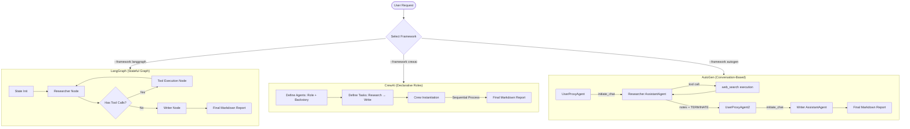
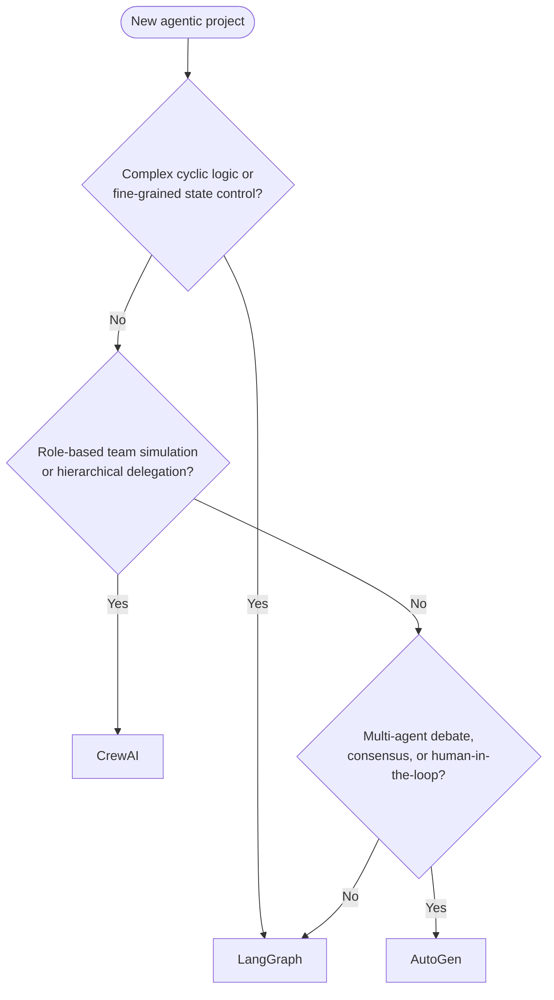

The first decision in any agentic project isn't which model to use. It's which framework will orchestrate it. Get that wrong and you inherit a stack you can't run locally, can't afford to scale, and can't escape when the vendor changes the API.

This is a [JigsawFlux](https://github.com/JigsawFlux) project. JigsawFlux builds open-source tools for health tech, humanitarian response, and crisis management — in places where "cloud-native" is not an option and IT budgets are measured in grants, not headcount. That context imposes hard constraints on every architecture decision: **portability**, **cost**, and **freedom from vendor lock-in**.

The frameworks here — **LangGraph**, **CrewAI**, and **AutoGen** — were chosen because they meet those constraints. They are open source, actively maintained, and run entirely on hardware you own. Alternatives like Microsoft Semantic Kernel or Amazon Bedrock Agents are capable, but they introduce hard dependencies on specific cloud ecosystems. That trade-off doesn't fit the JigsawFlux model.

<!-- truncate -->

Each framework is also the natural implementation home for a different family of agentic patterns — which is the other reason for this grouping, and why this is Part 1 of a two-part series. Part 2 implements those patterns directly.

---

## The shared task

Every framework runs the same pipeline: a **Researcher agent** uses a DuckDuckGo web search tool to gather facts on a given topic, then a **Writer agent** consumes those notes and produces a structured Markdown report. The topic in all runs was *solid-state batteries*.

```bash
python run.py --framework all --topic "solid-state batteries"
```

This symmetry is deliberate. Same task, same model (`claude-sonnet-4-6`), same tool — only the orchestration framework changes. That isolation means the telemetry at the end reflects framework behaviour and overhead, not model variation.



The full source is at [github.com/JigsawFlux/comparing-agent-frameworks](https://github.com/JigsawFlux/comparing-agent-frameworks).

---

## LangGraph: the stateful graph

LangGraph models execution as a directed graph where nodes are functions and edges are routing decisions. State flows through every node as a typed dictionary — you define what it contains, and reducers control how it gets updated.

The researcher loop is cyclic by design. It calls `web_search`, gets results back via the tool node, and loops until it decides it has enough information — at which point the conditional edge routes to the writer.

The state schema makes the data contract explicit:

```python
class AgentState(TypedDict):
    messages: Annotated[Sequence[BaseMessage], add_messages]
    topic: str
    research_notes: str
    final_report: str
```

The routing logic is a single function:

```python
def should_continue(state: AgentState):
    last_message = state["messages"][-1]
    if last_message.tool_calls:
        return "tools"   # loop back through tool node
    return "writer"      # research complete
```

And the graph wiring reduces to five lines:

```python
workflow.add_edge(START, "researcher")
workflow.add_conditional_edges(
    "researcher",
    should_continue,
    {"tools": "tools", "writer": "writer"}
)
workflow.add_edge("tools", "researcher")   # the cyclic loop
workflow.add_edge("writer", END)
```

What you get from this: fine-grained control over every routing decision, complete visibility into state at every step, and trivial output extraction (`state["final_report"]`). What it costs: you are building a graph. The mental model is powerful but requires internalising nodes, edges, reducers, and the distinction between cyclic and acyclic topologies before you can be productive.

**Agentic patterns this enables:** ReAct (the researcher loop is a ReAct loop), Plan-and-Execute, ReWOO, Reflexion, DAG pipelines, human-in-the-loop via `interrupt()`.

---

## CrewAI: declarative roles

CrewAI inverts the mental model. Instead of defining a graph, you define **agents** with a role, goal, and backstory, and **tasks** with a description and expected output. Hand them to a `Crew` and it handles the orchestration.

```python
researcher = Agent(
    role="Senior Technology Researcher",
    goal=f"Conduct deep research on '{topic}' and compile key insights",
    backstory=(
        "You are a highly analytical research specialist. To stay within strict "
        "API rate limits, use the search_tool exactly ONCE with a broad query. "
        "Produce precise, structured notes."
    ),
    tools=[search_tool],
    llm=llm,
)

writer = Agent(
    role="Expert Technical Writer",
    goal=f"Synthesize research notes into a professional technical report on '{topic}'",
    backstory=(
        "You are a veteran technical publisher who specialises in explaining complex "
        "advancements in clean, structured Markdown."
    ),
    llm=llm,
)
```

Tasks are similarly declarative — each specifies what it needs and what it should produce:

```python
research_task = Task(
    description=f"Research '{topic}' using web_search. Identify: core concept, benefits, key players, barriers.",
    expected_output="Detailed, structured notes listing research facts.",
    agent=researcher,
)

write_task = Task(
    description=f"Write a professional report on '{topic}' from the research notes.",
    expected_output="A structured technical report in Markdown format.",
    agent=writer,
)

crew = Crew(
    agents=[researcher, writer],
    tasks=[research_task, write_task],
    process=Process.sequential,
)
result = crew.kickoff()
```

Context passing between tasks is implicit — CrewAI injects the previous task's output as input to the next one. You never touch state directly.

This produced the richest research notes of the three runs: 9,351 characters versus LangGraph's 5,573. The declarative `backstory` and `role` fields give the model stronger framing to work from, and the verbose CrewAI reasoning traces generate more intermediate content. The trade-off is that sequential execution is the easy path; anything more complex — conditional routing, cyclic reasoning — requires switching to `Process.hierarchical` and adding a manager agent.

**Agentic patterns this enables:** Hierarchical agent (add a manager with `Process.hierarchical`), role-based pipelines, multi-agent delegation.

---

## AutoGen: conversation-based

AutoGen treats agent coordination as a conversation. Each agent is a participant; they exchange messages, call tools, and signal completion via a termination string. There is no graph, no task object — just agents talking.

The pipeline runs in two separate phases. Phase 1 is the research conversation:

```python
researcher = autogen.AssistantAgent(
    name="Researcher",
    system_message=(
        "You are a Senior Researcher. Use the web_search tool ONCE to gather facts. "
        "Compile structured research notes. When complete, end with TERMINATE."
    ),
    llm_config=llm_config,
)

user_proxy = autogen.UserProxyAgent(
    name="UserProxy",
    human_input_mode="NEVER",
    max_consecutive_auto_reply=5,
    is_termination_msg=lambda x: "TERMINATE" in x.get("content", ""),
    code_execution_config=False,
)

register_function(web_search, caller=researcher, executor=user_proxy, ...)
user_proxy.initiate_chat(researcher, message=f"Research '{topic}'...")
```

The `UserProxyAgent` is not a human — it is the tool executor. When the researcher emits a tool call, the proxy executes it and sends the result back as a message. The loop ends when the researcher appends `TERMINATE`.

Phase 2 repeats the pattern with a Writer agent and a fresh proxy, passing the extracted research notes as the opening message:

```python
user_proxy2.initiate_chat(
    writer,
    message=f"Write a professional report on '{topic}' based on:\n\n{research_notes}"
)
```

AutoGen's conversation-native model is best suited to topologies where agents negotiate, debate, or vote — patterns where the back-and-forth is the mechanism, not just the means to an end.

**Agentic patterns this enables:** Peer-to-peer network, Consensus/Joint, Human-in-the-loop (swap `UserProxyAgent` for an actual human).

---

## Telemetry: what the runs produced

All three ran against the same topic on the same hardware with `claude-sonnet-4-6`.

| Framework | Status | Time (s) | Notes (chars) | Report (chars) |
| :--- | :--- | ---: | ---: | ---: |
| **LangGraph** | Success | 129.64 | 5,573 | 18,178 |
| **CrewAI** | Success | 170.92 | 9,351 | 18,643 |
| **AutoGen** | Success | 76.19 | 0 | 322 |

Three things stand out.

**LangGraph and CrewAI both produced full reports.** The 41-second gap between them reflects CrewAI's more verbose internal reasoning — it generates more intermediate text per agent turn, which explains the longer notes. Both took the same 15-second rate-limit sleep between agent phases.

**AutoGen was fastest and produced almost nothing.** 76 seconds, 0 notes, a 322-character "report" that turned out to be the writer's input prompt echoed back. This is not an AutoGen model failure — the model ran successfully. It is a message extraction problem in the runner. AutoGen stores conversation history per agent pair (`user_proxy.chat_messages[researcher]`), and the termination-message stripping removed content that overlapped with the notes before extraction. The model did its job; the output pipeline had a subtle bug.

This is worth pausing on because it reveals a real architectural difference. LangGraph's typed state makes output extraction trivial — the final report is simply `state["final_report"]`. CrewAI exposes it via `task.output.raw`. With AutoGen, you parse message history, and subtle bugs in that parsing can silently produce nothing. The conversational flexibility that makes AutoGen powerful for multi-agent debate also makes structured output extraction more fragile.

---

## A note on n8n

LangGraph is sometimes compared to [n8n](https://n8n.io) — a visual, platform-managed workflow tool that also supports AI agents. Both can orchestrate multi-step agentic workflows, but they operate at different layers.

| | LangGraph | n8n |
| :--- | :--- | :--- |
| **Interface** | Code-first (Python / TypeScript) | Visual canvas (drag-and-drop nodes) |
| **State management** | Typed central state with reducers | Step-by-step JSON payload passing |
| **Cyclic loops** | Native graph edges | Implicit via agent thought loops |
| **Triggers** | Manual / custom API server | Native webhooks, crons, event listeners |
| **Human-in-the-loop** | `interrupt()` + checkpointer | Built-in Wait and Form nodes |
| **400+ integrations** | Write your own tool wrappers | Slack, Jira, Notion, Postgres out of the box |
| **On-premises** | ✅ Any Python environment | ✅ Self-hosted Docker |

Use LangGraph when the logic is complex, cyclic, and needs to live inside your existing Python application. Use n8n when you need rapid API integration, non-developer maintainers, or built-in webhook triggers without writing ingestion routes.

For JigsawFlux use cases — clinics, crisis response, volunteer-run operations — either works on-premises. The deciding factor is usually who will maintain it: developers reach for LangGraph, operational staff reach for n8n.

---

## Framework decision guide



| Framework | Paradigm | Best for |
| :--- | :--- | :--- |
| **LangGraph** | Stateful graph | ReAct loops, DAG pipelines, human-in-the-loop, fine-grained state control |
| **CrewAI** | Declarative roles | Role-based teams, hierarchical topologies, rapid prototyping |
| **AutoGen** | Conversation-based | Peer-to-peer networks, consensus patterns, multi-agent debate |

All three have a free tier and run on hardware you already own. None require a cloud subscription to develop or deploy.

---

## What's next

This comparison is the foundation for Part 2, which implements and benchmarks **agentic patterns** directly — using whichever framework is the natural fit for each:

**Single-agent patterns**
- **ReAct** — reason-act loops using LangGraph's cyclic edges
- **Plan-and-Execute** — separate planning phase from execution
- **ReWOO** — plan all tool calls upfront, then execute without intermediate observation
- **Reflexion** — self-critique and iterative self-improvement

**Multi-agent topologies**
- **Hierarchical** — orchestrator delegates to specialised sub-agents (CrewAI)
- **DAG** — directed pipeline with no feedback loops (LangGraph)
- **Peer-to-peer network** — lateral agent communication without a central manager (AutoGen)
- **Consensus/Joint** — multiple agents debate and converge on a shared answer (AutoGen)

The project source is on GitHub: [github.com/JigsawFlux/comparing-agent-frameworks](https://github.com/JigsawFlux/comparing-agent-frameworks).

---

This is a JigsawFlux project. JigsawFlux builds open-source tools for health tech, humanitarian response, and crisis management — tools designed to work on constrained budgets, unreliable infrastructure, and donated hardware. If you are working on something in this space, or want to contribute, the [JigsawFlux GitHub organisation](https://github.com/JigsawFlux) is where the work happens.
