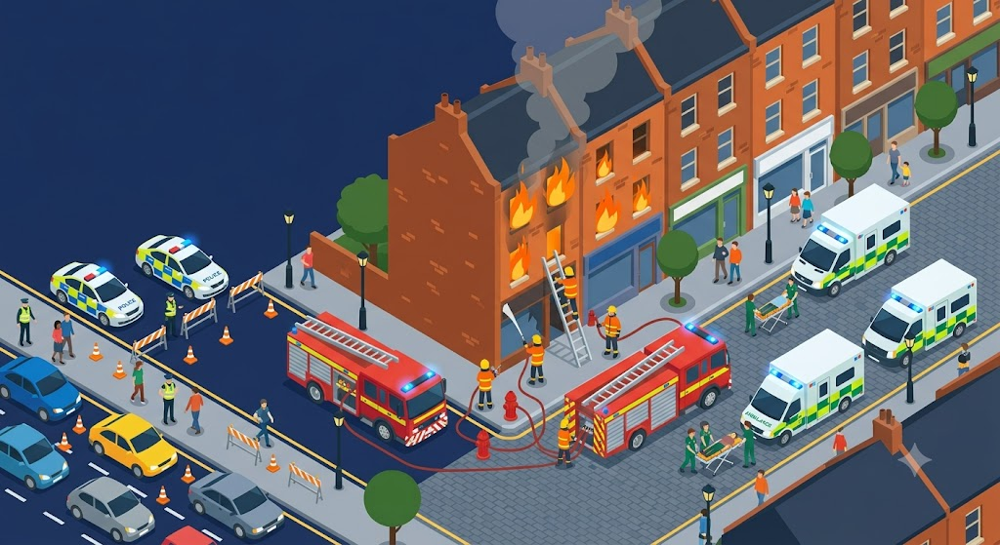
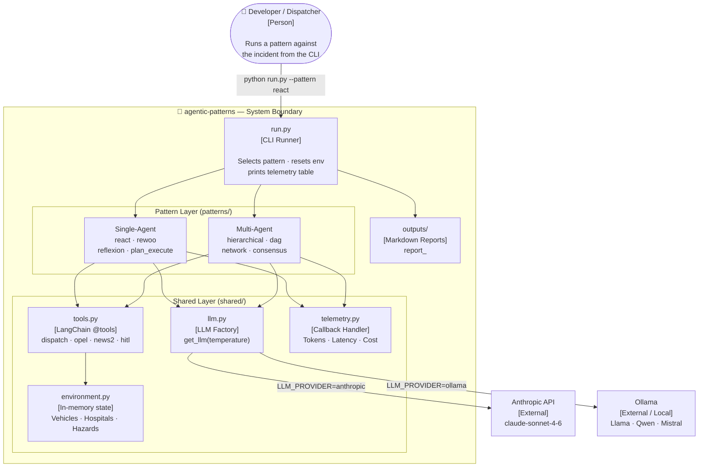
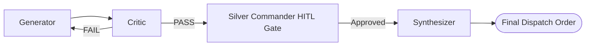
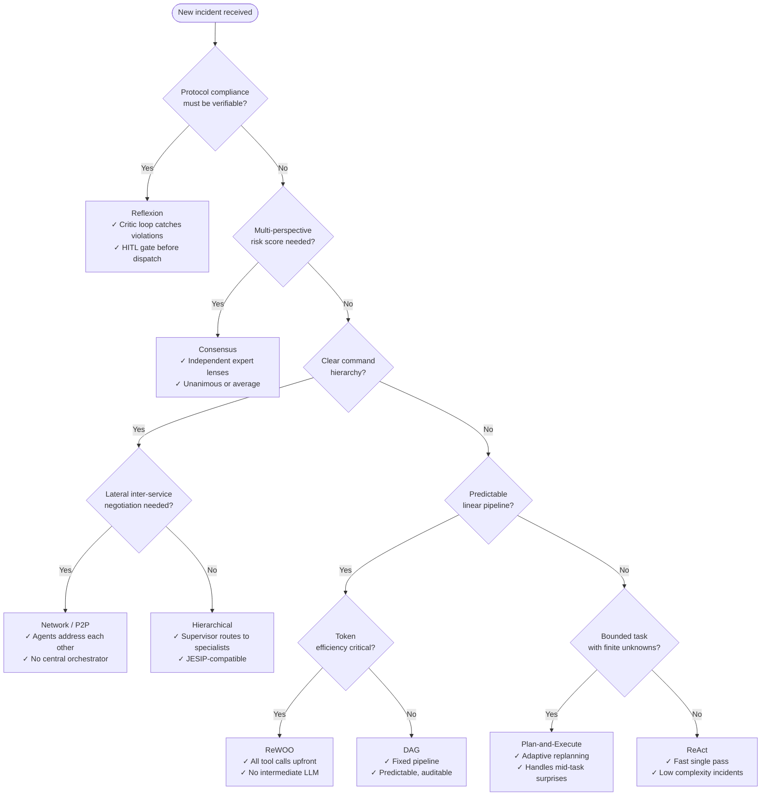

A 999 call comes in: a 3-storey building is on fire, casualties are reported, and High Holborn is gridlocked. The Incident Commander has roughly 90 seconds to answer four questions. Which hospital can take burns patients — and is it under pressure? How many pumping appliances does the NFCC minimum require for a multi-storey structural fire? Which traffic corridor can the ambulances actually reach? And does this cross the threshold for a formal Major Incident declaration?

Which agentic pattern you use to support that decision changes everything — not just how fast the answer arrives, but whether the answer is auditable, protocol-compliant, and safe to act on without a human double-checking it.

This is Part 2 of the JigsawFlux series on open-source agentic frameworks. [Part 1](/blog/comparing-agent-frameworks) compared LangGraph, CrewAI, and AutoGen at the framework level. Part 2 puts eight specific reasoning patterns — ReAct, ReWOO, Plan-and-Execute, Reflexion, Hierarchical, DAG, Network/P2P, and Consensus — through the same incident and measures what each one actually does. The full source is at [github.com/JigsawFlux/agentic-patterns](https://github.com/JigsawFlux/agentic-patterns).



<!-- truncate -->

---

## The Incident

> **Fictional scenario disclaimer:** All location names, NHS trust names, personnel, and incident data in this post are entirely fabricated. "14 Kingsbourne Terrace, WC1B 9ZZ" is an invented street name; the `ZZ` postcode suffix is unassigned in the Royal Mail system. All NHS trust names are invented. No connection to any real incident, address, person, or NHS operational data.

The simulation uses the METHANE major incident framework — the standard UK structure for declaring and communicating a major incident across blue-light services.

| Field | Detail |
| :--- | :--- |
| **M** — Major Incident | Declared — multi-agency response activated |
| **E** — Exact Location | 14 Kingsbourne Terrace, WC1B 9ZZ, London |
| **T** — Type of Incident | 3-storey building fire — smoke inhalation casualties — possible burns |
| **H** — Hazards | Structural collapse risk; smoke and toxic gas exposure; severe traffic gridlock at High Holborn / Holborn Circus (active roadworks) |
| **A** — Access | Via Gray's Inn Road / Theobald's Road — NOT via High Holborn |
| **N** — Number of Casualties | Unconfirmed — multiple — triage in progress |
| **E** — Emergency Services Required | LFB: 4 × Pumping Appliances, 1 × Aerial Ladder Platform, 1 × IRU │ LAS: 4 × RRVs, 4 × DCAs, 1 × HART │ MPS: 4 × Response Cars, 3 × RPUs, 2 × PSU Vans |

The four decisions the dispatcher must make before first units arrive:

1. **Burns routing** — Is Northgate University Hospital NHS Foundation Trust (the only burns facility in the protocol area) accepting? What is its OPEL level?
2. **Fire appliance count** — The NFCC mandates a minimum of 4 Pumping Appliances for a multi-storey structural fire. Is that number met?
3. **Traffic corridor** — High Holborn is gridlocked. Which alternative approach routes are viable?
4. **Major Incident declaration** — Does this cross the formal threshold? If so, who is notified?

Same four decisions. Eight different architectures. Let's see what each one does with them.

---

## The Shared Foundation

Every pattern runs against the same stateful environment (`shared/environment.py`) — a mock database holding UK vehicle availability per service, fictional NHS trust status, OPEL levels, and road hazards. The environment resets between pattern runs, which is what makes the comparison fair: each pattern starts from identical state.

The shared tools — available to every pattern — are:

| Tool | Purpose |
| :--- | :--- |
| `check_responder_availability` | Query Fire / Medical / Police vehicle availability |
| `query_hospital_status` | Get OPEL level, bed count, and specialties for a named trust |
| `check_opel_level` | Dedicated OPEL status check for a trust |
| `assess_news2_score` | Clinical triage scoring for casualty severity |
| `check_weather_and_traffic_hazards` | Road and weather conditions for a postcode |
| `dispatch_resource` | Commit a resource to the incident (writes to shared state) |
| `request_human_approval` | Blocking gate for Silver Commander sign-off before dispatch |

The environment models three fictional NHS trusts: **Northgate University Hospital NHS Foundation Trust** (MTC, burns unit, OPEL 2), **St. Aldric's General Hospital NHS Foundation Trust** (trauma unit, OPEL 1), and **Holborn Community Health Centre** (minor injuries, OPEL 1).

### C4 Container View



---

## Why LangGraph for All 8?

Part 1 mapped CrewAI to hierarchical topologies and AutoGen to conversation-based consensus. For this comparison, all eight patterns use **LangGraph** — the same framework, the same state schema conventions, the same tool decorators.

That is a deliberate, opinionated choice that deserves an explanation.

A CrewAI Crew would be simpler to write than a LangGraph graph for the Hierarchical pattern. An AutoGen conversation would be more natural than a LangGraph multi-agent loop for the Network pattern. But simpler-to-write is not the same as simpler-to-audit. In health tech and emergency services — domains where every dispatch decision can be reviewed in an inquest — the second property matters more than the first.

LangGraph's typed state makes the data contract explicit at every node. Every message, every tool call, every routing decision flows through a named field in a `TypedDict`. You can inspect state at any point in the graph. You can replay the graph from a checkpoint. You can insert an `interrupt()` at any edge and hand control to a human — which is exactly what the Reflexion pattern does before the final dispatch order is issued.

This is not a dismissal of CrewAI or AutoGen. Both are excellent frameworks for the right use cases (Part 1 covers this). It is an honest statement about which property matters most when the output of your agent has a direct consequence for whether an ambulance goes to the right hospital.

```python
class IncidentState(TypedDict):
    messages: Annotated[list[BaseMessage], add_messages]
    incident: str
    plan: str
    critique: str
    final_report: str
    iterations: int
    human_approved: bool
```

Every pattern defines its own variant of this schema. The fields change — Reflexion needs `critique` and `iterations`, the Network pattern needs a shared `transcript` — but the principle is constant: state is typed, explicit, and inspectable.

---

## Single-Agent Patterns

### ReAct — Reason + Act

ReAct interleaves reasoning and tool calls in a loop: reason about what to do, call a tool, observe the result, reason again. The loop runs until the agent decides it has enough information to produce a final answer. <sup>[[1]](#ref-1)</sup>

```python
workflow.add_conditional_edges(
    "agent",
    should_continue,
    {"tools": "tools", END: END}
)
workflow.add_edge("tools", "agent")  # the ReAct loop
```

Against our incident, ReAct completed in **~51 seconds** across 4 tool-call rounds: traffic check, hospital status, responder availability, dispatch. The final report routed burns casualties correctly to Northgate and flagged the High Holborn gridlock.

What ReAct does not do: it does not check its own output against protocol. It dispatched 3 Pumping Appliances in one run — below the NFCC minimum of 4 — and produced a confident report that said nothing was wrong. There was no critic. There was no second pass. The error would only surface if a human checked the dispatch against the NFCC framework.

**When to use it:** Category 2 or Category 3 incidents where protocol complexity is low and a single-pass, fast response is the priority. Not adequate for METHANE-declared major incidents where protocol compliance must be verifiable.

---

### ReWOO — Reason Without Observation

ReWOO inverts the ReAct approach: instead of interleaving reasoning and tool calls, it plans all tool calls upfront in a single LLM step using placeholder variables (`#E1`, `#E2`, ...), then executes them in sequence without any intermediate LLM calls. <sup>[[2]](#ref-2)</sup>

The 19-step plan the agent produced looks like this (abbreviated):

```text
#E1 = check_weather_and_traffic_hazards(location="WC1B 9ZZ")
#E2 = check_responder_availability(service="Fire")
#E3 = check_responder_availability(service="Medical")
#E4 = check_responder_availability(service="Police")
#E5 = query_hospital_status(hospital_name="Northgate University Hospital NHS Foundation Trust")
#E6 = query_hospital_status(hospital_name="St. Aldric's General Hospital NHS Foundation Trust")
#E7 = query_hospital_status(hospital_name="Holborn Community Health Centre")
#E8 = check_opel_level(hospital_name="Northgate University Hospital NHS Foundation Trust")
#E9 = assess_news2_score(symptoms="smoke inhalation, possible severe burns")
#E10 = dispatch_resource(service="Fire", resource_type="Pumping Appliance", quantity=3, ...)
... [9 more dispatch calls resolving #E2–#E9 as arguments]
```

The executor resolves each placeholder in order, feeding `#E2`'s result as an argument to `#E10`, and so on. No LLM sees the intermediate results. Completed in **~65 seconds**.

The efficiency gain is real — approximately 60% fewer LLM calls than a comparable ReAct run on the same incident. But the static plan is also the pattern's limit. If Northgate had been OPEL 4 (divert) when `#E5` resolved, the plan had no branch to handle it — the `#E10` dispatch to Northgate would have fired anyway. ReWOO commits to the plan; it cannot adapt mid-execution.

**When to use it:** Token-constrained environments, high-volume triage at low-to-moderate incident complexity, or any scenario where the tool-call sequence is predictable from the incident description alone. Not suitable when real-time OPEL status or unexpected resource unavailability must change the dispatch plan mid-run.

---

### Reflexion — Generate, Critique, Revise

Reflexion adds a critic loop to the generation cycle: a Generator agent proposes a plan, a Critic evaluates it against hardcoded safety protocols, and if the critique is not a `PASS`, the Generator revises. The loop runs up to 3 iterations or until the critic is satisfied. <sup>[[3]](#ref-3)</sup>



The critic checks against four hardcoded protocol rules:

1. NFCC minimum: 4 Pumping Appliances for a multi-storey structural fire
2. Burns routing: all burns casualties must route to the burns unit (Northgate)
3. Hazard protocol: traffic hazard must be flagged and approach routes updated
4. OPEL protocol: hospital OPEL status must be checked before routing

On iteration 1, the Generator dispatched 3 Pumping Appliances. The critic's response:

> *"NFCC FAIL — only 3 Pumping Appliances dispatched. NFCC minimum for a multi-storey structural fire is 4. Generator must revise the fire resource allocation before this plan can be approved."*

Iteration 2 corrected to 4 Pumping Appliances and received a `PASS`.

Before the Synthesizer runs, a **Silver Commander human-in-the-loop gate** fires:

```python
def hitl_gate(state: ReflexionState) -> ReflexionState:
    if not AUTO_APPROVE:
        print("\n[SILVER COMMANDER REVIEW REQUIRED]")
        approval = input("Approve dispatch order? (yes/no): ").strip().lower()
        state["human_approved"] = (approval == "yes")
    return state
```

The Synthesizer only runs if approval is granted. The final output — which you can read at [outputs/report_reflexion.md](https://github.com/JigsawFlux/agentic-patterns/blob/main/outputs/report_reflexion.md) — is a 24-section, 11-unit dispatch order with full METHANE report, hospital routing matrix, approach route table, and escalation triggers. It is also the longest, most operationally detailed output of all 8 patterns by a significant margin.

Total time: **~728 seconds** across 3 iterations. That is expensive. But it is the only pattern that caught a genuine protocol violation without being told where to look for it.

**When to use it:** METHANE-declared or Category 1 incidents where protocol compliance is non-negotiable and the cost of a wrong dispatch — wrong hospital, insufficient appliances — is measured in lives, not latency.

---

### Plan-and-Execute — Adaptive Replanning

Plan-and-Execute separates planning from execution: a Planner generates a sequence of steps, an Executor runs them, and after each execution cycle a Replanner reviews whether the plan is complete or needs revising. <sup>[[4]](#ref-4)</sup>

Against our incident, the Planner generated a 22-step initial plan. The Executor began working through it. After each tool call, the Replanner assessed the current state and asked: *is the plan still correct? Is it complete?*

It was not complete. Every executed action surfaced new operational variables — utility isolation status, mutual aid ETAs, Forward Command Point confirmation, HART decontamination scope. The Replanner treated each new field report as grounds for another full planning cycle. The plan expanded to 34+ steps. The pattern ran for **943 seconds** before hitting Anthropic's monthly API usage limit.

This is not a bug. The pattern was behaving exactly as designed — adaptive replanning on an open-ended, continuously evolving situation. That is precisely the problem. A METHANE-declared major incident is not a bounded task. It is an open-ended, continuously evolving situation where new information arrives faster than a replanning loop can integrate it. Plan-and-Execute's adaptive strength becomes a liability when there is no natural done-state.

ReWOO completed the same incident in 65 seconds by committing to a plan and not revisiting it. For this domain, that is the right trade-off.

**When to use it:** Bounded tasks with a defined goal and a finite set of unknowns — software debugging sessions, document generation pipelines, multi-step data analysis. Not the right pattern for major incident dispatch where the operational scope keeps expanding.

> The output file `outputs/report_plan-and-execute.md` reflects a pre-UK-alignment run and is retained for structural reference only. A full UK-aligned run will be published after the API quota resets.

---

## Multi-Agent Topologies

### Hierarchical — Supervisor and Specialists

The Hierarchical pattern adds a Supervisor that routes to specialist sub-agents by name. After each specialist completes, control returns to the Supervisor, which decides whether to route to another specialist or finish.

```python
def supervisor_router(state: HierarchicalState) -> str:
    last = state["messages"][-1].content.strip()
    if "Fire" in last: return "fire_specialist"
    if "Medical" in last: return "medical_specialist"
    if "Police" in last: return "police_specialist"
    if "FINISH" in last: return END
```

The command routing sequence on our incident:

```text
Supervisor → Fire Specialist → Supervisor → Medical Specialist → Supervisor → Police Specialist → Supervisor → FINISH
```

Fire dispatched first — consistent with JESIP's life safety priority principle, where fire suppression and casualty extraction precede secondary service coordination.

Each specialist runs its own tool-calling loop, dispatches its service's resources, and appends to a shared `transcript`. The Supervisor synthesises the transcript into the final report.

The result is the most operationally structured output of the multi-agent patterns: clear service boundaries, no cross-service confusion, logical sequence. It is also the most rigidly hierarchical — there is no mechanism for the Medical Specialist to tell the Fire Specialist that the hospital routing changes the appliance count requirement. Inter-service feedback has to flow through the Supervisor.

**When to use it:** Incidents with well-defined service boundaries and a clear command hierarchy — which describes most UK 999 multi-agency responses. The JESIP framework maps directly onto this topology.

Total time: **~160 seconds**.

---

### DAG — Directed Acyclic Pipeline

The DAG pattern is a fixed linear pipeline: Triage → Resource Allocation → Traffic Coordinator → Compiler. No loops, no feedback edges, no revisiting previous nodes.

```python
workflow.add_edge("triage", "resource_allocation")
workflow.add_edge("resource_allocation", "traffic_coordinator")
workflow.add_edge("traffic_coordinator", "compiler")
```

Each node is a single LLM call with a specific remit. Triage assesses severity and makes initial hospital routing recommendations. Resource Allocation commits vehicles. Traffic Coordinator updates the approach routes. The Compiler synthesises all four nodes' outputs into the final report.

The pipeline completed in **~129 seconds** and produced a clean, well-structured report. But the static topology exposed a real limitation: the Triage node made hospital routing assumptions before Resource Allocation had checked actual vehicle availability. When Resource Allocation found that HART was fully committed, there was no path back to revise the Triage node's casualty distribution. The pipeline continued with the original assumptions.

In a live incident, this gap would surface as a discrepancy between the triage plan and the dispatch reality — the kind of error that a Reflexion critic would catch, but a DAG pipeline cannot.

**When to use it:** Incidents with predictable information flow and no expectation of mid-pipeline revision — post-incident reporting, structured handover documents, pre-planned exercise scenarios. Not suitable when upstream decisions need to be revisited based on downstream findings.

---

### Network / Peer-to-Peer — Lateral Coordination

The Network pattern has no supervisor. Fire Chief, Police Chief, and Medical Chief communicate directly with each other in a multi-turn conversational loop. Each agent can address any other agent by name and update its position based on peer statements.

In round 1, the Fire Chief called tools to assess the building and dispatch appliances, then addressed the Police Chief directly:

> *"High Holborn is completely inaccessible due to active roadworks at Holborn Circus. Roads Policing Units need to clear Gray's Inn Road immediately — our Pumping Appliances cannot reach the scene without a clear northern corridor."*

The Police Chief responded by dispatching RPUs to Gray's Inn Road and confirming the corridor status, then surfaced a new constraint for the Medical Chief:

> *"Gray's Inn Road is now clear. However, the ambulance convoy will need RPU-03 escort for the Northgate run — the Holborn gridlock affects all southbound exits from the scene, not just the approach."*

The Medical Chief updated the transport plan accordingly.

After 2 rounds, all three chiefs had coordinated on the approach corridor, the hospital routing, and the escort requirement — without any central orchestrator directing the conversation.

The output at [outputs/report_network_p2p.md](https://github.com/JigsawFlux/agentic-patterns/blob/main/outputs/report_network_p2p.md) is the most realistic representation of inter-service coordination at Silver Command level. It is also the hardest to audit: the reasoning is distributed across message threads rather than concentrated in a single state machine. Replaying the decision logic requires reading the full conversation transcript, not inspecting a typed state dictionary.

**When to use it:** Scenarios requiring genuine lateral negotiation between domain experts — not command-and-control dispatch, but the Silver-level coordination phase where each service chief needs to hear the constraints of the others before committing. Total time: **~180 seconds** across 2 rounds.

---

### Consensus — Expert Debate and Voting

The Consensus pattern runs three independent expert agents — Threat Analyst, Resource Chief, Public Safety Liaison — in parallel. Each scores the incident severity independently (1–5), then shares its reasoning with the other two. If scores converge within a defined threshold, consensus is declared. If not, a second round of debate runs.

On our incident, the result was striking:

```text
╔══════════════════════════════════════════════════════╗
║                                                      ║
║         CONSENSUS THREAT SCORE:  4 out of 5         ║
║                                                      ║
║         Classification:  HIGH SEVERITY               ║
║         Consensus Method: Unanimous Agreement        ║
║                                                      ║
╚══════════════════════════════════════════════════════╝
```

All three experts independently scored 4/5. No second round was needed. The agreed finding — that the High Holborn gridlock was the single greatest escalation risk — emerged from three distinct analytical lenses converging on the same operational bottleneck:

- The **Threat Analyst** flagged it as a force multiplier that could delay suppression and allow fire spread to adjacent properties
- The **Resource Chief** identified it as the critical path for all ambulance routing and crew relief cycles
- The **Public Safety Liaison** noted that a prolonged closure would require adjacent property evacuation, multiplying the public-facing coordination demand

No single-agent pattern surfaced this finding as prominently. The unanimous, multi-lens convergence on a secondary hazard is the consensus pattern's distinctive contribution. Total time: **~96 seconds**.

---

## Telemetry

All 8 patterns ran on the same incident: *"Report of a 3-story building fire at 14 Kingsbourne Terrace (WC1B 9ZZ, London) with smoke inhalation casualties, possible burns, and severe traffic gridlock on High Holborn."*

| Pattern | Status | Run Time (s) | Topology | Key Characteristic |
| :--- | :---: | ---: | :--- | :--- |
| **ReAct** | ✅ | ~51 | Single agent, cyclic | Fast single pass; no protocol self-check |
| **ReWOO** | ✅ | ~65 | Single agent, batch | 19-step upfront plan; no intermediate LLM calls |
| **Consensus** | ✅ | ~96 | Multi-agent, parallel | 3 independent experts; unanimous first round |
| **DAG** | ✅ | ~129 | Multi-agent, linear | 4-stage pipeline; no feedback loops |
| **Hierarchical** | ✅ | ~160 | Multi-agent, routed | Supervisor → Fire → Medical → Police |
| **Network / P2P** | ✅ | ~180 | Multi-agent, lateral | 2 rounds; inter-service negotiation |
| **Reflexion** | ✅ | ~728 | Single agent, iterative | 2 iterations; NFCC violation caught; HITL gate |
| **Plan-and-Execute** | ⚠️ | 943 (aborted) | Single agent, replanning | Plan expanded from 22 to 34+ steps; API quota consumed |

The cost story is as important as the time story. ReWOO and Consensus are the most token-efficient patterns — ReWOO because it eliminates intermediate LLM reasoning, Consensus because three parallel single-pass agents are cheaper than one iterative loop. Reflexion is expensive precisely because its value is in the iteration. Plan-and-Execute's cost is unbounded on open-ended incidents.

`TelemetryCallback` in `shared/telemetry.py` captures per-call token counts, wall-clock latency, and estimated cost (Sonnet 4.6: $3/M input, $15/M output). Ollama runs at $0.00 — which is the reason sovereign deployment is Phase 2's first workstream.

---

## Pattern Selection Guide



The flowchart is a starting point, not a formula. Two patterns that do not appear as obvious choices for emergency dispatch — Plan-and-Execute and ReAct — are exactly the right tools for bounded, low-stakes tasks within an emergency services context: scheduling, document drafting, post-incident report generation. The patterns are not inherently domain-specific. The incident type is.

---

## What's Next

Phase 1 established that all 8 patterns work end-to-end against a UK-aligned NHS emergency scenario, with a shared LLM factory, per-run telemetry, and a human-in-the-loop gate in the critical path of the most safety-sensitive pattern.

Phase 2 addresses the harder questions:

**Sovereignty.** Do these patterns hold up when the LLM is not Anthropic Claude on a paid API, but Llama 3.1 or Qwen2.5 running locally on Ollama? Set `LLM_PROVIDER=ollama` in `.env` and run any pattern — the factory handles the rest. The open question is which patterns degrade gracefully when tool-calling is less reliable on smaller models, and which ones need structured output guards.

**Clinical domain depth.** The 999 fire scenario is a starting point. A Care Act 2014 triage scenario — safeguarding referral, mental health crisis, CRHT team dispatch — involves fundamentally different protocols, different responders, and different risk frameworks. Phase 2 extends the shared environment to this domain and runs the patterns against it.

**Audit and governance.** The current dispatch log is in-memory and resets between runs. Every `dispatch_resource` call and every `request_human_approval` decision needs to be written to a persistent, immutable audit record — with timestamp, approval status, and the reasoning state that produced it. `shared/audit.py` is the next file to write.

If any of those workstreams interests you — whether you are an engineer, an NHS practitioner, or an AI researcher — the work is open and the issues board is the right place to start: [github.com/JigsawFlux/agentic-patterns/issues](https://github.com/JigsawFlux/agentic-patterns/issues).

---

## References

**Research papers**

<span id="ref-1">[1]</span> Yao, S. et al. (2022). *ReAct: Synergizing Reasoning and Acting in Language Models*. [arXiv:2210.03629](https://arxiv.org/abs/2210.03629).

<span id="ref-2">[2]</span> Xu, B. et al. (2023). *ReWOO: Decoupling Reasoning from Observations for Efficient Augmented Language Models*. [arXiv:2305.18323](https://arxiv.org/abs/2305.18323).

<span id="ref-3">[3]</span> Shinn, N. et al. (2023). *Reflexion: Language Agents with Verbal Reinforcement Learning*. [arXiv:2303.11366](https://arxiv.org/abs/2303.11366).

<span id="ref-4">[4]</span> Wang, L. et al. (2023). *Plan-and-Solve Prompting: Improving Zero-Shot Chain-of-Thought Reasoning by Large Language Models*. [arXiv:2305.04091](https://arxiv.org/abs/2305.04091).

**Operational frameworks**

<span id="ref-5">[5]</span> Joint Emergency Services Interoperability Principles (JESIP). *Joint Doctrine: The Interoperability Framework*. [jesip.org.uk](https://www.jesip.org.uk).

<span id="ref-6">[6]</span> National Fire Chiefs Council (NFCC). *Fire and Rescue Service Operational Guidance — Incident Command*. NFCC, UK.

<span id="ref-7">[7]</span> NHS England. *Operational Pressures Escalation Levels (OPEL) Framework*. NHS England, 2022.

<span id="ref-8">[8]</span> Royal College of Physicians. *National Early Warning Score (NEWS2)*. RCP, 2017.

**Project sources**

<span id="ref-9">[9]</span> LangGraph — [langchain-ai/langgraph](https://github.com/langchain-ai/langgraph), GitHub.

<span id="ref-10">[10]</span> JigsawFlux. *agentic-patterns* — [github.com/JigsawFlux/agentic-patterns](https://github.com/JigsawFlux/agentic-patterns), full source and pattern outputs.

<span id="ref-11">[11]</span> JigsawFlux. *Part 1: Picking an Open-Source Agent Framework* — [/blog/comparing-agent-frameworks](/blog/comparing-agent-frameworks), LangGraph vs. CrewAI vs. AutoGen comparison.

---

This is a JigsawFlux project. JigsawFlux builds open-source tools for health tech, humanitarian response, and crisis management — tools designed to work on constrained budgets, unreliable infrastructure, and donated hardware. If you are working on something in this space, or want to contribute, the [JigsawFlux GitHub organisation](https://github.com/JigsawFlux) is where the work happens.
