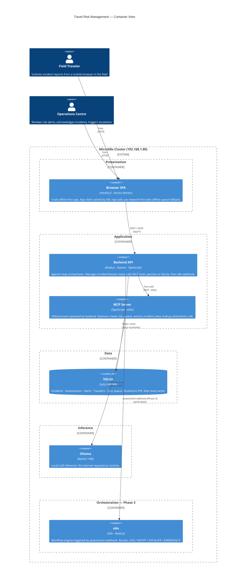
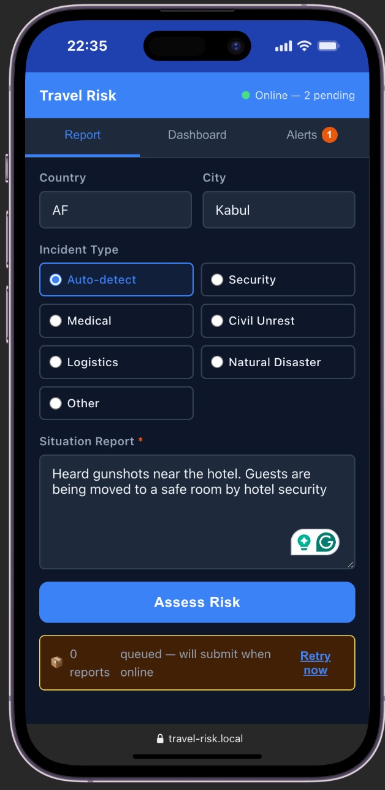
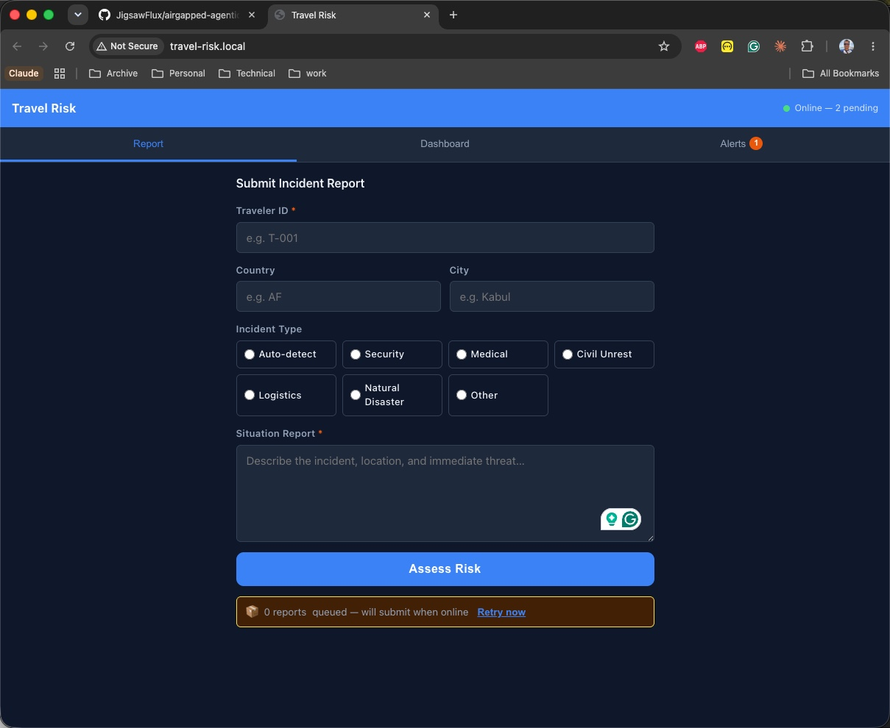
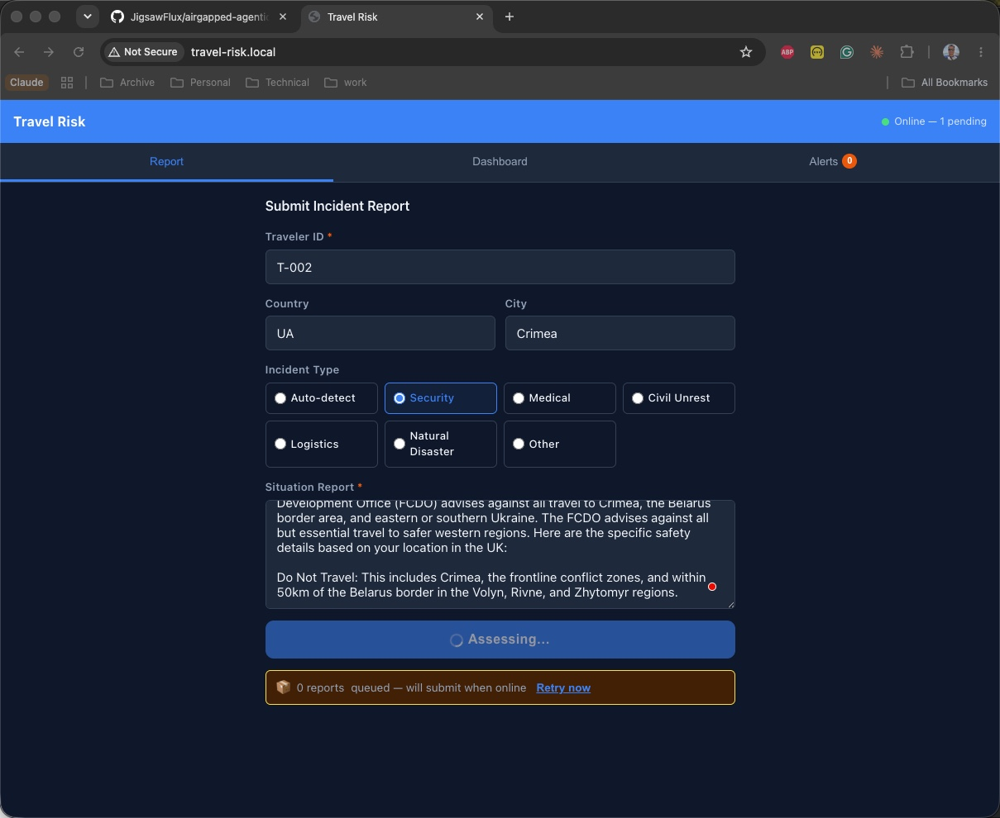
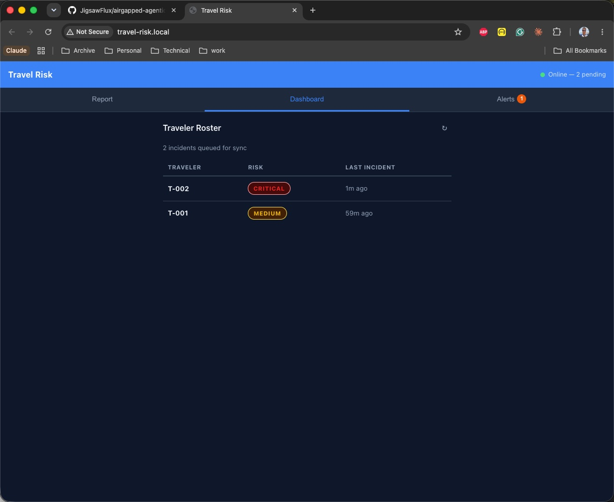
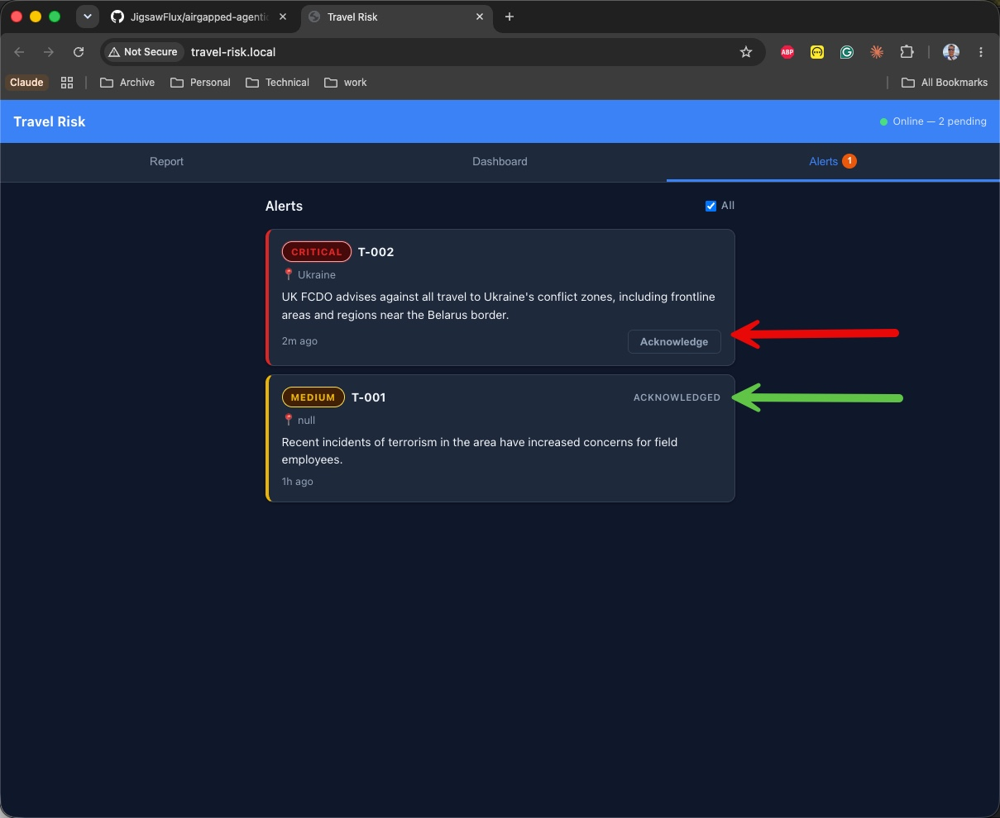
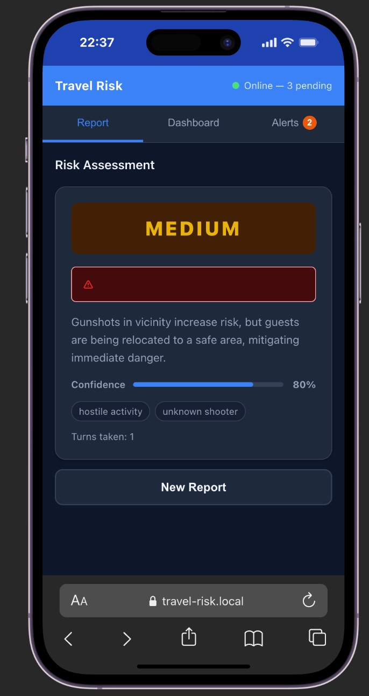
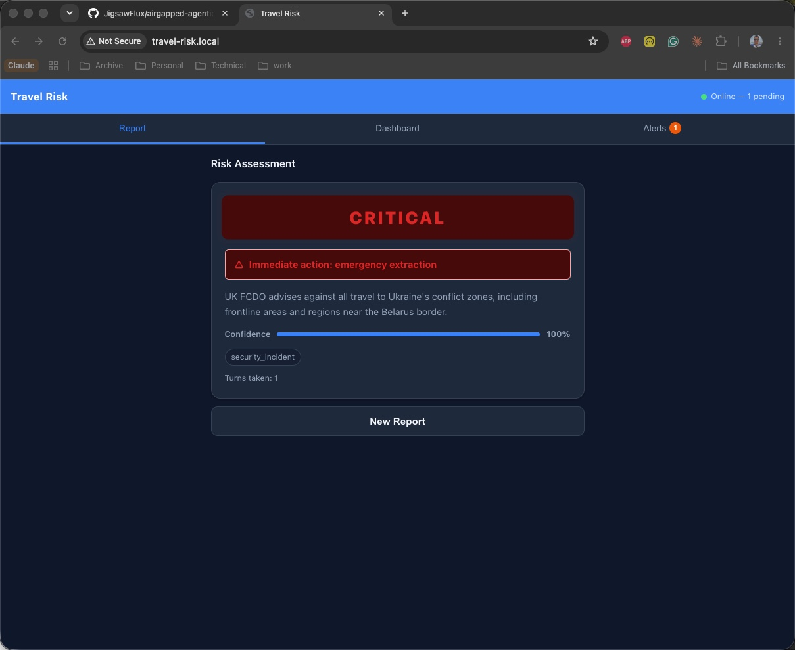
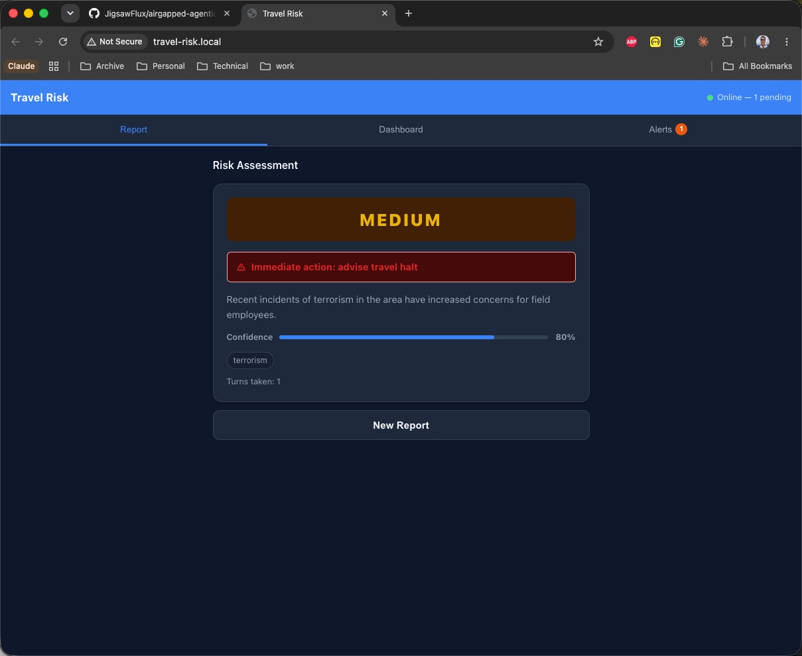

It is 11:40pm local time in Crimea. A field researcher — call her T-002 — is in her hotel room when she hears shots outside. She picks up her phone, opens the company travel app, and types what she can see. The app is offline. There is no satellite signal. The ops centre in London cannot be reached.

What happens in the next sixty seconds matters. Not for a sprint retrospective. For her.

This post is about building a system that makes those sixty seconds count — an offline-first agentic travel risk assessment application that runs entirely on a local LLM, asks one clarifying question if it needs to, and produces a structured risk verdict before the connection returns. No cloud dependency. No API key in the critical path. The database, the model, and the application all run on the same MicroK8s node — the one I set up in [my previous post](/blog/local-llm-kubernetes-home-lab) on my home lab Intel NUC.

But before the architecture: the context. This system exists because employers have a legal and moral duty to protect people they send into harm's way. That duty does not pause when the internet does.

The code is at [`JigsawFlux/airgapped-agentic-trm`](https://github.com/JigsawFlux/airgapped-agentic-trm).

<!-- truncate -->

---

## Duty of Care: The Legal and Moral Frame

Under the Health and Safety at Work etc. Act 1974, UK employers have a duty to ensure, so far as is reasonably practicable, the health, safety, and welfare of their employees — including those working abroad. <sup>[[1]](#ref-1)</sup> The Corporate Manslaughter and Corporate Homicide Act 2007 extended this: an organisation can face criminal prosecution if a gross failure in a duty of care contributes to an employee's death. <sup>[[2]](#ref-2)</sup>

ISO 31030:2021 — *Travel Risk Management: Guidance for organisations* — gives the international standard framework. It establishes that organisations sending personnel into elevated-risk environments must conduct pre-travel risk assessments, maintain situational awareness throughout the deployment, and have documented escalation procedures. <sup>[[3]](#ref-3)</sup> The FCDO's foreign travel advice is the UK government's primary tool for communicating those risks; every field traveler's brief should reference it. <sup>[[4]](#ref-4)</sup>

The gap this system addresses is the runtime gap: what happens *after* the traveler has departed, *after* the pre-travel brief, *when* something unexpected occurs in a location with no reliable connectivity. The duty of care doesn't end at the airport. It follows the traveler into the field — and so should the systems designed to protect them.

> **Scenario disclaimer:** T-002, all traveler IDs, and all incident details in this post are fictional test data. Any resemblance to real incidents, real personnel, or real organisations is coincidental.

---

## The Problem

Travel risk management firms and corporate security teams face an irreducible tension: the regions that carry the highest risk are often the regions with the least reliable infrastructure. A field traveler in Crimea, rural Zimbabwe, or northern Mali cannot rely on a stable internet connection to reach an ops centre when an incident occurs.

The conventional answer — satellite phone, call the duty officer — has two problems. First, it depends on one person being available at the other end at any hour. Second, it produces an unstructured verbal exchange that is hard to audit, hard to escalate consistently, and impossible to replay when the decision is reviewed after the fact.

An edge-deployed assessment system changes both. The traveler submits a structured incident report through a mobile browser. A locally-deployed LLM assesses risk using a bounded agentic loop, asks one clarifying question if needed, and returns a structured verdict: `LOW / MEDIUM / HIGH / CRITICAL` and an immediate action. The ops centre receives the same structured record when connectivity returns. Every decision is logged. Every assessment is auditable.

The system I built does this:

- Accepts incident reports from a mobile-first browser UI, cached offline by a Service Worker
- Runs a two-turn agentic loop with `llama3.1:8b` via an MCP server spawned as a child process
- Returns a structured verdict with risk level, rationale, confidence score, and immediate action
- Persists everything to a local SQLite database (via `sql.js` WASM — no native compilation required)
- Queues assessed incidents for batch sync to a remote ops server when connectivity returns
- Routes assessed incidents through n8n for structured escalation in Phase 3

---

## Architecture

The system runs in a `travel-risk` Kubernetes namespace on the same cluster as Ollama — the one from the [June post](/blog/local-llm-kubernetes-home-lab). No new hardware. No new infrastructure budget.



Five containers, two personas. The backend is the only component that touches both MCP and the database. n8n sits entirely outside the critical path — the assessment response reaches the traveler before the webhook fires, which means n8n failure never degrades the field experience.

---

## The Agentic Loop

The most consequential design decision is the two-turn bounded agentic loop. It directly determines whether the traveler gets a confident verdict or a hedged non-answer.

```text
POST /api/incidents
  │
  ├─ validate → insertIncident → createSession
  │
  └─ MCP: travel_risk_assess  (turn 1, clarificationsLeft=1)
        │
        ├─ NEEDS_CLARIFICATION ──► return { status:'clarifying', question }
        │                               │
        │                    POST /api/incidents/:id/assess
        │                               │
        │                    MCP: travel_risk_assess  (turn 2, clarificationsLeft=0)
        │                               │
        └─ ASSESSED ──────────────► insertAssessment → upsertTraveler
                                    → insertAlert (if ≥ MEDIUM)
                                    → enqueue → n8n webhook (fire-and-forget)
```

**Turn 1.** The traveler's report arrives at `POST /api/incidents`. The backend creates an `IncidentSession` (in-memory, keyed by `sessionId`) with `clarificationsLeft=1`, then calls the `travel_risk_assess` MCP tool with the full message history. The system prompt instructs the model: *if you need ONE clarifying question to make an accurate assessment, return `{"status":"NEEDS_CLARIFICATION","question":"..."}`. Otherwise return an `ASSESSED` verdict.* If clarification is needed, the backend returns `{ status: 'clarifying', sessionId, question }` and waits for the traveler to answer.

**Turn 2.** The traveler's answer arrives at `POST /api/incidents/:id/assess`. The backend appends `[assistant: lastQuestion, user: answer]` to the message history and calls the tool again with `clarificationsLeft=0`. The prompt now reads: *you must provide a final assessment now even if information is incomplete.* The model cannot ask a second question. It commits.

**Why a hard cap of two turns?** On a satellite or 2G connection, every round-trip to the LLM costs time — and time has consequences in a field incident. An unbounded loop could hang indefinitely on malformed output or an indecisive model. The worst case here is 2 × LLM round-trip: approximately 8–12 seconds on CPU-only `llama3.1:8b`. A low-ambiguity report assessed on turn 1 skips the second call entirely. The cap is configurable via `MAX_CLARIFICATIONS` env var — setting it to `0` forces an immediate verdict on every report, which is useful for high-tempo mass casualty scenarios where speed matters more than precision.

The loop state is pure in-memory:

```typescript
export interface IncidentSession {
  incidentId: string;
  travelerId: string;
  messages: Message[];         // grows from 1 to 3 across the two turns
  clarificationsLeft: number;  // starts at MAX_CLARIFICATIONS (default 1)
  lastQuestion: string | null;
  createdAt: number;
}
```

Sessions expire after 30 minutes and are swept every 5 minutes. On backend restart, the traveler resubmits — no data is lost, because the incident row is written to SQLite before the first LLM call.

### The system prompt and risk taxonomy

The model's instructions encode the four risk levels, the five immediate actions, and a strict JSON output contract. Structured output is not optional here — an ops centre cannot act on free text when an alert fires at 3am:

```
You are a Travel Risk Assessment AI for field employees in high-risk regions.

Assess the situation using these risk levels:
- LOW:      Routine conditions, normal operations can continue
- MEDIUM:   Elevated risk, increased vigilance required
- HIGH:     Significant threat, consider relocation or extraction
- CRITICAL: Immediate danger, activate emergency protocols now

Immediate action options:
  none | advise_travel_halt | escalate_medical |
  escalate_security | emergency_extraction

[If clarificationsLeft > 0]:
  If you need ONE clarifying question, respond ONLY with:
  {"status":"NEEDS_CLARIFICATION","question":"your specific question here"}

Otherwise respond ONLY with:
{"status":"ASSESSED","riskLevel":"LOW|MEDIUM|HIGH|CRITICAL",
 "rationale":"brief explanation under 300 chars","confidence":0-100,
 "flags":["flag1"],"extractedLocation":"city, country or null",
 "immediateAction":"none|advise_travel_halt|..."}

Respond ONLY with valid JSON. No prose outside the JSON object.
```

`llama3.1:8b` follows this reliably in testing. The adapter strips markdown fences if they appear and falls back to `{ riskLevel: 'MEDIUM', confidence: 0, immediateAction: 'none' }` if the JSON is unparseable — a safe default that flags the assessment for human review rather than silently dropping it.

### MCP tools

Three tools are registered on the MCP server. The backend currently calls only `travel_risk_assess` in the live loop; the other two are wired for Phase 3 enrichment:

| Tool | Purpose |
|------|---------|
| `travel_risk_assess` | Core agentic loop — returns `NEEDS_CLARIFICATION` or `ASSESSED` |
| `extract_incident_data` | Classify incident type and extract structured fields |
| `lookup_destination_risk` | Return baseline risk for a destination (Phase 1: static JSON; Phase 3: synced) |

### MCP over stdio, not HTTP

The MCP server runs as a `stdio` child process spawned by the backend — not a sidecar container, not a separate port. One Deployment, one PVC, the whole assessment stack in a single pod:

```typescript
const transport = new StdioClientTransport({
  command: 'npx',
  args: ['tsx', process.env.MCP_SERVER_PATH!],
  env: process.env as Record<string, string>,
});
```

The child process inherits the parent's environment variables, so LLM provider configuration (Ollama, OpenAI, Anthropic) flows through naturally without any additional wiring. Lifecycle is tied to the backend pod, which is correct for a single-replica MVP.

---

## LLM Provider Abstraction

The system doesn't hard-code Ollama. An `ILLMProvider` interface sits between the MCP server and whichever LLM is in use:

```typescript
export type LLMProviderType = 'ollama' | 'openai-compatible' | 'anthropic';

export interface ILLMProvider {
  chatWithMessages(
    messages: Message[],
    systemPrompt?: string
  ): Promise<{ content: string; durationMs: number }>;
  healthCheck(model: string): Promise<HealthCheckResponse>;
}
```

Three concrete implementations cover Ollama (`/api/chat`), OpenAI-compatible APIs (`/v1/chat/completions` — covers OpenAI, Azure OpenAI, Groq), and Anthropic (`/v1/messages`). The active provider is selected at startup from `LLM_PROVIDER` env var. Switching from an airgapped Ollama to a cloud provider when the device is back online is a ConfigMap change and pod restart — no code change, no rebuild.

One Anthropic-specific wrinkle worth noting: the Claude API does not accept a `system` role inside the `messages` array. It must be a separate top-level field. The `AnthropicProvider` promotes system-role messages from the history array accordingly — a small but important difference that produced one silent failure before the test suite caught it:

```typescript
// Claude API: system is a top-level field; messages array is user/assistant only
const body = {
  model: this.model,
  messages: messages.filter(m => m.role !== 'system'),
  max_tokens: 1024,
  system: systemPrompt,  // top-level, not in messages
};
```

This abstraction paid off during development: I could test the assessment logic against the Claude API locally without any code changes, then switch back to Ollama for the deployed version. The duty of care concern here is also real — if an organisation wants to keep incident reports fully on-premises and never send them to a cloud LLM, the provider enum enforces that at startup. Set `LLM_PROVIDER=ollama` and the data never leaves the cluster.

---

## Database: sql.js over better-sqlite3

The obvious Node.js SQLite choice is `better-sqlite3`. It is fast, synchronous, and well supported. But it is a native module — it requires `node-gyp` and a C toolchain at `npm install` time.

Inside an airgapped Alpine Linux container, there is no C toolchain. `node-gyp` fails during the image build. I discovered this at build time rather than deployment time, which was recoverable but slowed down the first deploy cycle.

The solution: `sql.js` — a WebAssembly port of SQLite that installs as a plain npm package with no native build step. <sup>[[5]](#ref-5)</sup> The database lives entirely in-process memory and must be explicitly flushed to disk after every write:

```typescript
export function persist(): void {
  const data = db.export();  // also flushes WAL
  fs.writeFileSync(RISK_DB_PATH, Buffer.from(data));
}
```

One subtle trap: `db.export()` resets `getRowsModified()` as a side effect of flushing the WAL. Capture the row-modified count *before* calling `persist()`, not after.

The schema has five tables: `travelers`, `incidents`, `assessments`, `alerts`, and `sync_queue`. The sync queue is the offline-first mechanism — every assessed incident is enqueued immediately, and `POST /api/sync` drains the queue when connectivity returns. An ops centre that receives a batch sync after a connectivity gap gets a complete, ordered record of every incident that was assessed offline — not a phone call log, not a WhatsApp thread.

Estimated footprint: ~1 MB empty, ~5 MB at 1,000 incidents. Well within the 5 GB PVC budget.

---

## The Frontend: Three Tabs, Designed for Stress

The UI is vanilla HTML/JS/CSS — no React, no build step, ~100 KB gzipped. The design constraint was deliberate: it must work on a low-spec mobile browser under stress, load from cache when the network is down, and be learnable in under two minutes by someone who has never used it before. Those are not aesthetic choices. They are functional requirements for a system used by someone who is frightened. <sup>[[6]](#ref-6)</sup>

Here is what it actually looks like in a traveler's hand — 22:35 local time, Kabul, an incident already unfolding:



No login screen. No tutorial. The form is the first thing the traveler sees.

Three tabs:

1. **Report** — switches between three states: form, clarifying question, verdict
2. **Dashboard** — traveler roster with last check-in and risk badge; auto-refreshes every 30s
3. **Alerts** — open incidents requiring acknowledgement

### Report tab — State A: form

Traveler ID, country, city, seven incident type radio buttons, and a free-text description field. The "Assess Risk" button submits to `POST /api/incidents`.



The status bar at the bottom (`0 reports queued — will submit when online`) is driven by the Service Worker's offline queue. Reports submitted without connectivity are stored locally in IndexedDB and retried automatically when the network returns. The traveler gets a local confirmation immediately — the sync is transparent.

### Report tab — State B: assessing

The moment the form is submitted, the button switches to `Assessing...` and the form is locked. The agentic loop is running. The UI waits on the POST response.



If the LLM returns `NEEDS_CLARIFICATION`, the tab switches to show the AI's question with an answer text area. If it returns `ASSESSED` directly — as it did here, where the situation was unambiguous at 100% confidence — the tab jumps straight to the verdict.

### Report tab — State C: verdict

The verdict screen shows the risk badge, immediate action in red if non-trivial, rationale, confidence bar, and extracted flags. The badge pulses for `CRITICAL`.

Risk colour tokens are CSS custom properties:

```css
--risk-critical: #dc2626;
--risk-high:     #ea580c;
--risk-medium:   #eab308;
--risk-low:      #16a34a;
```

### Dashboard tab

The traveler roster shows each person's last known risk level and time since last incident report. Auto-refreshes every 30 seconds. The sync count in the top right shows incidents queued for upload.



### Alerts tab

Open alerts for MEDIUM-and-above incidents. Each card shows traveler ID, location, rationale, and age. The ops team acknowledges here; the tab badge count reflects unacknowledged open alerts.



---

## n8n for Structured Escalation (Phase 3)

Once an assessment is written to SQLite, the backend fires a webhook to n8n — fire-and-forget, no `await`. An n8n failure never delays the response to the field traveler:

```typescript
if (N8N_WEBHOOK_URL) {
  axios.post(N8N_WEBHOOK_URL, payload).catch((err: Error) => {
    console.error('[n8n] Webhook failed:', err.message);
  });
}
```

The workflow branches on `riskLevel`:

| Risk Level | Action |
|------------|--------|
| LOW | Log only — no human notification |
| MEDIUM | POST to backend `/api/internal/log`; duty officer receives digest |
| HIGH | POST to ops notify endpoint; duty officer receives immediate alert |
| CRITICAL | POST ops notify → **wait 30 minutes** → POST re-escalate if unacknowledged |

The 30-minute re-escalation on CRITICAL is the part that matters most in a duty of care context. An unacknowledged CRITICAL alert in a duty of care incident review is exactly the kind of evidence that determines whether an organisation took reasonable steps to protect its employee. The n8n Wait node handles this without any custom code — and the timing is logged, so the ops team can demonstrate that re-escalation fired on schedule.

Everything runs in-cluster. No internet calls. The CRITICAL branch never relies on an external SMS or email gateway unless one is explicitly configured.

---

## Live Scenarios

> **Fictional scenario disclaimer:** All traveler IDs, location combinations used in testing, and incident reports below are fabricated test data. The FCDO advisory text pasted in the second scenario screenshot is real public domain content, used purely to demonstrate that the LLM can assess real-world source material — not to suggest any connection to a real incident.

These are the four scenarios I ran to verify the end-to-end flow. The screenshots below are from the live system on the MicroK8s cluster.

**Scenario 1 — Active security incident:**

```
Traveler: T-001 | Country: AF | City: Kabul
Report: "Heard gunshots near hotel. Guests being moved to a safe room by hotel security."
```

This is the same report from the mobile screenshot above. On turn 1, with the clarification allowance still open, the model assessed the initial text alone and came back MEDIUM — guests were already being relocated, which it treated as a mitigating factor:



That is a reasonable single-turn assessment. But it is also incomplete. When the loop was allowed to ask its clarifying question:

```
AI:     "Which floor is the safe room on, and are the exits on that side of the building clear?"
Answer: "3rd floor. South-facing exits are blocked — shots came from that direction."
Verdict: CRITICAL + emergency_extraction (2 turns)
```

Blocked exits on the threat-facing side changed the picture entirely. The same opening report, two different trajectories — MEDIUM if the loop commits on turn 1, CRITICAL once the clarifying turn reveals the exits are compromised. This is precisely the case `MAX_CLARIFICATIONS=1` is designed for: situations where the initial report is ambiguous enough that one more data point materially changes the assessment.

The model needed one clarifying question to establish the spatial relationship between the safe room and the threat. With that answer it committed immediately on turn 2.

**Scenario 2 — Conflict zone advisory (CRITICAL, 1 turn):**

A traveler pasted the text of the FCDO travel advisory for Crimea directly into the report field — a realistic scenario where a traveler finds official guidance and doesn't know how to interpret it.



The model assessed it in a single turn at 100% confidence. The advisory text was unambiguous: "Do Not Travel — includes Crimea, the frontline conflict zones, and within 50km of the Belarus border." There was nothing to clarify.

**Scenario 3 — Terrorism threat (MEDIUM, 1 turn):**

```
Traveler: T-001 | Country: GB | City: London
Report: "Recent incidents of terrorism in the area have increased concerns for field employees."
Verdict: MEDIUM + advise_travel_halt | Confidence: 80% | Flag: terrorism
```



Eighty percent confidence on a MEDIUM is the honest output for a vague report: enough threat signal to flag it, not enough to justify a higher risk level without more information. A duty of care posture should treat an 80% MEDIUM as a prompt for the ops team to call the traveler and get a fuller picture — the badge creates accountability for that follow-up.

**Scenario 4 — Logistics failure (LOW, 1 turn):**

```
Traveler: T-001 | Country: TH | City: Bangkok
Report: "Flight cancelled due to weather. Hotel has arranged rebooking at no extra cost."
Verdict: LOW + none | Confidence: 95%
```

No alert is created for LOW verdicts. The incident is still logged and queued for sync — the ops centre sees the full picture, including the non-critical events, when the sync runs.

Turn latency on CPU-only `llama3.1:8b`: 3–7 seconds per call. Two-turn paths complete in 8–12 seconds end to end. Acceptable for a field scenario; slower than a cloud API, but entirely local and offline.

---

## Deployment: Five Things That Went Wrong

The deployment was eventful. Here is what I actually hit, and how I resolved each one.

### 1. SSH to the cluster node was blocked

The standard airgapped import pattern is `docker save <image> | ssh nuc "microk8s ctr images import -"`. This requires SSH access to the cluster node. SSH failed: `Host key verification failed` on the hostname, `Permission denied (publickey,password)` on the raw IP.

**Workaround:** The MicroK8s built-in container registry addon was already enabled on NodePort 32000. Switched to a push-based workflow — build on the dev machine, push to the registry, let the kubelet pull from `localhost:32000` on-node. The manifests use `imagePullPolicy: IfNotPresent` and `image: localhost:32000/<name>:latest`.

### 2. Docker Desktop had gone to sleep between sessions

The Docker client binary was still on `$PATH` and reported its own version, but every `docker build` failed: `Cannot connect to the Docker daemon`. Docker Desktop had shut down.

**Workaround:** `open -a "Docker Desktop" && until docker info &>/dev/null; do sleep 2; done`. This is now a prerequisite check at the top of `deploy.sh`.

### 3. `docker push` to `localhost:5000` timed out

Docker Desktop's `buildx` builder runs inside a Linux VM. `kubectl port-forward` binds on the macOS host at `127.0.0.1:5000`. Inside the VM, that address is unreachable:

```text
dial tcp [::1]:5000: i/o timeout
```

**Workaround:** `crane` — Google's `go-containerregistry` CLI, a native macOS binary that supports `--insecure` for plain HTTP registries. <sup>[[7]](#ref-7)</sup> The flow:

```bash
docker save travel-risk-backend:latest > /tmp/backend.tar
crane push --insecure /tmp/backend.tar localhost:5000/travel-risk-backend:latest
```

`crane` runs on the host, reaches the port-forward at `127.0.0.1:5000`, pushes over HTTP without any daemon reconfiguration.

### 4. Docker produced multi-arch manifest lists the registry rejected

Modern Docker Desktop with `buildx` produces OCI manifest lists by default — even with `--platform linux/amd64`. The built-in MicroK8s registry (Docker Distribution v2) cannot handle manifest lists and responded with a stream of `Waiting` lines before timing out.

**Workaround:** `--provenance=false` suppresses the attestation manifest:

```bash
docker build \
  --platform linux/amd64 \
  --provenance=false \
  -f Dockerfile.backend \
  -t travel-risk-backend:latest .
```

Single OCI manifest; accepted without issue.

### 5. Modifying `daemon.json` was blocked by auto-mode safety classification

Adding `"insecure-registries": ["localhost:5000"]` to `~/.docker/daemon.json` would have let `docker push` work directly. Claude Code's auto-mode safety classifier blocked the edit — modifying TLS/authentication settings requires explicit confirmation. In retrospect, `crane` is the better solution regardless: no daemon restart required, no global Docker configuration change, works from any macOS terminal session.

---

## What Worked Well

**MCP stdio as the tool boundary.** Treating the MCP server as a child process rather than a sidecar kept the deployment simple: one Deployment, one PVC, the full assessment stack in a single pod. The boundary is clean — the backend owns HTTP and session state, the MCP server owns LLM interaction. Swapping the LLM provider requires no changes to the backend code.

**Bounded agentic loop.** The hard cap of two turns was the right call. In a duty of care context, predictable worst-case latency is not just a UX concern — it is a protocol requirement. If a traveler in a deteriorating situation submits a report and the app hangs, the consequences are worse than a confident-but-incomplete verdict. Two turns, then commit.

**Fail-safe defaults.** If the LLM returns unparseable JSON, the system defaults to `MEDIUM / confidence 0`. MEDIUM triggers an alert and queues the incident for sync. The ops team receives it and can follow up. The alternative — dropping the incident silently — is not acceptable in a duty of care system. The fail-safe is conservative by design.

**Provider abstraction from the start.** The `ILLMProvider` interface meant I could test the assessment logic against the Claude API without any code changes during development. The Anthropic system-prompt handling difference would have been a production surprise without the abstraction forcing me to handle it explicitly. It also means the system can be deployed entirely on-premises (Ollama) with a ConfigMap change — which may be a data residency requirement for some deployments.

## What I'd Do Differently

**Compile TypeScript in the container.** I used `tsx` (an esbuild-based TypeScript runner) for the MVP — no build step, the Dockerfile copies source and runs `tsx src/server.ts` directly. This adds ~200ms to startup and means the container image ships TypeScript source. Fine for a home lab MVP; a production deployment would add a `tsc` compile step to the Dockerfile.

**Formalise the human review gate for HIGH and CRITICAL verdicts.** The current system fires alerts for MEDIUM and above. A CRITICAL verdict produces an alert and an n8n re-escalation chain, but the traveler gets the verdict immediately with no mandatory human confirmation loop. In a production duty of care context, HIGH and CRITICAL verdicts should require a named duty officer to acknowledge receipt within a defined SLA — and that acknowledgement should be timestamped and stored. The alert mechanism is the foundation; the SLA enforcement is the next build.

**Pre-pull images before going airgapped.** The MicroK8s manifests use `imagePullPolicy: IfNotPresent`. If the cluster is truly offline and the images aren't already in the containerd store, the pods will never start. The README documents this; the deploy script should verify it.

---

## What's Next

Phase 2 is field device rollout: building Docker images for ARM v7/v8 (Raspberry Pi 4, tablets), building an offline deployment kit with a pre-loaded Ollama model, and adding JWT authentication. The MVP has no auth at all — acceptable on a home lab, not in a production deployment where traveler incident data carries both operational and legal sensitivity.

Phase 3 n8n orchestration is deployed and tested on the home lab cluster. The production version will route HIGH+ alerts to a real ops system and integrate with whatever duty officer notification channel the organisation uses.

The harder Phase 2 question is multi-device sync conflict resolution. Two field devices that both assessed the same incident offline will produce two independent assessment records. `sql.js` is a single-writer; the sync service needs a merge strategy before that scenario can arise in production.

The code, Kubernetes manifests, n8n workflow JSON, and `deploy.sh` — with all the `crane` and `--provenance=false` workarounds baked in — are at [`JigsawFlux/airgapped-agentic-trm`](https://github.com/JigsawFlux/airgapped-agentic-trm).

---

## References

**Legal and regulatory frameworks**

<span id="ref-1">[1]</span> Health and Safety Executive. *Health and Safety at Work etc. Act 1974*. HMSO. Sections 2 and 3 establish the employer's general duty of care, including for employees working overseas. [hse.gov.uk/legislation/hswa.htm](https://www.hse.gov.uk/legislation/hswa.htm).

<span id="ref-2">[2]</span> UK Parliament. *Corporate Manslaughter and Corporate Homicide Act 2007*. c.19. An organisation is guilty of an offence if the way in which its activities are managed or organised causes a person's death, and amounts to a gross breach of a relevant duty of care owed to the deceased. [legislation.gov.uk/ukpga/2007/19](https://www.legislation.gov.uk/ukpga/2007/19/contents).

<span id="ref-3">[3]</span> International Organisation for Standardisation. *ISO 31030:2021 — Travel risk management: Guidance for organizations*. ISO, Geneva, 2021. The primary international standard for employer duty of care in travel risk management. [iso.org/standard/75199.html](https://www.iso.org/standard/75199.html).

<span id="ref-4">[4]</span> Foreign, Commonwealth & Development Office. *Foreign travel advice*. GOV.UK. The UK government's authoritative travel advisories by country, including security, entry requirements, and health. [gov.uk/foreign-travel-advice](https://www.gov.uk/foreign-travel-advice).

**Technical references**

<span id="ref-5">[5]</span> sql.js contributors. *sql.js — SQLite compiled to WebAssembly*. [github.com/sql-js/sql.js](https://github.com/sql-js/sql.js). A pure WASM port of SQLite that installs as a plain npm package with no native compilation step.

<span id="ref-6">[6]</span> Nielsen, J. (1994). *10 Usability Heuristics for User Interface Design*. Nielsen Norman Group. Particularly heuristic 4 — *consistency and standards* — and heuristic 5 — *error prevention* — applied to high-stress UI contexts. [nngroup.com/articles/ten-usability-heuristics](https://www.nngroup.com/articles/ten-usability-heuristics/).

<span id="ref-7">[7]</span> Google. *crane — A tool for interacting with remote images and registries*. [github.com/google/go-containerregistry/cmd/crane](https://github.com/google/go-containerregistry/tree/main/cmd/crane). Used here to push Docker images to a plain-HTTP registry from a macOS host, bypassing the buildx VM boundary.

**Standards and guidance**

<span id="ref-8">[8]</span> British Standards Institution. *BS 8848:2014+A1:2019 — Specification for the provision of visits, fieldwork, expeditions, and adventurous activities outside the United Kingdom*. BSI, London. Relevant for organisations running overseas fieldwork programmes and establishing duty of care frameworks.

<span id="ref-9">[9]</span> Model Context Protocol (MCP) specification. *MCP — An open protocol for connecting AI models to tools and data sources*. Anthropic, 2024. [modelcontextprotocol.io](https://modelcontextprotocol.io).

**Project sources**

<span id="ref-10">[10]</span> JigsawFlux. *airgapped-agentic-trm* — full source, Kubernetes manifests, n8n workflow, and deploy script. [github.com/JigsawFlux/airgapped-agentic-trm](https://github.com/JigsawFlux/airgapped-agentic-trm).

<span id="ref-11">[11]</span> JigsawFlux. *Running a Local LLM on Kubernetes — A Home Lab Setup* — the infrastructure this system runs on. [/blog/local-llm-kubernetes-home-lab](/blog/local-llm-kubernetes-home-lab).

<span id="ref-12">[12]</span> JigsawFlux. *8 Agentic Patterns in Practice* — companion post on agentic reasoning patterns and human-in-the-loop design. [/blog/agentic-patterns-uk-emergency](/blog/agentic-patterns-uk-emergency).

---

This is a JigsawFlux project. JigsawFlux builds open-source tools for health tech, humanitarian response, and crisis management — tools designed to work on constrained budgets, unreliable infrastructure, and donated hardware. If you are working on something in this space, or want to contribute, the work happens at [github.com/JigsawFlux](https://github.com/JigsawFlux).
