The letter arrived on a Tuesday. Oncology outpatient appointment, 9:15am, Thursday fortnight. It was in English. The patient spoke Somali.

She didn't attend. The clinic marked her DNA — Did Not Attend — and returned the slot to the general pool. Three weeks later, a re-booking letter arrived, also in English. By the time a care navigator reached her by phone, her chemotherapy cycle had shifted. The treatment window had narrowed.

This happens eight million times a year across the NHS. The aggregate cost is approximately £1.2 billion annually, but in oncology the cost isn't primarily financial — it's clinical. Missed chemotherapy cycles and delayed radiotherapy planning disrupt treatment pathways engineered around strict timing for efficacy. The slot that goes unfilled at 9:15am on Thursday is time that cannot be recovered by anyone on the waiting list behind her.

I built [Appointment Guardian](https://github.com/JigsawFlux/appointment-guardian) this week to close a specific gap: not sending the reminder, but handling what comes after it. The system imports appointments from FHIR, generates personalised reminders in the patient's language using a local LLM, manages patient replies, classifies barriers, routes tasks to the right care team, and escalates non-response automatically — without any human initiating each step.

It went live on a home-lab MicroK8s cluster on 2026-07-18. This post documents what I built, the four architectural decisions that shaped it, and five things that went wrong.

<!-- truncate -->

---

## The Problem

The national "Did Not Attend" rate for NHS outpatient appointments is approximately 6.7%, though this masks significant variation. Psychiatry sees rates as high as 14%. Cancer specialties typically run lower — but they started higher. At Guy's and St Thomas', initial DNA rates in some oncology cohorts reached 13.5% before targeted digital interventions brought them down. The intervention that worked was DrDoctor's patient-led booking portal, which reduced DNA rates by 25% and reclaimed thousands of administrative hours by letting patients cancel or reschedule rather than simply not show up. [1, 2]

A single missed appointment costs the NHS between £120 and £160. In oncology the real cost is higher: a specialist registrar, an oncology nurse, time-sensitive cytotoxic drugs already drawn, imaging suite time already reserved. None of that cost is recoverable once the window passes. [3]

London trusts have pioneered the supply-side response: High Intensity Theatre lists at weekends (Guy's and St Thomas' now performs 12 hip replacements in a day where they previously did 4 [4]), ring-fenced surgical hubs at Barts Health, Community Diagnostic Centres in Wood Green and Finchley, and a cross-trust slot-pooling arrangement across Barking, Havering, and Redbridge. The Royal Free London recently hit 85.6% of cancer patients treated within 62 days of referral — a genuine milestone. [5]

These are all supply-side responses. They create capacity. The demand-side problem — patients who don't attend not because they don't want to but because a barrier got in the way — requires a different kind of intervention.

The conventional response is a text reminder. The problem with a text reminder is that it creates a one-way channel. The patient receives it and either attends or doesn't. There is no mechanism to learn that she can't get there, that the letter was in the wrong language, that she's now a carer for a family member, that the date clashes with a shift she can't swap. When that information doesn't reach the booking team in time, the slot is wasted and she goes back to the bottom of the list.

Appointment Guardian is the system that makes the reminder into a dialogue.

---

## Architecture

The system has five layers. Here is the system context:

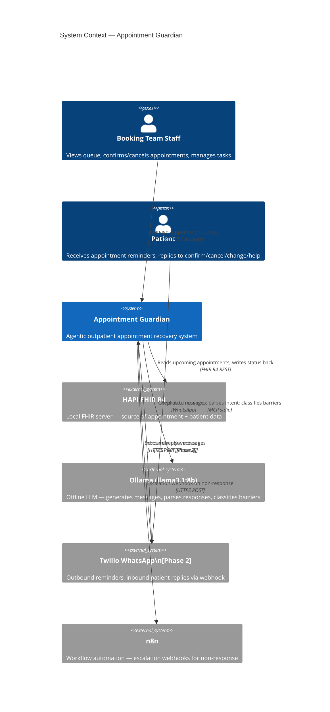

And the containers inside the system boundary:

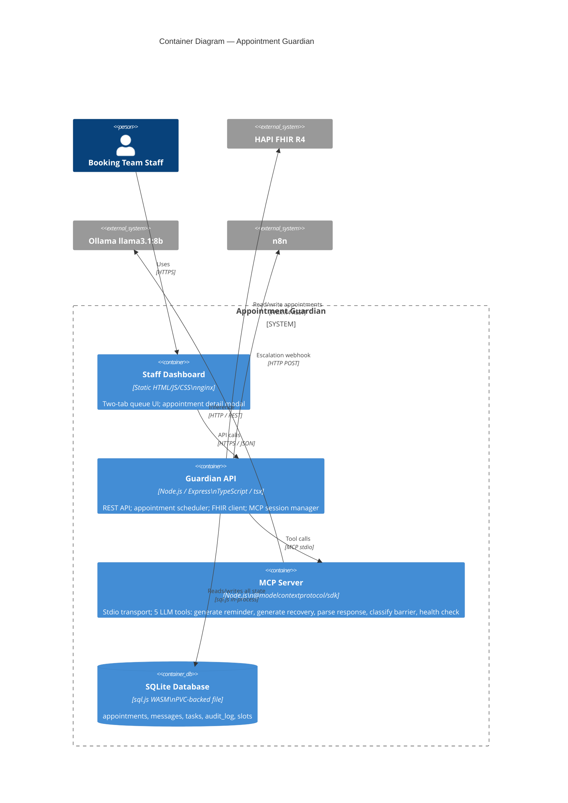

A few things that don't show on the diagram are worth stating explicitly:

**The MCP server is a child process.** It is not a separate Kubernetes pod or a sidecar container. The backend spawns it over stdio on startup. This means there is no service discovery, no network timeout, and no authentication surface between the backend and the LLM layer. There is also a tradeoff: if the subprocess dies, `MCPSessionManager` is responsible for reconnecting. I discovered this matters in practice — more on that in the war stories section.

**SQLite runs in-process.** `sql.js` compiles SQLite to WebAssembly and runs it inside the Node.js process. The database is a single file on a Kubernetes PersistentVolumeClaim. Every write calls `persist()` synchronously before returning. There is no separate database pod, no connection pool, no network latency between the backend and its data.

**FHIR is a data source, not the system of record.** The Guardian reads booked appointments from HAPI FHIR R4 and writes status updates back (`fulfilled`, `cancelled`) as a courtesy. SQLite is the source of truth for the agentic loop. If FHIR is unreachable, the Guardian continues operating; the write-back retries on the next reconciliation. This is an explicit architectural choice — ADR-006 — and it has consequences I'll describe below. The FHIR server itself is [HAPI FHIR](https://hapifhir.io) — the open-source Java reference implementation from Smile CDR, running as `hapiproject/hapi:latest` in its own pod; without it there would be no standards-compliant appointment data to drive the agentic loop.

The system went live on 2026-07-18. All four pods running in the `appointment-guardian` namespace on the NUC:

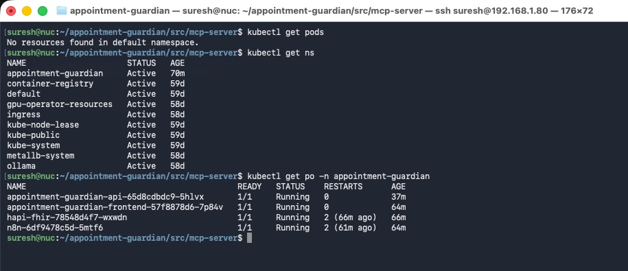

The staff dashboard serves at `guardian.local`. Here is the "All Appointments" view after the first scheduler poll — 73 appointments imported across Cardiology, Orthopaedics, Ophthalmology, Neurology, and Dermatology, with statuses reflecting where each one sits in the lifecycle:

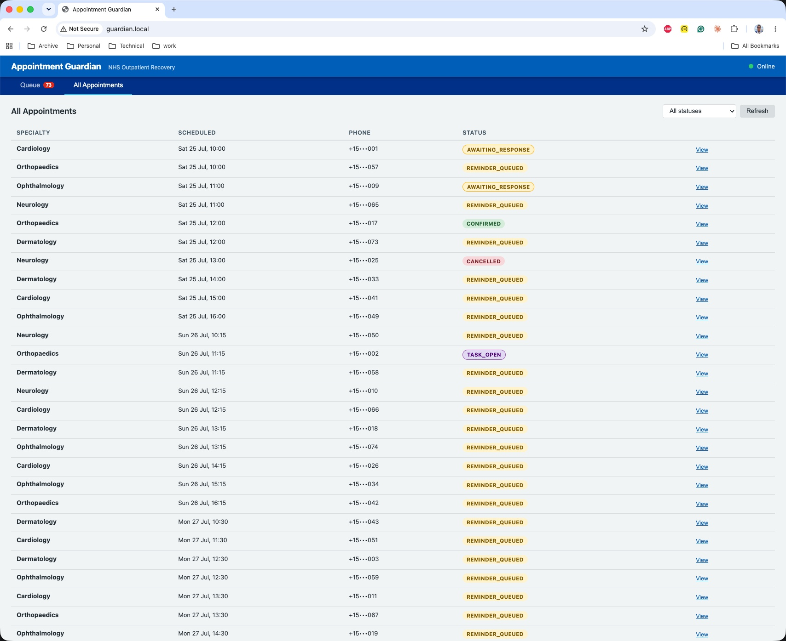

---

## The Agentic Loop

The `AppointmentScheduler` runs on a configurable poll interval (default: one hour). Each tick does two things.

**`importAppointments()`** fetches booked appointments in the 7–14 day window from FHIR:

```text
GET /fhir/Appointment?status=booked&date=ge+7d&date=le+14d
    &_include=Appointment:patient&_count=200
```

For each appointment not already in the local database, it:

1. Inserts the appointment with status `SCHEDULED`
2. Calls `mcp.generateReminderMessage(context, language)` — an MCP tool call that hits Ollama
3. On success: stores the generated text, advances to `REMINDER_QUEUED`, writes an outbound message record, logs the audit event
4. On LLM failure: falls back to a hardcoded template and continues — the scheduler never blocks on LLM availability

The LLM prompt for reminder generation is injected with the specialty, date, time, and optional location at runtime:

```text
You are an NHS appointment reminder service. Write a short WhatsApp message
reminding the patient about their upcoming Oncology appointment on
Thursday, 2 August 2026 at 09:15 at The Christie.

The message must:
- Be in the language with BCP-47 code "so" (or English if you cannot produce
  that language)
- Be under 300 characters
- End with these exact response options on a new line:
  Reply: 1=Confirm 2=Cancel 3=Change date 4=Need help
- Be friendly and non-threatening

Respond with ONLY the message text. No JSON, no explanation.
```

The numbered reply options at the end are not decoration — they define the entire intent classification scheme. When a patient replies, the system matches their message against `1`, `yes`, `confirm` for confirmation; `2`, `no`, `cancel` for cancellation; and so on. In Phase 2, when Twilio delivers real WhatsApp replies, the numbers do the heavy lifting. Free-text replies are deferred to Phase 3.

The Action Queue shows every appointment requiring attention, with the LLM-generated reminder text visible inline. The first scheduler run produced reminders in English, Bengali, Polish, Romanian, Urdu, and other languages — each drawn from the patient's BCP-47 language tag stored in the FHIR Patient resource:


Clicking into any appointment opens the detail modal with the full reminder text, message log, task list, and audit trail. Three examples showing the same numbered-reply structure rendered in each language:


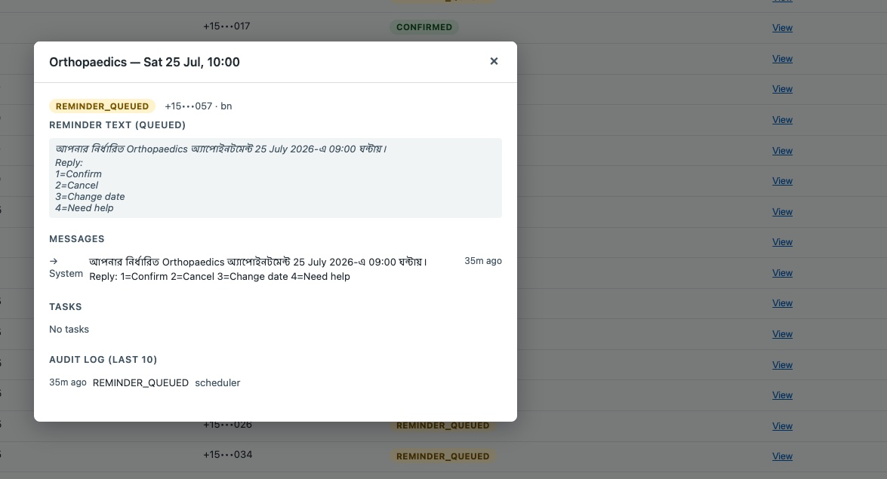

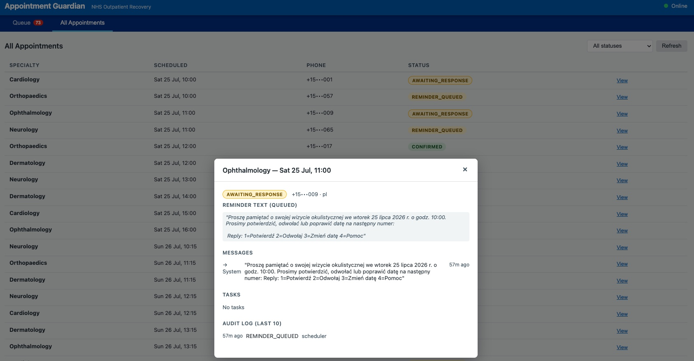

**`detectNonResponse()`** queries for appointments in `AWAITING_RESPONSE` whose `updated_at` is older than 48 hours, advances them to `NON_RESPONSE`, and fires a POST to the n8n escalation webhook with the appointment details. The webhook can trigger a care navigator notification. Non-response escalation has a 5-second timeout and fails softly — if n8n is unreachable the appointment has already transitioned; the audit log records the Guardian's action regardless.

---

## The State Machine

With multiple actors capable of changing appointment status — the scheduler, staff clicking buttons, the Twilio webhook, n8n callbacks — you need one place that says what transitions are legal and everything else trusts it.

The status filter on the "All Appointments" tab surfaces every state the machine knows — a useful reminder that the dropdown and the transition table share exactly the same vocabulary:

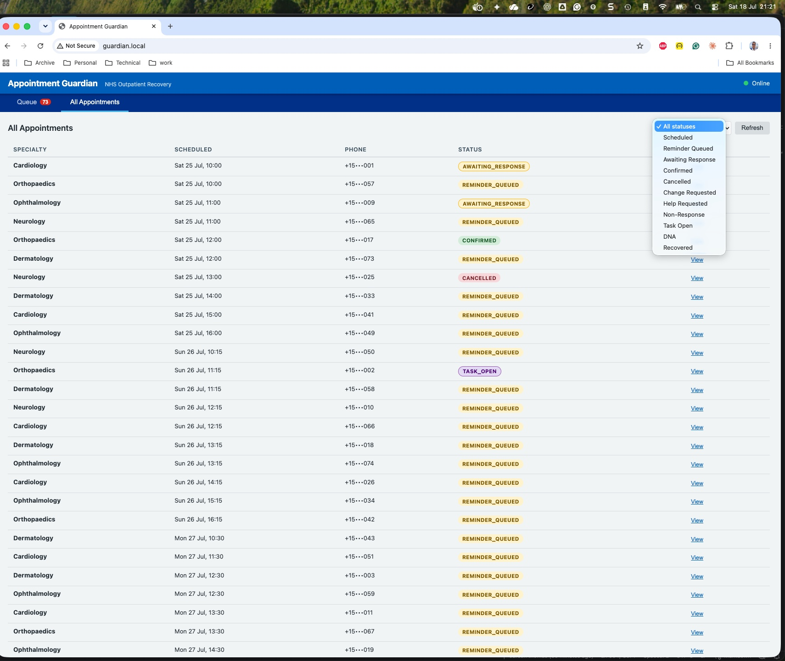

`appointment-session.ts` is that place. The entire module is a lookup table and three exported functions. It has no imports from the rest of the backend except the `AppointmentStatus` type:

```typescript
const TRANSITIONS: TransitionMap = {
  SCHEDULED: {
    REMINDER_SENT: 'REMINDER_QUEUED',
  },
  REMINDER_QUEUED: {
    REMINDER_SENT: 'AWAITING_RESPONSE',
  },
  AWAITING_RESPONSE: {
    CONFIRMED:        'CONFIRMED',
    CANCELLED:        'CANCELLED',
    CHANGE_REQUESTED: 'CHANGE_REQUESTED',
    HELP_REQUESTED:   'HELP_REQUESTED',
    TASK_CREATED:     'TASK_OPEN',
    NON_RESPONSE:     'NON_RESPONSE',
    RECOVERED:        'RECOVERED',
  },
  CHANGE_REQUESTED: {
    SLOT_OFFERED: 'AWAITING_RESPONSE',
    TASK_CREATED: 'TASK_OPEN',
    CANCELLED:    'CANCELLED',
  },
  HELP_REQUESTED: {
    TASK_CREATED: 'TASK_OPEN',
    CONFIRMED:    'CONFIRMED',
  },
  TASK_OPEN: {
    TASK_RESOLVED: 'CONFIRMED',
    CANCELLED:     'CANCELLED',
  },
  NON_RESPONSE: {
    DNA_MARKED:  'DNA',
    SLOT_OFFERED: 'AWAITING_RESPONSE',
    CONFIRMED:   'CONFIRMED',
  },
};

export function transition(
  current: AppointmentStatus,
  event: TransitionEvent
): AppointmentStatus | null {
  return TRANSITIONS[current]?.[event] ?? null;
}
```

`null` means the transition is not in the table. Routes that get `null` back return HTTP 409. There is no `if/else` in business code; the state machine is the single source of authority.

The full lifecycle looks like this:

```text
                   ┌──────────────┐
                   │  SCHEDULED   │
                   └──────┬───────┘
                 REMINDER_SENT
                            │
                   ┌──────▼───────┐
                   │REMINDER_QUEUED│  ◄── Phase 1 resting state
                   └──────┬────────┘
                 REMINDER_SENT (Phase 2)
                            │
                  ┌─────────▼──────────┐
                  │  AWAITING_RESPONSE  │
                  └────┬────┬────┬─────┘
             CONFIRMED │    │    │ HELP_REQUESTED
                       │    │    │
            ┌──────────┘    │    └─────────────┐
            ▼               │                   ▼
       ┌─────────┐  CHANGE  │         ┌──────────────────┐
       │CONFIRMED│  _REQ.   │         │  HELP_REQUESTED  │
       │(terminal)│         │         └────────┬─────────┘
       └─────────┘   ┌──────▼─────────┐  TASK_CREATED
                     │CHANGE_REQUESTED│        │
                     └──┬─────────────┘        ▼
            SLOT_OFFERED │            ┌───────────────┐
                         │            │   TASK_OPEN    │
            ┌────────────┘            └───────┬───────┘
            ▼                       TASK_RESOLVED
  back to AWAITING_RESPONSE                   │
                                              ▼
                                         CONFIRMED

          NON_RESPONSE (timer)
                  │
           ┌──────▼──────┐
           │ NON_RESPONSE │
           └──────┬───────┘
       DNA_MARKED │
                  ▼
            ┌─────────┐
            │   DNA   │
            │(terminal)│
            └─────────┘
```

Three transitions are worth calling out specifically.

**The simulate-reply auto-advance.** In Phase 1 there is no Twilio. Staff trigger simulated patient replies from the dashboard. If the appointment is in `REMINDER_QUEUED` — the scheduler generated the text but no message was actually sent — clicking "Simulate: Help" auto-advances it to `AWAITING_RESPONSE` first, then applies the patient intent. The result is a three-event audit trail: `REMINDER_QUEUED` (scheduler) → `REMINDER_SENT` (simulate) → `TASK_OPEN` (staff_simulation). This is realistic enough to validate the full agentic loop without a Twilio account.

**The barrier classification fork.** When a patient replies with intent `help`, the webhook (Phase 2) or simulate-reply route (Phase 1) calls `mcp.classifyBarrier()`. The LLM returns a structured routing decision:

```json
{"type": "transport", "routing": "navigator"}
```

The barrier type and routing target are stored on the task record. The care navigator sees a task queue with pre-classified barriers and knows immediately whether to arrange transport, contact the interpreter service, or escalate to the clinical team.

**The slot recovery loop.** `NON_RESPONSE` is not a dead end. A non-responding patient can still be confirmed if staff reach them by phone, or given a slot offer (`SLOT_OFFERED → AWAITING_RESPONSE`) which re-enters the dialogue loop. `DNA` is a terminal state only after `DNA_MARKED` — which requires an explicit staff action.

These transitions are live in the dashboard. Here the Orthopaedics appointment (Bengali, `bn`) has moved to `CHANGE_REQUESTED` after the patient simulated a reschedule request:

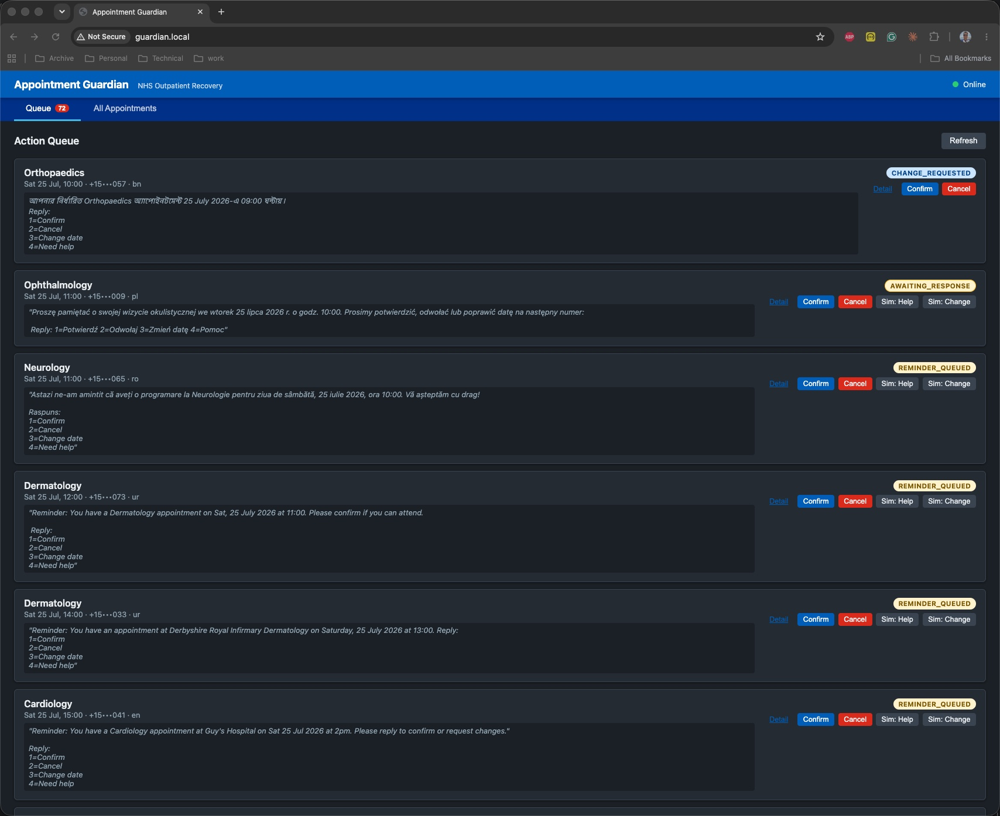

From `CHANGE_REQUESTED`, staff can confirm the appointment, offer an alternative slot (which loops it back to `AWAITING_RESPONSE`), or cancel. The queue keeps it visible until one of those actions is taken:


Meanwhile, the Ophthalmology appointment (Polish, `pl`) has advanced to `TASK_OPEN` — the patient replied "Need help" and the LLM classified their barrier as transport, routing a task to the patient navigator:

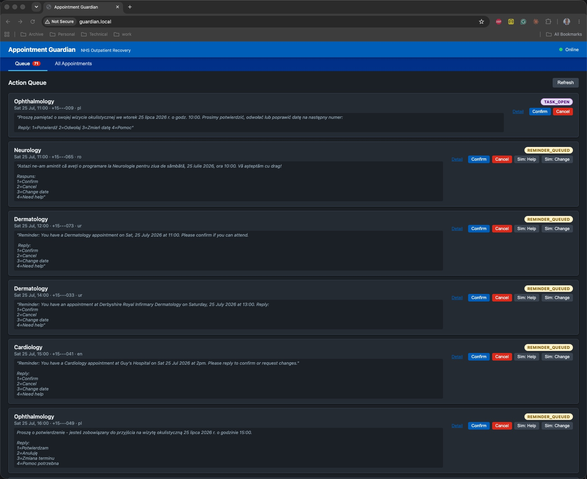

After a staff member confirms an appointment, the detail modal shows the complete two-event audit trail — proof that the scheduler queued the reminder and a human confirmed it:

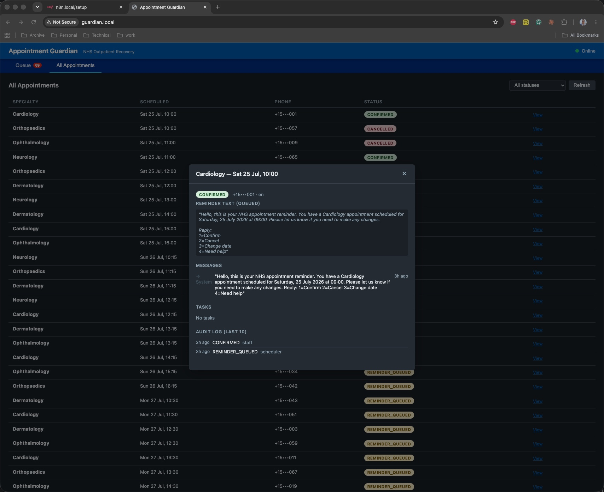

---

## Three Decisions That Shaped This

### sql.js WASM SQLite over a standalone database

The first thing I ruled out was a separate database pod. PostgreSQL requires a service, a secret, a connection pool, a backup job, and a migration strategy. For a single-pod pilot on a home-lab cluster, that is four unnecessary failure modes.

`sql.js` compiles SQLite to WebAssembly and runs it inside the Node.js process. The database file lives on a Kubernetes PersistentVolumeClaim. Every mutation calls `persist()` synchronously before the function returns, writing the current in-memory state to disk. Backup is `cp guardian.db guardian.db.bak`. There is no migration tool — schema init runs on startup and is idempotent.

The tradeoff is single-writer only and modest per-write I/O overhead. For a single-pod pilot processing at most a few hundred appointments per day, neither matters.

One thing that does matter: `sql.js` TypeScript types are stricter than they look. `BindParams` does not accept `any` — dynamic query parameters in list queries required explicit `string[]` typing. This bit me twice before I found the pattern.

### MCP stdio transport for LLM integration

The backend needs to call LLM inference for four distinct tasks: generate a reminder, generate a recovery message, parse a patient reply, and classify a barrier. These are different enough in prompt structure and output schema that they warrant separate tool definitions.

I integrated via the Model Context Protocol with a stdio transport. The MCP server is a child process of the backend. The backend calls typed TypeScript methods (`generateReminderMessage`, `parsePatientResponse`, etc.); under the hood these are MCP JSON-RPC calls over the child process's stdin/stdout; the MCP server calls Ollama's HTTP API.

The decoupling is the point. Setting `LLM_PROVIDER=anthropic` routes all inference through the Anthropic API with zero code changes. The `ILLMProvider` abstraction means the scheduler never knows whether it's talking to a local Ollama instance or Claude. For the NHS context this matters: a production deployment would likely use a cloud LLM, but the pilot runs entirely offline on home-lab hardware.

The tradeoff is subprocess overhead — approximately 30ms per tool invocation for the stdio round-trip, before inference time. For a scheduler that runs once an hour this is irrelevant.

### Phase 1 web-only simulation

Setting up Twilio WhatsApp requires an ngrok tunnel (to expose the private home-lab IP), a Twilio account, sandbox approval, and patients to whitelist their phone numbers. This is a non-trivial setup that would delay testing by days.

Phase 1 ships instead with `POST /api/appointments/:id/simulate-reply`. Staff trigger simulated patient replies (`confirm`, `cancel`, `change`, `help`) from the dashboard. This runs the full state machine, MCP barrier classification, FHIR write-back, and audit trail end-to-end. The LLM-generated reminder text is visible in the queue before simulation. The audit log shows the complete three-event trace.

Phase 2 is a clean addition: add `TwilioClient` and `webhookRouter`, remove `simulate-reply`. No state machine changes. No scheduler changes. No schema changes.

---

## What the System Doesn't Do

Four boundaries are hard-coded in the architecture and never crossed autonomously:

- **No clinical triage or prioritisation.** The system does not decide which patient gets the next available slot based on clinical need. That decision stays with the clinical team.
- **No waiting-list changes without staff approval.** Status transitions that matter clinically — confirmation, cancellation, DNA marking — require a staff action or a patient reply. The scheduler only generates and queues; it does not confirm.
- **No DNA risk-scoring of individual patients.** The system does not build a model of which patients are likely to miss appointments and use it to prioritise outreach. That would create an implicit triage system.
- **No booking into clinical slots without the provider's process.** The slot recovery flow offers patients an alternative slot; it does not book them into it without traversing the normal booking pathway.

These are not technical limitations. They are governance constraints written into the design. The MCP tool schema descriptions for `parse_patient_response` and `classify_barrier` are marked explicitly: `GOVERNANCE: does not make clinical decisions`.

---

## Five Things That Went Wrong

### 1. `imagePullPolicy: IfNotPresent` silently ran stale code

The first two backend deploys after a rebuild did nothing. The pod restarted but ran the previous image. MicroK8s's built-in registry (`localhost:32000`) had the new digest, but the node had a cached layer for the `:latest` tag and `IfNotPresent` told it not to check. Every `kubectl rollout restart` was a no-op.

Fix: `imagePullPolicy: Always`. The registry round-trip is approximately 100ms on LAN. Acceptable for a development cluster using mutable `:latest` tags.

### 2. HAPI FHIR entered CrashLoopBackOff on first apply

Recent versions of `hapiproject/hapi:latest` introduce a Spring Boot circular bean dependency that prevents startup. The pod logged the exception and immediately exited.

Fix: `SPRING_MAIN_ALLOW_CIRCULAR_REFERENCES=true` in the FHIR deployment environment. Standard workaround for this specific HAPI version family; no effect on FHIR server behaviour.

### 3. The MCP child process died silently

During load testing with a large batch of appointments, the MCP server stopped responding. The backend was logging MCP tool call results as `undefined` without throwing. The child process had hit an unhandled promise rejection and exited. The stdio transport registered no error because the parent's stdout pipe had not closed cleanly.

Fix: explicit reconnection handling in `MCPSessionManager` — detect when `callTool` returns a null/undefined result and attempt a subprocess restart before propagating the error. Added a health check to the `/api/status` endpoint so this surface is visible.

### 4. Ollama hallucinated JSON with markdown fences

Early runs with `llama3.1:8b` returned the JSON wrapped in markdown code fences, with an explanatory sentence prepended: `Here is the JSON you requested:` followed by a ` ```json ` block. `JSON.parse()` failed on the fenced string. The fallback kicked in and returned `{ intent: 'unknown' }` — which is safe, but meant every reply was unclassified.

Fix: `cleanJsonResponse()` strips markdown code fences before parsing. Enum allowlists (`VALID_INTENTS`, `VALID_TYPES`, `VALID_ROUTING`) reject any value outside the permitted set regardless of what the model returns. Any malformed output degrades to the safe default rather than crashing.

The MCP server test suite (12 tests) covers all four LLM methods, with explicit tests for the fence-stripping and fallback paths:


The backend test suite (63 tests) covers the state machine exhaustively, the full database layer, and the server routes:

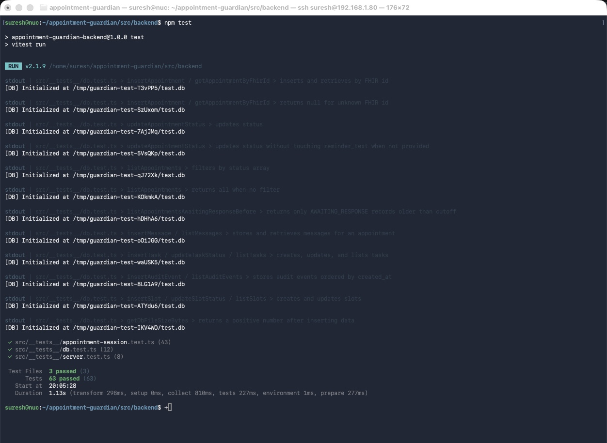

### 5. FHIR write-back is fire-and-forget

This is not a bug — it is ADR-006, an explicit architectural decision. But it created a surprise: after confirming an appointment via the dashboard, the FHIR record still showed `booked`. The write-back had fired successfully but the FHIR server's internal cache had not refreshed.

The Guardian's SQLite record was correct. The audit log was correct. But when a second staff member queried FHIR directly (via the HAPI console), they saw a different status than the Guardian dashboard showed.

The lesson: in any system where the local state and the external source of truth can diverge — even briefly — you need to document that divergence explicitly for every team that might query either system. The status page now shows the last successful FHIR write-back timestamp for each appointment.

---

## What's Next

**Phase 2** adds the Twilio WhatsApp channel. `TwilioClient` handles outbound message delivery; `webhookRouter` receives inbound replies, verifies the Twilio signature (HMAC-SHA1 over sorted POST parameters, timing-safe compare), and maps patient messages to intents using rule-based regex. The numbered prompt structure — `1=Confirm 2=Cancel 3=Change date 4=Need help` — means the vast majority of replies are single digits. The regex handles common natural-language synonyms. Unknown replies get a re-prompt. ngrok runs as a systemd service on the NUC to provide the public webhook endpoint.

**Phase 3** replaces the regex intent parser with `mcp.parsePatientResponse()`. The MCP tool and the Ollama adapter method are already implemented; only `routes/webhook.ts` changes. Phase 3 also adds a Tasks tab to the dashboard and the slot recovery flow: when a patient requests a change, the system queries FHIR for available slots and offers them one.

**Phase 4** closes the recovery loop — `CHANGE_REQUESTED` → available FHIR Slot → offered to patient → `AWAITING_RESPONSE`. This is the phase that actually recaptures waste: a cancelled slot immediately becomes an offer to the next patient in the right state.

**The humanitarian variant.** Appointment Guardian is the first JigsawFlux system to run a full agentic loop in an NHS-realistic context. The same pattern — FHIR-style data source, MCP stdio LLM integration, pure state machine, offline-capable — applies to community health programmes in low-resource settings. That is why the architecture was designed the way it was. The NHS pilot is the proving ground.

---

## References

[1] DrDoctor. *Guy's and St Thomas' Improves Waiting List Management with DrDoctor*. DrDoctor Case Studies, 2024. [https://www.drdoctor.co.uk/resources/case-studies/guys-and-st-thomas-improves-waiting-list-management-with-drdoctor-full](https://www.drdoctor.co.uk/resources/case-studies/guys-and-st-thomas-improves-waiting-list-management-with-drdoctor-full)

[2] Ruzankin, P. et al. *Reducing Did Not Attend Rates in NHS Outpatient Services*. ScienceDirect / SSM — Digital Health, 2024. [https://www.sciencedirect.com/science/article/pii/S2514664524013225](https://www.sciencedirect.com/science/article/pii/S2514664524013225)

[3] Patients Know Best. *The Cost of a DNA Appointment*. [https://patientsknowbest.com/dna/](https://patientsknowbest.com/dna/)

[4] Guy's and St Thomas' NHS Foundation Trust. *NHS Staff Find Innovative Way to Tackle Surgery Waiting Lists*. [https://www.guysandstthomas.nhs.uk/news/nhs-staff-find-innovative-way-tackle-surgery-waiting-lists](https://www.guysandstthomas.nhs.uk/news/nhs-staff-find-innovative-way-tackle-surgery-waiting-lists)

[5] NHS England London Region. *Shorter Waits and Faster Cancer Care as London NHS Records Best Performance in Years*. May 2026. [https://www.england.nhs.uk/london/2026/05/14/shorter-waits-and-faster-cancer-care-as-london-nhs-records-best-performance-in-years/](https://www.england.nhs.uk/london/2026/05/14/shorter-waits-and-faster-cancer-care-as-london-nhs-records-best-performance-in-years/)

[6] Whittington Health NHS Trust. *DNA and Late Cancellation Policy*. [https://www.whittington.nhs.uk/default.asp?c=1524](https://www.whittington.nhs.uk/default.asp?c=1524)

[7] NHS England. *Community Health Services Waiting Times: Actions to Meet Targets*. [https://www.england.nhs.uk/long-read/community-health-services-waiting-times-actions-to-meet-targets/](https://www.england.nhs.uk/long-read/community-health-services-waiting-times-actions-to-meet-targets/)

[8] Model Context Protocol specification. Anthropic, 2024. [https://modelcontextprotocol.io](https://modelcontextprotocol.io)

[9] HAPI FHIR. *HAPI FHIR — The Open Source FHIR API for Java*. [https://hapifhir.io](https://hapifhir.io)

[10] JigsawFlux. *Appointment Guardian — source code*. GitHub, 2026. [https://github.com/JigsawFlux/appointment-guardian](https://github.com/JigsawFlux/appointment-guardian)

[11] JigsawFlux. *Offline, Not Off-Duty: Agentic Risk Management in an Air-Gapped Field Office*. JigsawFlux Blog, July 2026. [/blog/airgapped-agentic-trm](/blog/airgapped-agentic-trm)

[12] JigsawFlux. *Eight Agentic Patterns on a Fictional UK 999 Incident*. JigsawFlux Blog, July 2026. [/blog/agentic-patterns-uk-emergency](/blog/agentic-patterns-uk-emergency)

---

This is a JigsawFlux project. JigsawFlux builds open-source tools for health tech, humanitarian response, and crisis management — tools designed to work on constrained budgets, unreliable infrastructure, and donated hardware. If you are working on something in this space, the code is at [github.com/JigsawFlux](https://github.com/JigsawFlux) and the architecture decisions are documented in `ARCHITECTURE.md`.
