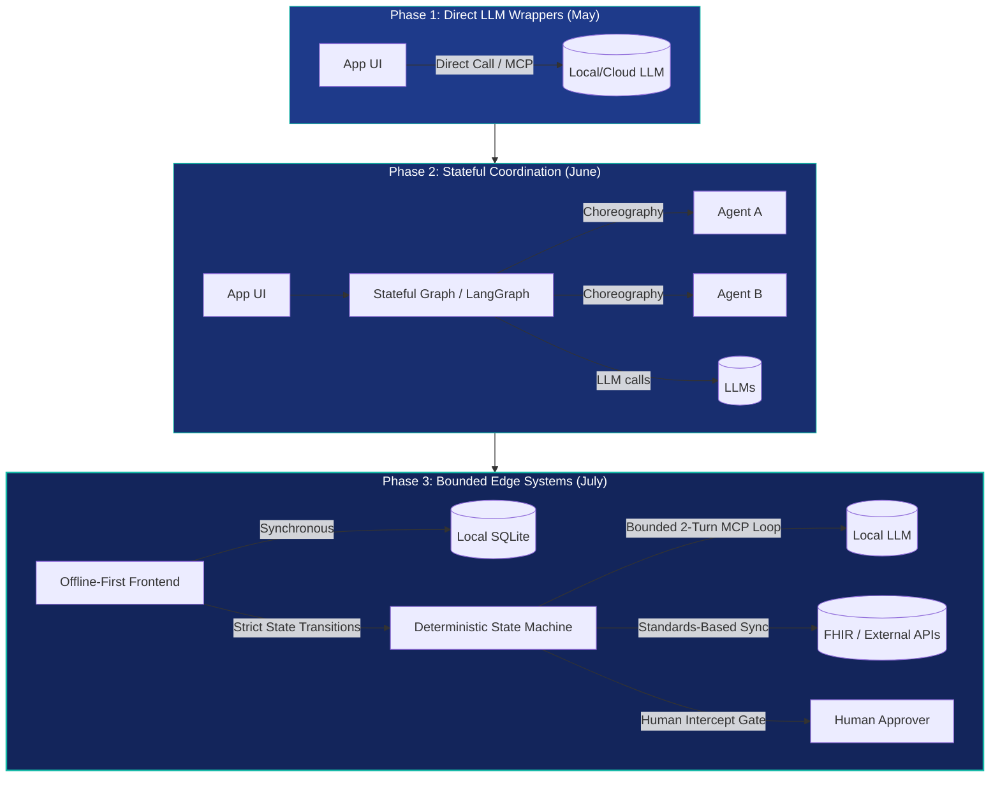

Ten weeks, nine posts, and four working systems.

The practical question behind all of it: how do you build useful AI systems where cost, connectivity, data privacy, and human accountability are hard constraints?

The industry narrative is dominated by cloud-first, fully autonomous agents operating with unlimited budgets. JigsawFlux took a different direction: local inference, offline-first architectures, Kubernetes home labs, and strict state-machine controls.

The path is visible in retrospect: direct local LLM wrappers gave way to stateful agent workflows, which gave way to bounded edge systems for clinical consultation, travel risk assessment, and NHS appointment recovery.

This is what those nine posts covered, what connects them, and the five engineering rules that emerged from the work.

<!-- truncate -->

## The journey so far

| Date | Post | What it established |
| --- | --- | --- |
| 15 May | [Running a Local LLM with Ollama and MCP](/blog/local-llm-ollama-mcp-spike) | Local inference can be exposed through a clean MCP-based application architecture. |
| 20 May | [Claude, Copilot and Gemini for Architects](/blog/ai-for-architects-beyond-code) | AI tools are becoming architecture collaborators, not merely code completion tools. |
| 1 June | [Running a Local LLM on Kubernetes](/blog/local-llm-kubernetes-home-lab) | A home lab can host persistent, self-managed inference with MicroK8s, Ollama, Open-WebUI, MetalLB, and ingress. |
| 11 June | [Stop Burning AI Credits](/blog/ai-credits-optimization) | Model choice and routing need deliberate cost governance. |
| 21 June | [Agent Clinic](/blog/agent-clinic) | Human-in-the-loop agents can support clinical workflows without replacing clinical judgement. |
| 28 June | [Picking an Open-Source Agent Framework](/blog/comparing-agent-frameworks) | Framework selection should follow the required coordination and auditability model. |
| 5 July | [8 Agentic Patterns in Practice](/blog/agentic-patterns-uk-emergency) | Different agentic patterns produce materially different operational behaviour under the same scenario. |
| 12 July | [Offline, Not Off-Duty](/blog/airgapped-agentic-trm) | Offline-first, bounded agentic systems can support duty of care in the field. |
| 19 July | [Appointment Guardian](/blog/appointment-guardian-nhs) | An agentic loop can help recover missed appointments through personalised, stateful follow-up. |

## The foundations: tools, models, and infrastructure

The first three posts established the technical base for everything that followed.

[The architects' field guide](/blog/ai-for-architects-beyond-code) positioned Claude, GitHub Copilot, and Gemini as complementary tools. The important shift was from asking which assistant writes the best code to asking which tool best supports a particular architectural activity: understanding a large system, producing an ADR, scaffolding infrastructure, reviewing security, or turning a diagram into an implementation plan.

[The Ollama and MCP spike](/blog/local-llm-ollama-mcp-spike) then made a different point: not every useful AI capability needs to sit behind a cloud API. It introduced a layered application where an Express backend calls a persistent MCP session, which exposes tools backed by a local Ollama model. That separation matters. It makes the inference backend replaceable and keeps the browser away from the model service.

[The Kubernetes home-lab post](/blog/local-llm-kubernetes-home-lab) took that prototype into a more durable environment. The hardware was modest, the inference CPU-only, and the limitations were stated plainly. But the result mattered: local models, persistent storage, internal service discovery, ingress, and a usable web interface could all run on an Intel NUC. The work showed that "local" does not have to mean fragile.

Together, these posts established a recurring JigsawFlux position:

- local and open tooling are legitimate architectural choices, not fallback options;
- deployment constraints should shape the design from the start;
- an honest account of latency, hardware, and operational trade-offs is more useful than a benchmark detached from deployment reality.

## Cost is an architecture decision

[The AI credits post](/blog/ai-credits-optimization) expanded the definition of architecture to include consumption. The argument was not that frontier models should be avoided, but that they should be used where their capability is justified.

The model-routing framework has three tiers: inexpensive models for deterministic work, balanced models for ordinary generative work, and frontier models for deep reasoning. It also separates day-to-day IDE traffic from programmatic traffic, with central gateway controls for the latter.

This theme continues throughout the later posts. A low-cost Bedrock model supports the Agent Clinic proof of concept. Local Ollama models support the travel-risk and appointment-recovery systems. The choice is never simply cloud versus local; it is a decision about capability, cost, data handling, latency, and the consequences of losing connectivity.

That is one of the strongest threads across the series: **model selection is a product and operational decision, not just a developer preference.**

## From agents as demos to agents as workflows

The middle of the series moves from infrastructure to orchestration.

[Agent Clinic](/blog/agent-clinic) demonstrates why a graph is often a better fit than a stateless function for a real workflow. A consultation can pause after automated intake, wait for a doctor, ask the patient a clarification, then continue into prescription handling. LangGraph's typed state and `interrupt()` mechanism make that pause-and-resume model explicit. The clinician remains the decision-maker; the agent reduces administrative burden around the decision (open-source code in the [agentic-clinic](https://github.com/JigsawFlux/agentic-clinic) repository).

[The framework comparison](/blog/comparing-agent-frameworks) made the framework choice concrete (available in the [comparing-agent-frameworks](https://github.com/JigsawFlux/comparing-agent-frameworks) repo). LangGraph, CrewAI, and AutoGen were used for the same researcher-and-writer task, exposing their different mental models:

| Framework | Core model | Best fit in the review |
| --- | --- | --- |
| LangGraph | Explicit stateful graph | Controlled routing, cycles, and inspectable state |
| CrewAI | Declarative roles and tasks | Role-based collaboration and rapid sequential pipelines |
| AutoGen | Agent conversation | Debate, consensus, and conversational coordination |

The most valuable result was not a winner. It was the evidence that flexibility comes with different failure modes. Typed state makes structured output straightforward; conversational history requires more careful extraction. That is precisely the kind of implementation detail that matters once an agent's output feeds an operational workflow.

[The eight-pattern emergency-response comparison](/blog/agentic-patterns-uk-emergency) extended this idea. The same fictional 999 incident, tools, and environment (implemented in [agentic-patterns](https://github.com/JigsawFlux/agentic-patterns)) were run through ReAct, ReWOO, Plan-and-Execute, Reflexion, Hierarchical, DAG, Network, and Consensus patterns. The point was not that one pattern universally wins. It was that topology changes the speed, traceability, and reliability of a decision-support process.

For emergency and health contexts, the series makes a clear preference visible: explicit state, bounded behaviour, logs, replayability, and a human approval gate are often more valuable than a superficially autonomous agent.

## Designing for the moment the network disappears

The two newest system posts turn the earlier ideas into domain-specific applications.

[Offline, Not Off-Duty](/blog/airgapped-agentic-trm) frames its design around a field traveller who cannot reach an operations centre. Its answer is an offline-first browser experience, local SQLite storage, a local LLM, and a bounded two-turn MCP loop (built in the [airgapped-agentic-trm](https://github.com/JigsawFlux/airgapped-agentic-trm) repository). The hard limit on clarifications is not an arbitrary implementation detail: it recognises that, in a high-risk situation, an endless conversation with an uncertain model is a safety failure.

[Appointment Guardian](/blog/appointment-guardian-nhs) applies the same engineering discipline to missed outpatient appointments. It combines FHIR R4 appointment data, a local LLM, a pure-function state machine, SQLite-backed workflow state, and staff tasks (built in the [appointment-guardian](https://github.com/JigsawFlux/appointment-guardian) repository). Instead of treating a reminder as a one-way notification, it creates a dialogue that can discover barriers, route them to the right team, and escalate non-response.

Both posts share several design decisions:

1. The LLM is a component inside a wider system, not the system itself.
2. Workflow state is explicit and durable.
3. The system must continue to provide useful behaviour when a dependency is unavailable.
4. Automation has clear limits and escalation paths.
5. Auditability is a feature, especially when people may be affected by the outcome.

The applications differ, but the pattern is consistent: use the model to interpret, draft, classify, or ask a useful question; use deterministic workflow code to control state, policy, and action.

## What has changed across the series

The progression is visible in the architecture diagrams as much as in the prose.

The earliest post describes layers around a single model call. The later posts include state machines, persistent queues, standards-based data sources, human interruption points, and deployment boundaries. The model has become less central to the architecture, even as the systems have become more agentic.

That is a healthy evolution. It avoids the common trap of treating an LLM as a replacement for application design. The strongest systems in this series are not those with the most agents or the largest model. They are the ones that define:

- what the model may decide;
- what the model may only recommend;
- when a human must approve;
- how the system behaves without connectivity;
- where data is stored and how it can be inspected;
- what happens when the model, a subprocess, or an external service fails.

## The recurring principles: Rules of thumb

Looking across all nine posts, five operational principles stand out as rules of thumb for building real-world AI systems.

**Rule 1: Start with the operating environment.** A charity clinic, a field deployment, a home lab, and an NHS workflow all impose different constraints. Good architecture begins with those constraints rather than importing a generic cloud pattern.

**Rule 2: Treat the LLM as a replaceable dependency, not the runtime.** MCP adapters, provider abstractions, and layered boundaries make it possible to choose a local or cloud model without rewriting the workflow around it.

**Rule 3: Design the cage before the agent.** A clarification cap, a typed graph, a state machine, or an approval step is not a limitation of the agent. It is the mechanism that makes the surrounding system dependable.

**Rule 4: Human-in-the-loop is a safety architecture, not a temporary compromise.** Agent Clinic's doctor review and the emergency-response approval gate are not placeholders until the model gets "better." They are fundamental to the safety and accountability model.

**Rule 5: Treat deployment as part of the product.** Kubernetes manifests, persistent volumes, ingress, offline caches, and failure reports belong in the story because they determine whether the software works outside a developer's demo.

## Where this points next

The first nine posts have moved from AI-assisted architecture to accountable, deployable systems. The next stage is to deepen the production properties already identified: stronger evaluation of local-model outputs, resilience testing, observability, security review, privacy controls, and user validation with the people who would operate these workflows.

There is also a natural opportunity to connect the projects. The local inference platform, agent framework patterns, bounded loops, offline-first frontend, and workflow state-machine approach are becoming a reusable set of building blocks. The challenge is not to turn them into a single generic platform too early. It is to keep proving them in real, constrained problems where each component earns its place.

That has been the useful lesson of the series so far: AI becomes more valuable when it is less magical. Put it inside a well-defined system, give it the right boundaries, and design for the environment in which people will actually depend on it.
