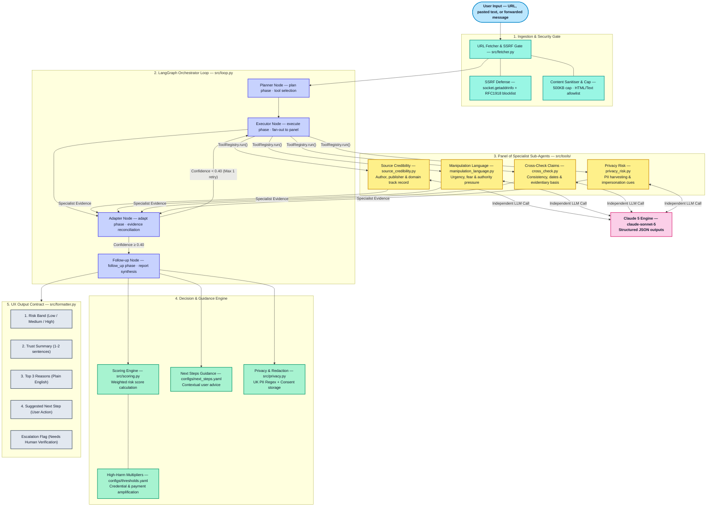

The message arrived on a Thursday evening. Forwarded twice already. The text looked official: a government energy rebate notification, a pending payment of £400, a link to "verify your bank details before the payment window closes Friday." The sender was her son's colleague. Nobody had checked where it came from first.

She forwarded it to her son before clicking. He was about to say it looked fine. Then he noticed the URL: `gov-rebate-energy.co.uk`. Not `gov.uk`. Not `energy.gov.uk`. A registered domain, clean design, HTTPS padlock, professional enough to pass a quick read. He told her not to click. She'd been one browser tab away from entering her sort code and account number into a credential-harvesting form.

This near-miss required one thing: a second person who knew what to look for. Most people don't have that. That's what I'm trying to build.


<!-- truncate -->

---

## The problem

The Office for National Statistics' Public Opinions and Social Trends survey, fielded across 2025 and 2026, puts the scale of the UK digital safety challenge in plain numbers:

- **81%** of UK adults worry about distinguishing real from fake information online
- **77%** worry about their personal data being used without consent
- Only **36%** believe AI will benefit them personally — and that share has been declining

These numbers are not a technology-literacy gap that will close when people get more exposure to the internet. The people most exposed — younger adults, daily social media users — are, if anything, more likely to encounter engineered misinformation because they encounter more content overall. The gap is structural: the tools for generating and distributing convincing false content have improved faster than the tools for checking it.

The harm isn't abstract. UK Finance's annual fraud report recorded **£1.17 billion** lost to authorised push payment (APP) fraud — the category that includes fraudulent bank transfers triggered by convincing impersonation. The majority of victims were first contacted through messaging apps and social media: a forwarded link, a fake customer-service account, a message impersonating HMRC or a bank. In every case, a brief credibility check on the message would have identified the danger signal.

As a solution architect who spent six years designing oncology devices and health informatics at Elekta, and currently works at International SOS supporting critical events, emergency medical response, and travel risk management, I look at software through a **duty-of-care** lens. In oncology, an erroneous data point or delayed workflow directly impacts patient outcomes; in duty-of-care response, timely, accurate information protects human lives. When digital platforms expose everyday citizens to deceptive manipulation without a trustworthy safety net, software engineers have a responsibility to build systems that protect people when they are most vulnerable.

The checking step doesn't exist at the moment it's needed. That's the gap this tool addresses.

---

## What current tools get wrong

Full-time fact-checking organisations — Full Fact, Snopes, Africa Check — do excellent work and set the evidentiary standard everyone else should aspire to. They are also too slow, too narrowly scoped (focused primarily on public political claims rather than personalised scam messages), and not built for the everyday use case: someone who received a forwarded WhatsApp at 9pm and needs to know if it is safe to click.

Browser-based fraud warnings cover known malicious URLs. They are effective and important. They don't cover the domain registered last week, the message that contains no URL at all, or the blog post that sits on a valid domain but contains a fabricated health claim.

AI tools marketed for misinformation detection tend toward one of two failure modes:
1. They produce binary verdicts with no reasoning — "FAKE" or "REAL" — giving the user no way to evaluate, trust, or learn from the output.
2. They are designed for newsroom workflows and require the user to pre-identify a specific claim to check against a specific fact database.

Neither addresses the everyday pattern: an untrained user, an unfamiliar message, a time pressure, and no one to ask.

---

## What I built

The [Verification Agent](https://github.com/JigsawFlux/verification-agent) is a local Python application. It takes any input — a URL, a forwarded message, a headline, screenshot text — and returns a plain-English verdict: **Risk Level** (Low / Medium / High), a **Trust Summary**, the **Top 3 Reasons** the agent reached that verdict, and a **Suggested Next Step**. Always those four things. Never fewer than three reasons. Never a verdict without an explanation.

The architecture follows a JigsawFlux Plan → Execute → Adapt → Follow-up loop, built on LangGraph `StateGraph` — extending the agentic design patterns established in our previous open-source systems.

---

## Architecture & System Context

The system processes requests through five distinct layers: security-gated URL ingestion, orchestrator state machine, specialist sub-agent evaluation panel, multi-signal scoring synthesis, and UX contract formatting.



The planner node records which tools it selected. The adapter node is always traversed — it decides in-place whether evidence is conflicting and whether to loop back for a retry. Phase transitions are logged to `state.phase_log` on every run. The formatter enforces the four-block output contract. If the pipeline fails at any stage, `SAFE_FALLBACK_RESPONSE` is returned — ensuring the user always receives a safe, non-technical response.

---

## The panel of specialists

The executor node runs four independent Claude-powered tools in sequence. Each makes a single LLM call and returns a structured JSON verdict. They are independent: no tool sees another tool's output. The signals are collapsed into a flat dictionary and passed downstream to scoring.

**`check_source_credibility`** assesses the origin of the content. Is there an identifiable publisher or author? Is the source known? Does the domain or publication have a verifiable track record? For URL inputs it works on the fetched page text; for messages, on the text itself plus any embedded URLs or attribution claims. Key signals: `source_known`, `author_identifiable`, `domain_age_signal`, `credibility_score`.

**`detect_manipulation_language`** scans for the rhetorical patterns that distinguish engineered persuasion from neutral information — urgency, fear-based framing, authority pressure ("HMRC requires you to", "your account will be closed"), calls to share widely. These patterns are not proof of misinformation; a genuine emergency might use urgent language. But they are consistently present in engineered scams and amplified misinformation. Key signals: `urgency_present`, `fear_language`, `authority_pressure`, `evidence_snippets`.

**`cross_check_claims`** assesses whether the specific claims in the content are internally consistent and show the markers of verifiable, dated, sourced information. A claim that cannot be dated, attributed to a named source, or traced to a verifiable event is a signal regardless of whether the claim itself is true or false. Key signals: `claim_supported`, `date_context_ok`, `evidence_quality`, `consistency_score`.

**`privacy_risk_check`** looks for credential-harvesting and PII-solicitation patterns. Is personal data — National Insurance numbers, payment details, login credentials — being requested? Is the request using impersonation (pretending to be a bank, HMRC, or a government service)? This tool fires the escalation flag when `credential_harvesting` or `impersonation` is detected. Key signals: `pii_solicitation`, `payment_pressure`, `credential_harvesting`, `impersonation`.

All four tools share a single JSON-parsing utility in `src/tools/_shared.py`. The extraction function uses `JSONDecoder().raw_decode()` in a loop over the raw LLM output — scanning character by character for the first `{`, attempting a decode, advancing on failure. This means a verbose LLM response (`"Here is my assessment: {...}"`) extracts cleanly. It handles fenced code blocks, embedded prose, and multiple JSON objects in a single response — stopping at the first complete object rather than greedily matching from the first `{` to the last `}`.

---

## Three engineering decisions

### SSRF protection in the URL fetcher

If users can submit arbitrary URLs, the fetcher becomes a server-side request forgery (SSRF) vector — a way to probe internal services, cloud metadata endpoints, or localhost interfaces. The production threat is a URL like `http://169.254.169.254/latest/meta-data/` to exfiltrate AWS credentials, or `http://internal-admin:8080` to reach an unauthenticated internal service.

`src/fetcher.py` implements a multi-layer defence. Before any HTTP request is made, `_check_ssrf(hostname)` calls `socket.getaddrinfo` to resolve the hostname to all IP addresses, then checks each resolved address against a blocklist of non-routable ranges:

```python
_BLOCKED_NETWORKS = [
    ipaddress.ip_network("10.0.0.0/8"),      # RFC 1918
    ipaddress.ip_network("172.16.0.0/12"),   # RFC 1918
    ipaddress.ip_network("192.168.0.0/16"),  # RFC 1918
    ipaddress.ip_network("127.0.0.0/8"),     # loopback
    ipaddress.ip_network("169.254.0.0/16"),  # link-local / AWS metadata
    ipaddress.ip_network("100.64.0.0/10"),   # CGNAT
    ipaddress.ip_network("fc00::/7"),        # IPv6 ULA
    # ... plus IPv6 loopback and link-local
]
```

`ip.is_global` catches most cases. The explicit blocklist is belt-and-braces for ranges where `is_global` may not behave as expected. Critically, the SSRF check re-runs after every redirect — a URL that begins at a public IP but redirects to `192.168.0.1` is blocked at the redirect step, not passed. The return value is a `FetchResult` dataclass, not a bare string, so callers receive structured information including `success`, `input_type`, `status_code`, `content_type`, `truncated`, `fetch_latency_ms`, and `error_reason` on failure.

The fetcher also enforces a `content-type` allowlist (HTML, plain text, XHTML only), a 500KB streaming cap, and a 10-second timeout. Binaries, PDFs, and media files are rejected before any bytes are read.

### Consent-gated PII redaction

The agent processes forwarded messages and URLs that may contain personal information — email addresses, phone numbers, National Insurance numbers, bank account details. Storing that raw text would be a serious privacy failure for a tool built to protect users.

`src/privacy.py` provides two primitives. `redact_pii(text)` applies regex patterns before any text enters persistent storage: UK NI numbers, 16-digit payment cards, email addresses, UK phone numbers (both `+44` and `0` prefixes, with `(?<!\w)` anchoring that works before `+` where standard `\b` does not), and 8-digit bank account numbers.

`HistoryStorage` is consent-gated. History is disabled by default (`HISTORY_CONSENT=false` in `.env`). When enabled, each run writes a JSON record containing `run_id`, `risk_level`, `confidence`, `escalate`, `input_type`, and the PII-redacted input — never the raw content, never the full tool outputs.

```python
HistoryStorage().save(run_id, {
    "input_type": input_type,
    "risk_level": formatted["risk_level"],
    "confidence": formatted["confidence"],
    "escalate": formatted["escalate"],
    "input_redacted": redact_pii(user_input[:500]),
})
```

The 500-character truncation before redaction is deliberate: even the redacted text should not capture an entire article. The history record is for pilot metrics — risk distribution, escalation rate, input type mix — not content analysis.

### Model selection and output hardening

The agent uses `claude-sonnet-5`. The task requires sustained reasoning about subtle rhetorical patterns, nuanced credibility signals, and the difference between urgent-but-legitimate and urgency-as-manipulation. That warrants Sonnet over Haiku for these four tools.

Each tool sanitises its own output before returning. `_as_bool()` in `_shared.py` handles the Python footgun where `bool("false")` returns `True` because non-empty strings are truthy — a real defect when an LLM returns `"false"` as a JSON string value. `_clamp01()` enforces that `risk_contribution` is always in `[0.0, 1.0]`. Evidence snippets are capped at 3. All fallback values are explicitly defined in `_default_result()` so a tool that cannot parse its LLM output never propagates unexpected types downstream.

---

## The scoring engine

`src/scoring.py` converts four independent `risk_contribution` values into a risk band, with weights from `configs/thresholds.yaml`:

```yaml
source_credibility:    0.30
manipulation_language: 0.25
cross_check:           0.25
privacy_risk:          0.20
```

High-harm signal multipliers amplify the weighted score when impersonation, payment pressure, or credential harvesting is detected — these signals are disproportionately predictive of active scams rather than merely poor-quality content, and the scoring engine treats them accordingly.

`confidence` is computed from the spread of the four `risk_contribution` values. High spread means the specialists disagree — one tool sees high risk, another sees low. The `adapter_node` detects this explicitly (any tool above 0.7 and any tool below 0.3 in the same run), logs "conflicting evidence detected," and reduces confidence by 0.2. If confidence drops below 0.4 and the run has not already retried, the executor reruns. High confidence from a unanimous panel produces a clean verdict; conflict produces a hedged one.

A `confidence_floor_for_low_risk` threshold (0.6) means the agent cannot output Low risk while the specialists are in meaningful disagreement — low confidence is never reported as reassurance.

---

## Live pilot

With `ANTHROPIC_API_KEY` set in `.env`, the full four-tool pipeline runs against `claude-sonnet-5`. Here are results from the first two pilot inputs this week, rendered as self-contained HTML via `render_html()` in `src/formatter.py`:

**Input 1: PayPal phishing message**

```text
URGENT: Your PayPal account has been suspended due to suspicious activity.
Click the link below immediately to verify your identity or your account
will be permanently closed. Verify now: http://paypal-secure-verify.xyz/confirm
```

![Verification Agent result card for the PayPal phishing message — High Risk, 100% confidence, red left border, red risk header. Three reasons: "This message uses urgent phishing language and a fake, non-PayPal domain to trick users into revealing personal information"; "urgent, fear-based language and impersonation of PayPal to pressure the recipient into clicking a suspicious verification link"; "classic phishing characteristics (urgency, suspicious non-PayPal domain, threat of account closure)." Red escalation banner at base: "⚠ Needs Human Verification — do not act or share until reviewed."](./img/VerificationResult_HighRisk.jpg)

**Input 2: BBC News / ONS inflation report**

```text
BBC News, 17 July 2025: UK inflation fell to 2.1% in June, down from 2.3%
in May, according to figures published today by the Office for National Statistics.
```


Both results are from real `claude-sonnet-5` API calls. The phishing card correctly identifies the fake PayPal domain (`paypal-secure-verify.xyz`), the urgency pattern, and triggers the escalation flag. The BBC card identifies ONS as a primary source, notes the neutral register, and scores Low. The cross-check tool correctly notes it cannot verify the specific inflation figure — because it has no access to the ONS publication directly — rather than asserting verification it has not performed. That distinction matters: honest uncertainty is not the same as a failed check.

The terminal output from `run_pilot.py` — which runs both inputs and writes HTML to `run_results/` — takes around 20 seconds per run, four sequential LLM calls each:

```text
→ Checking: phishing_paypal...
  Risk: High  Confidence: 100%
  Saved: phishing_paypal_20260808_225557.html

→ Checking: bbc_inflation...
  Risk: Low  Confidence: 100%
  Saved: bbc_inflation_20260808_225614.html

Done.
```


---

## What it doesn't do

Four boundaries are hard in the architecture and not configurable:

**No web search or database cross-referencing.** The agent works on the content it is given — the text of the URL or the message itself. It does not query fact-checking databases, run live web searches, or compare input against a corpus of known misinformation. This keeps the tool fast, private, and not dependent on third-party data sources. It also means the cross-check tool is reasoning about internal consistency rather than external ground truth.

**No verdict without a reason.** The output contract is enforced in `format_response()`: if no reasons are produced, the formatter inserts "Insufficient evidence to determine reliability." A bare verdict — "High Risk" with no explanation — is not a permitted output state.

**No autonomous action.** The agent advises. It does not block URLs, flag content to platforms, send alerts, or take any action on the user's behalf. The "Needs Human Verification" escalation flag is a label on the output card, not a system event.

**No PII storage by default.** `HISTORY_CONSENT` defaults to `false`. Enabling it — for pilot metrics — requires an explicit `.env` change and stores only the PII-redacted summary, never the raw input or full tool outputs.

---

## Four things that went wrong

### 1. `bool("false") == True`

Every tool returns boolean signals — `urgency_present`, `pii_solicitation`, `impersonation` — parsed from LLM JSON. LLMs sometimes return these as string values: `"false"` rather than `false`. In Python, `bool("false")` is `True`. A non-empty string is truthy. The tools were therefore marking content as manipulation-free and privacy-safe — not because the LLM was saying that, but because Python's bool coercion was silently reversing the `"false"` string.

The fix is `_as_bool()` in `src/tools/_shared.py`:

```python
def _as_bool(value, fallback: bool) -> bool:
    if isinstance(value, bool): return value
    if isinstance(value, str):
        s = value.strip().lower()
        if s in {"true", "1", "yes", "y"}: return True
        if s in {"false", "0", "no", "n"}: return False
    if value is None: return fallback
    return bool(value)
```

This is now tested explicitly across all four boolean fields in every tool. `test_string_false_not_truthy` verifies that the string `"false"` passed to any boolean field returns `False`.

### 2. Greedy JSON extraction

The original extraction used `re.search(r'\{.*\}', raw, re.DOTALL)`. With `re.DOTALL`, `.*` matches across newlines — and greedy matching means it scans from the first `{` to the *last* `}`. In a verbose LLM response like `"My assessment: {...} — therefore I conclude {...}"`, this extracts a malformed fragment spanning both objects rather than stopping at the first complete one.

The fix is a `JSONDecoder().raw_decode()` loop in `_extract_json()`. It scans forward until it finds a `{`, attempts a decode from that position, and if successful returns the slice from there to the end of the parsed object. Failure advances the cursor to the next `{`. This finds the first complete JSON object, not the greedy span.

### 3. SSRF redirect test mock

The test `test_redirect_to_private_ip_blocked` verifies that a URL at a public IP which then redirects to `192.168.0.1` is blocked at the redirect step. The test needed to mock `socket.getaddrinfo` to return a public address for the initial domain, while letting the SSRF check see the real private IP for the redirect destination.

The first mock used `return_value=public_ip_addrinfo` — a single static response. This meant the mock returned the public IP for *all* `getaddrinfo` calls, including the one checking `192.168.0.1`. The SSRF check couldn't see the private address because the mock had replaced it.

Fix: `side_effect` function that inspects the hostname argument — returning public addresses for `example.com` but allowing real resolution for everything else — so the SSRF check sees the actual private address on the redirect step and blocks it.

### 4. `temperature` deprecated for `claude-sonnet-5`

The first live pilot run failed immediately with `400 invalid_request_error: 'temperature' is deprecated for this model.` The `shared/llm.py` `get_llm()` function was passing `temperature=0.1` to `ChatAnthropic`. Claude Sonnet 5, and the Claude 5 model family generally, no longer accept this parameter — it is silently valid for older models and a hard error on newer ones.

Fix: remove `temperature` from the Anthropic branch of `get_llm()`. The Ollama branch retains it — `temperature` remains valid for local models. This is a model-specific breaking change that surfaces only at first real API call; it is not surfaced in the SDK version constraints.

---

## Connecting to the series

[Appointment Guardian](/blog/appointment-guardian-nhs) built a duty-of-care agentic loop around a specific NHS gap — eight million missed outpatient appointments per year and no mechanism to learn why a patient didn't come. The structural decision there was a pure-function state machine controlling what transitions are legal, so the LLM can classify and suggest but cannot unilaterally change clinical status.

The [Graduate Career Navigator](/blog/uk-grad-employment-navigator) applied the same framing to a 54% employment concern: deterministic scoring before the LLM, transparent cost tracking, no auto-apply, no CV rewriting. The cage is architectural — no capability for autonomous action that could harm the user.

The Verification Agent is the same pattern applied to digital safety and information verification. The cage here is the output contract (four blocks, always), the `HISTORY_CONSENT=false` default, the `SAFE_FALLBACK_RESPONSE` that fires on any pipeline failure, and the explicit framing in each specialist's system prompt: *"You are analysing this content. You are not making a decision for the user."*

The [retrospective from week 9](/blog/reviewing-the-first-nine-posts) distilled this as Rule 3: *Design the cage before the agent.* For a misinformation tool, the cage is what makes a tool worth trusting at the point when 81% of the public already worry they can't tell what's real.

A tool that shows its reasoning, stays within its scope, and never acts on your behalf is not a complete answer to the misinformation problem. But it is an honest one.

The code is available at [github.com/JigsawFlux/verification-agent](https://github.com/JigsawFlux/verification-agent).

---

## References

[1] Office for National Statistics. *Public Opinions and Social Trends, Great Britain*. ONS, 2025–2026. https://www.ons.gov.uk/peoplepopulationandcommunity/wellbeing/bulletins/publicopinionsandsocialtrendsgreatbritain

[2] UK Finance. *Annual Fraud Report 2024*. UK Finance, 2024. https://www.ukfinance.org.uk/system/files/2024-09/Annual%20Fraud%20Report%202024_0.pdf

[3] Full Fact. *The Scale of the Misinformation Problem in the UK*. Full Fact, 2024. https://fullfact.org

[4] JigsawFlux. *Appointment Guardian: An Agentic NHS Appointment Recovery System*. JigsawFlux Blog, 19 July 2026. /blog/appointment-guardian-nhs

[5] JigsawFlux. *54 Percent: A Duty-of-Care Job Navigator for the UK's Most Anxious Labour Market*. JigsawFlux Blog, 2 August 2026. /blog/uk-grad-employment-navigator

[6] JigsawFlux. *Beyond the Agent Hype: 5 Engineering Rules from 10 Weeks of Building Bounded AI Systems*. JigsawFlux Blog, 26 July 2026. /blog/reviewing-the-first-nine-posts

[7] LangGraph documentation. LangChain, 2024. https://langchain-ai.github.io/langgraph/

[8] OWASP. *Server-Side Request Forgery Prevention Cheat Sheet*. OWASP, 2024. https://cheatsheetseries.owasp.org/cheatsheets/Server_Side_Request_Forgery_Prevention_Cheat_Sheet.html

---

*This is a JigsawFlux project. JigsawFlux builds open-source tools for health tech, humanitarian response, and crisis management — designed to work on constrained budgets, in real operating environments, with honest accounting of trade-offs. Code at [github.com/JigsawFlux](https://github.com/JigsawFlux).*
