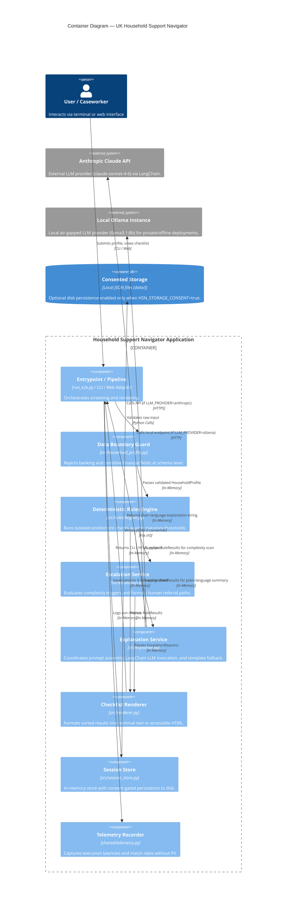

Arthur is 75. He lives alone in a cold, terraced house in Greater Manchester on a basic State Pension of just under £210 a week. When his dual-fuel energy bill climbed again this winter, he started turning off his heating at 4pm and eating one hot meal every two days.

He had never claimed a means-tested benefit in his life. He assumed benefits were "for other people," that applying meant handing over his bank statements to an invasive algorithmic portal, and that even if he qualified, it would only be for a few pounds.

He didn't know that his weekly income placed him £15 below the Pension Credit guarantee threshold. He didn't know that claiming that £15 a week would automatically passport him to a £150 Warm Home Discount rebate, an 85% Council Tax Reduction from his local authority, a free TV licence (available to Pension Credit recipients aged 75 or over), and support with NHS dental and optical costs. Across the year, his unclaimed entitlement totaled more than £4,200.

Arthur isn't an isolated case. He is one of **880,000 eligible UK pensioners** missing out on Pension Credit, part of a wider **£23 billion mountain of unclaimed benefits and support schemes** every year across England.


<!-- truncate -->

---

## The problem: record anxiety, record unclaimed support, and 4% trust

The Office for National Statistics (ONS) fielded its *Public Opinions and Social Trends* survey across June 2026. The findings map the emotional baseline of UK households:

| Public Concern | % of UK Adults | JigsawFlux Portfolio Status |
| :--- | :--- | :--- |
| **Cost of living** | **88%** | **Addressed today by Household Support Navigator** |
| NHS & Healthcare | 78% | Addressed by [Appointment Guardian](/blog/appointment-guardian-nhs) |
| The Economy | 70% | Cross-cutting economic context |
| Employment | 54% | Addressed by [Graduate Career Navigator](/blog/uk-grad-employment-navigator) |
| Digital Misinformation | 81%* | Addressed by [Verification Agent](/blog/verification-agent) |

*\*The 81% figure is from the ONS AI trust subsection ("worry about distinguishing real from fake information"), a different survey question to the public concerns figures above (88/78/70/54%).*

Cost of living is the single largest public anxiety in Britain today. Yet, alongside this pressure sits a staggering paradox: **over £23 billion in means-tested support goes unclaimed every year** (Policy in Practice / DWP 2024–2026 baselines).

The barrier is rarely lack of statutory entitlement. It is a friction gauntlet:
1. **Fragmented discovery:** There is no single government service that shows a household every entitlement they qualify for across national benefits, local council reductions, and energy supplier grants.
2. **Invisible passporting:** Most claimants have no idea that claiming one foundational benefit (like Pension Credit or Universal Credit) automatically unlocks multiple secondary entitlements.
3. **Local scheme opacity:** Discretionary schemes like the Household Support Fund (HSF) vary by council, are announced on ad-hoc cycles, and are poorly indexed.
4. **Fear and stigma:** People dread entering financial details into opaque web forms or worry that an application will trigger penalties or disrupt existing support.

### The AI Trust Paradox in Welfare

The instinctive Silicon Valley response to this problem is "build an autonomous AI agent that fills out benefits forms for you." 

The ONS survey explains why that approach is fundamentally wrong:
- Trust in AI for **government decision-making is 4%** — the lowest trust category recorded.
- Trust in AI for **caregiving is 5%**.
- **77%** of UK adults worry about non-consensual data use.
- Only **36%** believe AI will personally benefit them.

Having spent six years designing oncology devices and health informatics at Elekta — where an unverified calculation or software bug directly impacts patient radiation safety — and currently working at International SOS supporting critical events and duty-of-care medical response, I evaluate software through an uncompromising safety lens. In high-stakes human environments, **you never let a probabilistic model make decisions of legal or financial record.**

If you build a black-box AI that guesses eligibility, asks for bank credentials, or attempts to submit claims autonomously, you have failed the user before the first token streams.

---

## What I built

The [Household Support Navigator](https://github.com/JigsawFlux/household-support-navigator) is a local, privacy-first Python system. It takes self-reported household attributes (age, income, household size, region, housing status) and produces an honest, prioritized action checklist with official application links, suggested document checklists, and plain-language reasoning.

The architecture strictly enforces [JigsawFlux Rule 3: **Design the cage before the agent**](/blog/reviewing-the-first-nine-posts) — define what the system cannot do before writing a single prompt.

```
HouseholdProfile → screen_household() → [RuleResult, ...]
                                              │
                        ┌─────────────────────┼─────────────────────┐
                        ▼                     ▼                     ▼
              explain_results()   detect_complex_case()    build_checklist()
                (src/explainer)      (src/escalation)         (src/renderer)
                        │                     │                     │
                        │                     ▼                     ▼
                        │         render_escalation_message() render_cli() / HTML
                        ▼
            Plain-Language Summary
```

### The Three Structural Pillars

1. **Deterministic Rule Engine Decides:** Eligibility is computed entirely via pure Python functions in `src/rules/*.py`. Every rule evaluates explicit statutory thresholds and returns an immutable `RuleResult` with citation to the official GOV.UK legislation. **Claude never determines eligibility.**
2. **LLM Explains, Bounded by Code:** Claude Sonnet 4.6 (via `src/explainer.py`) receives the pre-calculated `RuleResult` objects and translates them into warm, accessible English with document-gathering hints. If the LLM call fails, times out, or returns empty text, the system automatically falls back to a deterministic text template.
3. **Mandatory Non-Bypassable Human Escalation:** Any complex scenario (self-employed earnings, 5+ household members, low-confidence calculations) triggers mandatory referral to Citizens Advice and MoneyHelper. The agent never attempts to guess ambiguous edge cases.

### Try it yourself

```bash
git clone https://github.com/JigsawFlux/household-support-navigator
cd household-support-navigator
python -m venv .venv && source .venv/bin/activate
pip install -r requirements.txt
cp .env.example .env          # add your ANTHROPIC_API_KEY, or set LLM_PROVIDER=ollama
python run_e2e.py             # runs two sample households end-to-end
```

---

## Architectural Deep Dive (C4 Model)

To make the system straightforward for developers and local authorities to adopt and extend, I documented the architecture using the C4 specification with Mermaid.

Here is the Container diagram showing the runtime isolation and privacy boundaries:



The Ollama path is not just a dev convenience. For caseworkers at a Citizens Advice bureau or local council, it means the entire pipeline runs air-gapped — household profile data never leaves the building.

---

## Three Key Engineering Decisions

### 1. Anti-Surveillance Boundary Guard

In a cost-of-living tool, the temptation for platforms is to ask for Open Banking access or account numbers to "automate the calculation." We rejected this completely.

`src/household_profile.py` implements a strict defensive boundary before data ever touches internal data structures:

```python
_BLOCKED_FIELD_PATTERNS = ("account_number", "sort_code", "iban", "card_number", "bank_")

def reject_if_financial_data_present(raw_payload: dict) -> None:
    """
    Guard used at the API/form boundary — never allow bank/account fields
    to enter the system, even if a client sends them.
    """
    for key in raw_payload:
        lowered = key.lower()
        if any(pattern in lowered for pattern in _BLOCKED_FIELD_PATTERNS):
            raise ProfileValidationError(
                "Financial/bank details are not accepted by this service."
            )
```

Furthermore, `SessionStore` is in-memory only. Disk persistence is locked behind an environment gate (`HSN_STORAGE_CONSENT=true`), and `shared/telemetry.py` records latencies and hit counts under unique `run_id` UUIDs without ever serializing household profile attributes.

### 2. Fault-Isolated Rule Execution

A web service calculating multiple benefit streams should never crash entirely because one local council API or rule module encountered an edge case. 

In `src/rules/engine.py`, `screen_household()` wraps every rule invocation in an isolated exception handler. If a rule fails, it is replaced with a safe `needs_review` signpost pointing to GOV.UK:

```python
def _safe_error_result(rule_name: str, exc: Exception) -> RuleResult:
    logger.error("rules.engine: rule %s failed: %s", rule_name, exc, exc_info=True)
    return RuleResult(
        entitlement=rule_name,
        eligible=False,
        reason="This check could not be completed automatically. Please check the official site.",
        source_url="https://www.gov.uk/check-benefits-financial-support",
        confidence="needs_review",
        signpost_only=True,
    )


def screen_household(profile: HouseholdProfile) -> list[RuleResult]:
    results = []
    for rule in _RULES:
        try:
            results.append(rule(profile))
        except Exception as exc:  # intentional broad catch — isolate per-rule failure
            results.append(_safe_error_result(rule.__name__, exc))
    return results
```

### 3. Grounded Prompts and Deterministic Fallback

The prompt passed to Claude Sonnet in `src/explainer.py` acts as an editorial voice, not an evaluator:

> *"You are a benefits communication assistant for UK households. You will be given a list of entitlement check results, each already determined by a deterministic rule engine (not by you). You must NOT change or contradict any eligible/ineligible determination given to you..."*

If Claude API is unavailable or rate-limited, `explain_results()` catches the exception and immediately invokes `_fallback_template(results)`. The user receives their checklist and document guidance regardless of whether third-party AI APIs are reachable.

---

## Live Pipeline Runs & E2E Verification

To verify the pipeline end-to-end, `run_e2e.py` runs two representative UK household profiles against live Claude Sonnet 4.6 inference and renders CLI, HTML, and telemetry records to `data/e2e_output/`.

### Case 1: Low-Income Pensioner (Arthur's Profile)

```python
HouseholdProfile(
    age=68,
    household_size=1,
    region="England",
    annual_income=10_500,
    housing_status="renter",
    employment_status="retired",
    existing_benefits=["pension_credit_guarantee"],
    has_partner=False,
)
```

#### Terminal Checklist Output

```text
Household Support Navigator — Your Checklist
============================================

✅ You may qualify: Council Tax Reduction
  Why: Household income (£10,500) is at or below the illustrative Council Tax Reduction threshold (£16,000) for this household size. Exact reduction amount depends on your council's scheme.
  Confidence: medium
  More info: https://www.gov.uk/apply-council-tax-reduction

✅ You may qualify: Pension Credit
  Why: Household income (£10,500) is at or below the Pension Credit guarantee threshold (£11,960).
  Confidence: medium
  More info: https://www.gov.uk/pension-credit/eligibility

✅ You may qualify: Warm Home Discount
  Why: Household reports a qualifying means-tested benefit, which typically triggers automatic eligibility for the Warm Home Discount rebate.
  Confidence: medium
  More info: https://www.gov.uk/the-warm-home-discount-scheme

ℹ️ Check locally: Household Support Fund
  Why: Household Support Fund schemes are run locally and vary by council. This is a signpost to check current local eligibility and available grants — it is not a guaranteed entitlement.
  Confidence: needs_review
  More info: https://www.gov.uk/cost-of-living/find-help-in-your-area

❌ Likely not eligible: Healthy Start
  Why: Healthy Start is for pregnant women or households with a child under 4 — this was not indicated for this household.
  Confidence: medium
  More info: https://www.healthystart.nhs.uk/
```

#### Claude Sonnet Plain-Language Translation

Claude explains the results and generates an actionable document preparation checklist:

```text
### ✅ Pension Credit — Likely Eligible
Based on your household income of £10,500, which is at or below the Pension Credit guarantee threshold, the checker indicates you are likely eligible for Pension Credit. This is a top-up benefit designed to bring your weekly income up to a minimum level, and it can also open the door to other help such as free TV licences and housing benefit.

Documents you will typically need:
- Pension statements or other proof of income
- Your National Insurance number
- Bank details (for the claim form — these are not stored by this tool)
🔗 Official information and how to apply: https://www.gov.uk/pension-credit/eligibility
```

---

### Case 2: Young Family in Manchester

```python
HouseholdProfile(
    age=28,
    household_size=3,
    region="Manchester",
    annual_income=18_000,
    housing_status="renter",
    employment_status="employed",
    existing_benefits=["universal_credit"],
    is_pregnant_or_young_child=True,
)
```

In this run, the engine correctly:
- Disqualifies Pension Credit (applicant is 28).
- Qualifies Council Tax Reduction (£18,000 is below the £24,000 threshold for a family of 3).
- Qualifies Healthy Start (qualifying Universal Credit benefit + pregnancy/child under 4).
- Qualifies Warm Home Discount via means-tested Universal Credit.
- **Deep-links localized Manchester support:** Resolves region `"Manchester"` directly to `https://www.manchester.gov.uk/householdsupportfund` rather than the generic national portal.

#### Telemetry Record (`data/e2e_output/telemetry_*.json`)

`entitlement_counts` tracks rule invocations per run (all 5 rules ran once); `eligible_count` and `ineligible_count` are the outcome totals that matter.

```json
{
  "run_id": "595400f8-6f58-4744-9792-3390fbeeed11",
  "latency_seconds": 18.097,
  "entitlement_counts": {
    "Pension Credit": 1,
    "Council Tax Reduction": 1,
    "Warm Home Discount": 1,
    "Healthy Start": 1,
    "Household Support Fund": 1
  },
  "eligible_count": 3,
  "ineligible_count": 2,
  "escalated": false,
  "llm_calls": 1,
  "llm_errors": 0
}
```

The entire 5-rule evaluation plus Claude Sonnet explanation completes in ~18 seconds — almost all of that is LLM inference time over the Anthropic API. The rule engine itself runs in under 10ms; the Ollama local path returns in 2–3 seconds on a modest GPU. The test suite runs 57 unit and integration tests in 0.06 seconds.

---

## What It Doesn't Do (Hard Governance Boundaries)

To protect vulnerable citizens, these boundaries are hardcoded into the architecture:

1. **No autonomous claim submissions:** The tool never submits a claim on a user's behalf. It prepares the user with official links and document lists; a human always applies.
2. **No collection of financial credentials:** No account numbers, sort codes, or card details.
3. **No LLM-guessed eligibility:** If an entitlement rule cannot be evaluated deterministically, it returns `needs_review` or escalates.
4. **No silent failure on complexity:** Self-employed workers and large households (5+) are routed directly to Citizens Advice and MoneyHelper. Immigration complexity triggers (NRPF / No Recourse to Public Funds) are planned for a future release — complex immigration cases should currently be referred manually to Citizens Advice.
5. **Rule thresholds are illustrative:** Pension Credit, Council Tax Reduction, and Warm Home Discount income figures in `src/rules/*.py` are approximations based on GOV.UK published guidance. They must be reconciled against current DWP rates before any pilot deployment — they are accurate enough to demonstrate the pipeline, not to advise real claimants.

---

## Connecting to the JigsawFlux Series

Every project in the JigsawFlux suite tackles a specific high-anxiety gap in UK public life using duty-of-care architecture:

- [Appointment Guardian](/blog/appointment-guardian-nhs) tackled the 78% NHS concern — addressing 8 million missed outpatient appointments via a strict state machine where LLMs can converse but cannot unilaterally alter clinical statuses.
- [Graduate Career Navigator](/blog/uk-grad-employment-navigator) tackled the 54% employment concern — scoring entry-level jobs against ONS SOC benchmarks without auto-apply spam or keyword deception.
- [Verification Agent](/blog/verification-agent) tackled the 81% misinformation concern — checking suspicious URLs and phishing messages through a specialist panel with SSRF defense and consent-gated PII redaction.
- **Household Support Navigator** tackles the **88% cost-of-living concern** — putting £23 billion in unclaimed entitlements within reach of everyday households without compromising their privacy or trust.

When trust in institutions and AI is low, the solution is not more autonomous black boxes. It is radical transparency, deterministic guarantees, and software that respects human dignity.

The complete code, C4 architecture documentation, and test suite are open source at [github.com/JigsawFlux/household-support-navigator](https://github.com/JigsawFlux/household-support-navigator).

---

## References

[1] Office for National Statistics. *Public Opinions and Social Trends, Great Britain: 3 to 28 June 2026*. ONS, 2026. https://www.ons.gov.uk/peoplepopulationandcommunity/wellbeing/bulletins/publicopinionsandsocialtrendsgreatbritain

[2] Department for Work and Pensions. *Pension Credit: Estimates of Take-up in 2023 to 2024*. DWP, 2024. https://www.gov.uk/government/statistics/pension-credit-take-up-2023-to-2024

[3] Policy in Practice. *Missing Out: £23 Billion of Support Goes Unclaimed Every Year*. Policy in Practice, 2024. https://policyinpractice.co.uk

[4] JigsawFlux. *Appointment Guardian: An Agentic NHS Appointment Recovery System*. JigsawFlux Blog, 19 July 2026. /blog/appointment-guardian-nhs

[5] JigsawFlux. *54 Percent: A Duty-of-Care Job Navigator for the UK's Most Anxious Labour Market*. JigsawFlux Blog, 2 August 2026. /blog/uk-grad-employment-navigator

[6] JigsawFlux. *81 Percent: A Duty-of-Care Verification Agent for Everyday Misinformation*. JigsawFlux Blog, 9 August 2026. /blog/verification-agent

[7] JigsawFlux. *Beyond the Agent Hype: 5 Engineering Rules from 10 Weeks of Building Bounded AI Systems*. JigsawFlux Blog, 26 July 2026. /blog/reviewing-the-first-nine-posts

---

*This is a JigsawFlux project. JigsawFlux builds open-source tools for health tech, humanitarian response, and digital duty-of-care — designed to work on constrained budgets, in real operating environments, with honest accounting of trade-offs. Code at [github.com/JigsawFlux](https://github.com/JigsawFlux).*
